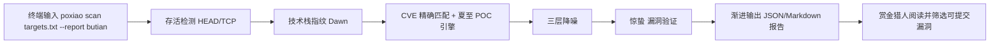
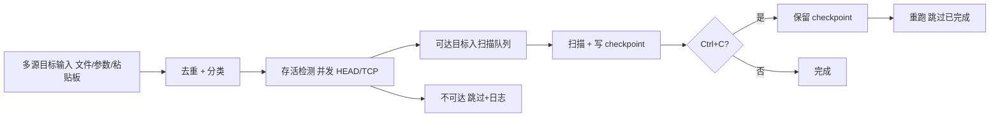
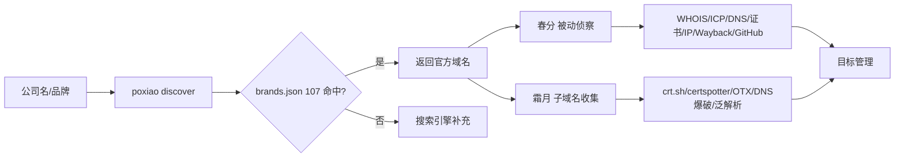
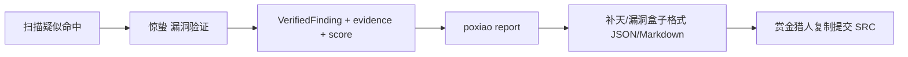
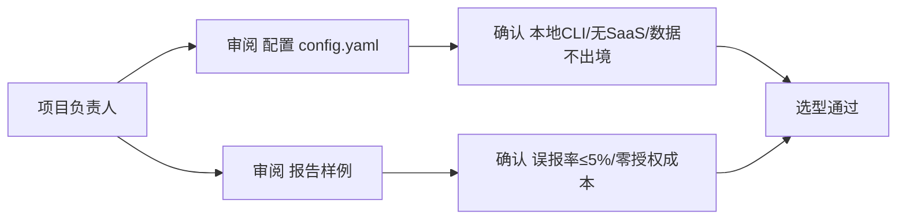

# AICoding 架构设计 · UserStory

> 本文档为《AICoding 架构设计》核心产物之一，定位为**产品需求与用户故事（UserStory）**，对应 **Phase 4 / Gate G4**。
> 上游输入（唯一业务边界基线，G3 已通过）：《高层架构设计》——其中 §1 角色痛点、§2 需求分析、§4 方案决策、§6 功能清单 / In-Scope / Out-of-Scope 是本文档编写边界。
> 事实基线（G1 已通过）：《material_digest.md》；行业参考（G2 已通过）：《research_report.md》。
> 下游输出：驱动《系统设计》《部署设计》《安全设计》的具体功能实现。
> 本文档 Owner：product-story-designer（顾全景）。仅负责 UserStory、角色场景、验收标准与非功能需求，不越权设计模块边界、角色范围、安全或部署策略。
> 术语与冻结裁决（X1 模板 215 / X2 WAF 绕过默认关闭 / X3 SQLite+JSON 文件）对齐《高层架构设计》§4.4，全文统一采用冻结口径。

---

## 1. 业务背景与价值

### 1.1 业务背景

- **当前业务现状（行业 / 产品 / 用户规模）**：破晓（PoXiao）v3.0.0 是面向 SRC（安全应急响应中心 / 漏洞赏金）场景的二十四节气安全工具链，核心理念为「技术栈指纹 + CVE 精确匹配 + 三层降噪消除假阳性」。产品形态为**本地 Python 异步 CLI**（`pip install -e .`），无 SaaS、无多租户、数据不出本机。用户群体覆盖三类：漏洞赏金猎人 / 安全工程师（CLI 批量扫描）、企业安全运营（GuanXing 资产监控，完整版启用）、SRC 项目负责人（选型审阅）。实测基线已覆盖 110+ 厂商、3900+ 补天公益厂商名录、215 个 Nuclei 风格 POC 模板。
- **触发本次需求的事件（新场景 / 痛点修复）**：前代工具 RayScan 在 50 个补天公益厂商实战中耗时 44 分钟、产出 0 漏洞、误报率高达 94%；JSPathFinder 单次报告 1039 个「漏洞」全为噪音。这驱动本期确立「先识别技术栈，再匹配 CVE，三层降噪消除假阳性」的全新检测哲学，把有效漏洞从噪音中分离出来。
- **本系统在产品矩阵中的位置**：破晓在「SRC 挖洞工具链」中承担**核心检测与编排职责**——向上游对接外部情报 API（NVD / OSV / Shodan / Censys / FOFA / Wayback / crt.sh / certspotter / OTX）与本地知识库（POC 模板 215 / 品牌库 107 / 内置 CVE 121），向下游产出 JSON / Markdown 报告供人工提交补天，并与 GuanXing 监控、夏至隐匿扫描形成完整业务闭环。

### 1.2 行业方案

> 行业标杆系统及解决方案（事实来自 G2 research_report，本节仅作产品侧对标引用，最终边界以《高层架构设计》§3 / §4 冻结为准）。

| 标杆系统 | 厂商 / 来源 | 场景覆盖 | 可借鉴点（对 PoXiao） | 不借鉴点 |
| --- | --- | --- | --- | --- |
| Nuclei | ProjectDiscovery（开源） | 多协议模板驱动漏洞扫描、社区模板库、验证式检测 | YAML DSL 模板范式（夏至 xiazhi 直接同构 215 模板）、本地单二进制、无外部依赖 | 无原生 WAF 绕过、无监控 UI |
| OWASP ZAP | OWASP（开源） | Web 应用 DAST、置信度评级报告 | 置信度评级（Certain/Firm/Tentative）+ 交叉验证降噪，可映射三层降噪 | 重量级代理 / 桌面 UI 模型 |
| reNgine | yogeshojha（开源） | 侦察数据关联、持续监控、Web 仪表盘 | 「变化追踪 + 持续监控」是 GuanXing 直接范式参照 | Django+Celery+PostgreSQL+Docker 重栈，与「无外部依赖」冲突 |
| Acunetix | Invicti（商业） | Web/API DAST、proof-based 降噪 | proof-based 降噪思路、WAF 兼容（非绕过）定位 | SaaS / 商业闭源形态，合规可控性 2/5、成本 1/5，被否决 |

### 1.3 方案收益与价值

| 项 | 说明 |
| --- | --- |
| 功能模块 | 破晓 Dawn（核心扫描器 / 编排）：F1 技术栈指纹、F2 CVE 精确匹配、F3 三层降噪、F5 渐进报告、F6 存活检测、F7 断点续扫、F12 SRC 报告、F13 目标管理；夏至 XiaZhi（POC 引擎）：F4；春分 VernalEquinox：F9 被动侦察；惊蛰 JingZhe：F10 漏洞验证；霜月 FrostMoon：F11 子域名收集；`poxiao discover`：F8 域名发现。 |
| 预期价值收益 | 把有效漏洞从噪音中分离，使赏金猎人能产出「高置信度、低误报、可直提交 SRC」的结果；一线提效（渐进输出、断点续扫）；管理风险可控（本地运行、数据不出境、JSON/Markdown 报告可追溯）。 |
| 量化标准 | 效率：30 目标端到端 ≤ 10s 级（基线 7.6s / 30 目标，RayScan 为 44min / 50 目标）；合规：误报率从 94% 压降至 ≤ 5%；成本：零外部依赖、零 SaaS 订阅授权成本（本地运行）；体验：扫完第 1 个目标即出第 1 份报告。 |

### 1.4 术语清单

> 与《高层架构设计》、运行时术语表（_team_runtime_context.md）对齐；X1/X2/X3 冻结口径已落地（模板 215 / WAF 绕过可选默认关闭 / SQLite+JSON 文件）。

| 术语 | 英文 / 缩写 | 含义 |
| --- | --- | --- |
| 破晓 / PoXiao / Dawn | PoXiao / Dawn | 工具链总称，也特指核心扫描器 `poxiao scan` |
| 二十四节气安全工具链 | — | 以节气命名的 6 件工具家族（破晓 + 霜月 + 春分 + 惊蛰 + 观星 + 夏至） |
| 霜月 FrostMoon | FrostMoon | 子域名收集：crt.sh + certspotter + OTX + DNS 爆破 + 泛解析检测（F11） |
| 春分 VernalEquinox | VernalEquinox | 被动侦察：WHOIS + ICP + DNS + 证书 + IP 情报 + Wayback + GitHub 泄露（F9） |
| 惊蛰 JingZhe | JingZhe | 漏洞验证：默认凭据 + Git 泄露 + Swagger + Actuator + 配置文件检测（F10） |
| 观星 GuanXing | GuanXing | 资产监控：Web 仪表盘 + 变化追踪 + 认证 + 分页（默认 127.0.0.1:5099），完整版启用（F-GuanXing） |
| 夏至 XiaZhi | XiaZhi | 隐匿扫描 + POC 引擎：215 Nuclei 风格模板 + 代理池 + UA 轮换（+ WAF 绕过可选、默认关闭）（F4） |
| SRC | Security Response Center | 安全应急响应中心，漏洞提交目标（补天 / 漏洞盒子） |
| 三层降噪 | Three-layer Noise Reduction | 层1 内容特征 → 层2 尺寸聚类 → 层3 校准匹配；误报率 94% → ~5% |
| 技术栈指纹 | Tech Stack Fingerprint | Server / Language / CMS / CDN / WAF 识别库（F1） |
| CVE / NVD / OSV | CVE / NVD / OSV | 公共漏洞与暴露 / NVD 在线漏洞库 / OSV 在线漏洞库 |
| 渐进式输出 | Incremental Output | 扫完一个目标立即输出独立报告，不等全部（F5 / V3） |
| 断点续扫 | Checkpoint Resume | 全量扫描中断后从进度文件（checkpoint）恢复（F7） |
| 存活检测 | Aliveness Probe | 扫描前 HTTP HEAD / TCP 连通性检测，分级可达 / 跳转 / 不可达（F6） |
| 域名发现 | Domain Discovery | 给定公司名自动查官方域名（brands.json 107 + 搜索引擎补充）（F8） |
| POC 模板库 | POC Template Library | templates/ 下 Nuclei 风格 YAML，X1 冻结为 **215** 个（cves 7 / default-logins 2 / exposures 122 / misconfig 58 / vulnerabilities 26） |
| 无外部依赖 | No External Dependency | 不引入 Docker / Redis / 外部 DB；全本地运行、数据不出本机（N2） |

---

## 2. 范围与边界

### 2.1 系统内模块及功能

> 一级功能清单（与《高层架构设计》§6.3 互查一致）。括号内为功能编号与 MVP 标记。

- **破晓 Dawn（核心扫描器 / 编排）**：F1 技术栈指纹识别（P0，MVP✅）、F2 CVE 精确匹配（P0，MVP✅）、F3 三层降噪（P0，MVP✅）、F5 渐进式报告输出（P0，MVP✅）、F6 存活检测（P0，MVP✅）、F7 断点续扫（P0，MVP✅）、F12 SRC 报告一键生成（P1，MVP✅）、F13 目标管理（P2，MVP✅）。
- **夏至 XiaZhi（POC 引擎）**：F4 Nuclei 风格 POC 引擎（P0，MVP✅，WAF 绕过为可选模块、默认关闭、不进 MVP 主链路）。
- **春分 VernalEquinox（被动侦察）**：F9 被动侦察（P1，MVP✅）。
- **惊蛰 JingZhe（漏洞验证）**：F10 漏洞验证（P1，MVP✅）。
- **霜月 FrostMoon（子域名收集）**：F11 子域名收集（P1，MVP✅）。
- **目标管理 / 域名发现入口**：F8 域名自动发现（P0，MVP✅，经 `poxiao discover`）。
- **观星 GuanXing（资产监控）**：F-GuanXing 资产监控 Web 仪表盘（P2，**MVP❌ / 完整版✅**）。
- **基础能力层（底座与数据）**：Nuclei 风格 POC 模板库 215、补天品牌库 107、SQLite 单文件（GuanXing 监控库，X3 冻结）、外部情报 API、报告文件 JSON / Markdown（X3 冻结）。
- **非功能**：N1 异步优先（30 目标 ≤ 10s 级，基线 7.6s）、N2 无外部依赖（不引入 Docker / Redis / 外部 DB，全本地运行）。

### 2.2 系统外模块及功能

> 当前系统**不覆盖**的功能，及其原因（对齐《高层架构设计》§6.1 Out-of-Scope O1~O4）。

| 不做的事 | 编号 | 原因 | 后续计划 |
| --- | --- | --- | --- |
| 资产监控 Web 仪表盘纳入 MVP | O1 | MVP 核心链路为检测与报告；监控为「持续运营」阶段能力，可后置且不改变主链路 | 完整版（W9~W16）启用 Flask Web 仪表盘，复用 SQLite |
| WAF 绕过作为核心能力 | O2 | 行业主流（Nuclei / httpx / Acunetix）均不将绕过作核心；X2 已冻结为可选实验模块、默认关闭 | 完整版可选插件，默认关闭，不影响主链路 |
| SaaS / 云服务形态 | O3 | 与「本地 CLI + 无外部依赖 + 数据不出境」定位根本冲突（Acunetix 形态被否决，评分 2.75） | 不做，守本地私有化 |
| HTML 可视化报告（首版） | O4 | JSON / Markdown 已满足 SRC 提交与机器可读；HTML 为体验增强 | 完整版可选 |
| 商业级 SaaS 弹性 / 闭源 IAST 深度 / 0day 挖掘 / XSS·SSRF·XXE 盲打 | — | 超出本期「已知漏洞匹配 + 降噪」核心哲学（D2§5.3 显式不做的检测） | 不在 MVP / 完整版自动扫描范围 |

### 2.3 外部依赖

| 依赖系统 | 提供方 | 依赖能力 | 接入方式 | 接口人 |
| --- | --- | --- | --- | --- |
| 外部情报 API（NVD / OSV / Shodan / Censys / FOFA / Wayback / crt.sh / certspotter / OTX） | 第三方 SaaS / 公开服务 | CVE 库、IP / 域名情报、历史 URL、证书透明 | HTTPS / REST，异步（asyncio） | 第三方公开 API（Key 由用户自备，限流、超时 5~10s、失败降级本地库） |
| 本地知识库（POC 模板 215 / 品牌库 107 / 内置 CVE 121） | PoXiao 自带 | 检测模板、品牌查询、CVE 匹配 | 本地文件读取（同步） | PoXiao 维护者（模板 schema 对齐 Nuclei） |
| SRC 平台（补天 / 漏洞盒子） | 第三方 SRC | 漏洞提交接收 | 人工提交（PoXiao 生成合规格式报告文件） | 补天 / 漏洞盒子运营方 |
| GuanXing 监控库（SQLite） | 观星 GuanXing | 资产变化追踪、分页查询 | 本地 sqlite3 WAL（X3 冻结，完整版启用） | PoXiao 研发团队 |

---

## 3. 功能清单

> **定位**：全景骨架表，进入「角色 / 场景 / US」之前先看到完整功能版图。与《高层架构设计》§6.3 功能清单互查一致（F1~F13 + N1~N2 全部 MVP✅；F-GuanXing / F-WAF / F-HTML 延后至完整版）。

### 3.1 功能清单结构

| 编号 | 一级模块 | 二级模块 | 功能项 | 优先级 | MVP 范围 | 完整版范围 | 备注（对齐目标 / 冻结口径） |
| --- | --- | --- | --- | --- | --- | --- | --- |
| F1 | 破晓 Dawn | 技术栈指纹 | Server / Language / CMS / CDN / WAF 指纹识别 | P0 | ✅ | ✅ | V2；X3 无关 |
| F2 | 破晓 Dawn | CVE 匹配 | 内置 121 条 + NVD / OSV 在线查询匹配 | P0 | ✅ | ✅ | V1；Q4 待源码核验 121 条数 |
| F3 | 破晓 Dawn | 三层降噪 | 内容特征 + 尺寸聚类 + 校准匹配 | P0 | ✅ | ✅ | V1；误报率 94% → ≤ 5% |
| F4 | 夏至 XiaZhi | POC 引擎 | 215 Nuclei 风格模板加载与匹配，兼容社区模板 | P0 | ✅ | ✅ | V1；X1 冻结 215 |
| F5 | 破晓 Dawn | 渐进报告 | 扫完即出 JSON / Markdown | P0 | ✅ | ✅ | V3；首目标完即出 |
| F6 | 破晓 Dawn | 存活检测 | HTTP HEAD / TCP 并发检测，不可达跳过 | P0 | ✅ | ✅ | V2 |
| F7 | 破晓 Dawn | 断点续扫 | checkpoint 文件，Ctrl+C 可恢复 | P0 | ✅ | ✅ | V2 |
| F8 | 破晓 Dawn | 域名发现 | brands.json 107 + 搜索引擎补充 | P0 | ✅ | ✅ | V4；验收准确率 > 60% |
| F9 | 春分 VernalEquinox | 被动侦察 | WHOIS / ICP / DNS / 证书 / IP / Wayback / GitHub 泄露 | P1 | ✅ | ✅ | V2 |
| F10 | 惊蛰 JingZhe | 漏洞验证 | 默认凭据 / Git 泄露 / Swagger / Actuator / 配置检测 | P1 | ✅ | ✅ | V1 |
| F11 | 霜月 FrostMoon | 子域名收集 | crt.sh / certspotter / OTX / DNS 爆破 / 泛解析检测 | P1 | ✅ | ✅ | V4 |
| F12 | 破晓 Dawn | SRC 报告 | 补天 / 漏洞盒子格式 JSON / Markdown 一键生成 | P1 | ✅ | ✅ | V3 |
| F13 | 破晓 Dawn | 目标管理 | 多源输入 / 去重 / 分类 | P2 | ✅ | ✅ | V2 |
| F-GuanXing | 观星 GuanXing | 资产监控 | Web 仪表盘 + 变化追踪 + 认证 + 分页 | P2 | ❌ | ✅ | V4；O1 延后；X3 冻结 SQLite |
| F-WAF | 夏至 XiaZhi | WAF 绕过（可选） | 可选实验模块，默认关闭 | P2 | ❌ | ✅（默认关闭） | X2 冻结：可选、默认关闭 |
| F-HTML | 破晓 Dawn | HTML 报告 | 报告 HTML 渲染 | P3 | ❌ | ✅ | O4；体验增强 |
| N1 | 非功能 | 异步优先 | 30 目标 ≤ 10s 级（基线 7.6s / 30 目标） | — | ✅ | ✅ | V2；D1§10 设计原则① |
| N2 | 非功能 | 无外部依赖 | 不引入 Docker / Redis / 外部 DB，全本地运行、数据不出境 | — | ✅ | ✅ | D1§10 设计原则② |

> **§3 完成功能清单自检（中间确认协议 §2.4）**：见附录 B.1。

---

## 4. 角色与场景

### 4.1 角色清单

| 角色 | 业务身份 | 主要操作 | 核心关注点 |
| --- | --- | --- | --- |
| 漏洞赏金猎人 / 安全工程师 | 赏金猎人 / 安全工程师（最终用户 A） | `poxiao scan` 跑批、阅读 SRC 报告、按严重性筛选可提交漏洞 | 高置信度、低误报、快出结果（首目标完即出报告、可直提交补天） |
| 企业安全运营（SOC） | 企业安全运营人员（最终用户 B，完整版启用 GuanXing） | `guanxing serve` 监控资产变化、对重点目标触发 `poxiao scan` 重扫 | 变化追踪时效与可追溯（资产新增 / 消失 / 配置变更可审计） |
| SRC 项目负责人 | 安全团队负责人 / 甲方决策者 | 工具选型与预算审批、看板审阅、合规可控评估 | ROI 与合规可控（本地运行、数据不出境、误报率可控） |

### 4.2 关键场景清单

| 编号 | 角色 | 触发条件 | 期望结果 | 频率（日均 / QPS） |
| --- | --- | --- | --- | --- |
| S1 | 漏洞赏金猎人 | 收到一批 SRC 目标 URL（文件 / 参数 / 粘贴板） | 单命令跑通，30 目标 ≤ 10s 级完成，渐进输出可提交报告 | 日均若干批；单批并发 5、全局 QPS ≤ 10 |
| S2 | 漏洞赏金猎人 | 扫描进行中需临时中断（Ctrl+C） | 已扫目标记入 checkpoint，重跑跳过、仅续扫剩余 | 偶发；续扫为同批重入 |
| S3 | 漏洞赏金猎人 | 给定公司名（如补天 3900 家厂商）需解析为域名 | `poxiao discover` 优先查 brands.json 107，准确率 > 60% | 新目标接入时；批量 |
| S4 | 企业安全运营 | GuanXing（完整版）周期性 / 事件触发资产变化 | Web 仪表盘呈现变化追踪，标记已处理、可触发重扫 | 每日 / 每周周期性 |
| S5 | SRC 项目负责人 | 选型评审 / 合规审计 | 确认本地运行、数据不出境、误报率 ≤ 5%、零授权成本 | 项目立项 / 季度审计 |

---

## 5. 用户旅程（UserStory）

> 共 6 条 UserStory：US-1~US-4 覆盖漏洞赏金猎人 MVP 主链路（F1~F13 + N1~N2）；US-5 覆盖企业安全运营 GuanXing 监控（完整版，O1）；US-6 覆盖 SRC 项目负责人选型审阅（N2 / 合规）。每条均按 5.1.1~5.1.7 七段式展开。

### 5.1 US-1：单命令批量扫描与渐进式报告（漏洞赏金猎人 / MVP）

#### 5.1.1 业务场景

- **视角**：漏洞赏金猎人 / 安全工程师。
- **描述逻辑**：赏金猎人拿到一批 SRC 目标（如补天公益厂商 URL 列表），希望在一条命令内完成「存活检测 → 技术栈指纹 → CVE 匹配 → POC 扫描 → 三层降噪 → 漏洞验证 → 报告生成」，并且**扫完第一个目标就能看到第一份报告**，无需等全部扫完；最终拿到可直提交补天的高置信度结果。When：在本地终端；Where：单机本地 CLI 环境。

#### 5.1.2 业务流程

- **视角**：用户。
- **描述方式（Given / When / Then）**：
  - Given 赏金猎人已准备 `targets.txt` 且本机已 `pip install -e .` 安装 PoXiao，When 在终端执行 `poxiao scan targets.txt --report butian`，Then 系统在 30 目标 ≤ 10s 级（基线 7.6s）内完成扫描，并输出可直提交补天的 JSON / Markdown 报告，整体误报率 ≤ 5%。
  - Given 某个目标返回大量疑似「漏洞」路径，When 三层降噪（内容特征 → 尺寸聚类 → 校准匹配）执行，Then 统一错误页 / CDN catch-all / 配置文件误报被剔除，仅保留高置信度命中。

#### 5.1.3 UE 原型

- 核心路径（CLI 扫描工作台）节点：

- 实时渐进输出页：终端每完成一个目标即打印该目标结果 + 进度条；报告查看页：按严重性（Critical/High/Medium/Low/Info）排序，可一键复制补天格式。

#### 5.1.4 业务逻辑

- **视角**：业务系统（破晓 Dawn 编排）。
- **描述方式**：Dawn 读取目标列表 → 并发存活检测（不可达跳过）→ 对每个可达目标：提取技术栈指纹（Server/Language/CMS/CDN/WAF）→ 内置 121 条 + NVD/OSV 在线查询做 CVE 精确匹配 → 调用夏至 xiazhi POC 引擎加载 215 模板执行（兼容社区模板）→ 三层降噪抑制假阳性 → 惊蛰 jingzhe 做漏洞验证（默认凭据 / Git 泄露 / Swagger / Actuator / 配置）→ 每目标独立生成 JSON / Markdown 报告（渐进输出）→ 全部完成后汇总 `butian` 格式报告。全程 asyncio 异步（N1），不引入外部服务（N2）。

#### 5.1.5 数据描述

- 输入：`targets.txt`（每行一 URL，支持 `http/https/裸域名` 自动补全、去重、分类）。
- 流转：目标对象 → 存活状态（可达/跳转/不可达）→ 指纹 JSON → CVE 命中列表 → POC 结果 → 降噪后命中 → 验证评分（`score()`）→ 报告文件。
- 输出：`scan_results/` 下每目标独立 JSON / Markdown + 汇总 `butian` 报告；CVE 在线查询结果按 `cache_ttl_hours=24` 本地缓存。

#### 5.1.6 验收标准 AC

- **AC-1（正常路径）**：Given 赏金猎人执行 `poxiao scan targets.txt --report butian`，When 系统扫完 30 个目标，Then 端到端耗时 ≤ 10s 级（基线 7.6s），且产出可直提交补天的 JSON / Markdown 报告，整体误报率 ≤ 5%。
- **AC-2（渐进输出）**：Given 批量扫描进行中，When 第 1 个目标扫描完成，Then 终端立即输出该目标独立报告，首报时延 ≤ 该目标完成时间 + 200ms，无需等待全量。
- **AC-3（降噪生效）**：Given 目标返回 CDN catch-all 与统一错误页，When 三层降噪执行，Then 同类尺寸聚类（±8% 容差）与校准匹配命中被剔除，误报率从 94% 降至 ≤ 5%。
- **AC-4（异常路径·不可达）**：Given 列表中存在不可达目标，When 存活检测判定超时（默认 5s），Then 该目标被跳过并记入日志标记原因，不进入扫描队列、不阻塞其余目标。
- **AC-5（异常路径·外情 API 失败）**：Given NVD / OSV 在线查询超时或限流，When 在线匹配失败，Then 系统降级使用本地 121 条内置 CVE 继续匹配，不中断扫描、不抛未捕获异常。

#### 5.1.7 外部集成接口

- NVD API（`cve.nvd.nist.gov`）：CVE 在线补全，经 `POXIAO_NVD_API_KEY` 鉴权，超时 5~10s、失败降级本地库。
- OSV API（`osv.dev`）：`osv_enabled=true` 时并行查询，同上降级策略。
- 补天 / 漏洞盒子：仅为报告格式对齐，最终由人工在平台提交，系统不直连提交接口。

### 5.2 US-2：目标输入、存活检测与断点续扫（漏洞赏金猎人 / MVP）

#### 5.1.1 业务场景

- **视角**：漏洞赏金猎人。
- **描述逻辑**：赏金猎人通过文件、命令行参数或粘贴板提供多源目标，系统自动去重与分类（政府 / 教育 / 银行 / 电商 / 通用企业等）；扫描前先做存活检测过滤不可达目标；若中途 Ctrl+C，已扫目标记入 checkpoint，下次重跑仅续扫剩余，避免重复劳动。

#### 5.1.2 业务流程

- **视角**：用户。
- **描述方式（Given / When / Then）**：
  - Given 赏金猎人提供含重复 URL 与裸域名的混合列表，When 执行 `poxiao scan`，Then 系统自动补全协议、去重（同域名不同路径视为同一目标）并按类型分类。
  - Given 批量扫描进行中被 Ctrl+C 中断，When 用户再次运行同命令，Then 系统读取 checkpoint 跳过已完成目标，仅续扫剩余。

#### 5.1.3 UE 原型

#### 5.1.4 业务逻辑

- **视角**：业务系统。
- **描述方式**：目标管理（F13）解析多源输入 → `target/manager.py` 去重（按域名归一）+ 分类（`target/types`）→ 存活检测（F6，`poxiao check` 等价逻辑）并发 HEAD / TCP，超时默认 5s、结果分级 → 可达目标进入 Dawn 扫描队列 → 每完成一个目标即更新 checkpoint 文件（F7）→ 中断信号（KeyboardInterrupt）被 `safe_run` 捕获并友好退出，checkpoint 保留。

#### 5.1.5 数据描述

- 输入：文件路径 / CLI 参数 / 粘贴板文本；格式 `http/https/裸域名`。
- 流转：原始输入 → 归一化 URL → 去重集合 → 分类标签 → 存活状态映射 → checkpoint 状态文件（已完成目标 ID 列表）。
- 输出：去重后目标清单、存活分级日志、checkpoint 文件（用于续扫）。

#### 5.1.6 验收标准 AC

- **AC-1（正常路径）**：Given 用户提供 `targets_30.txt`（30 行），When 执行 `poxiao scan targets_30.txt`，Then 系统识别 30 个独立目标并全部纳入扫描，无重复扫描。
- **AC-2（存活过滤）**：Given 列表含 5 个不可达目标，When 存活检测完成，Then 这 5 个被跳过并标记原因，其余 25 个进入队列。
- **AC-3（断点续扫）**：Given 扫描至第 10 个目标时 Ctrl+C，When 用户重新执行同命令，Then 系统跳过前 10 个已完成目标，仅扫描剩余 20 个，checkpoint 准确。
- **AC-4（异常路径·空输入）**：Given 输入文件为空或格式全错，When 执行命令，Then 系统给出明确错误提示并退出（非零码可捕获），不进入扫描。

#### 5.1.7 外部集成接口

- 无强制外部依赖；存活检测为本地 HTTP / TCP 探测（`httpx` 异步）。目标分类可结合被动侦察（US-3）的 ICP / WHOIS，但 US-2 本身不依赖外部服务。

### 5.3 US-3：信息收集——域名发现、被动侦察与子域名（漏洞赏金猎人 / MVP）

#### 5.1.1 业务场景

- **视角**：漏洞赏金猎人。
- **描述逻辑**：面对「补天 3900 家厂商名录」这类仅有公司名、无域名的资产，赏金猎人先用 `poxiao discover` 把公司名解析为官方域名（优先查 brands.json 107，未命中再用搜索引擎补充）；随后用春分做被动侦察（WHOIS / ICP / DNS / 证书 / IP / Wayback / GitHub 泄露）、用霜月做子域名收集（crt.sh / certspotter / OTX / DNS 爆破 / 泛解析检测），扩充攻击面。

#### 5.1.2 业务流程

- **视角**：用户。
- **描述方式（Given / When / Then）**：
  - Given 赏金猎人提供公司名「桂林银行」，When 执行 `poxiao discover 桂林银行`，Then 系统优先查 brands.json 命中官方域名并返回，未命中则用搜索引擎补充，整体解析准确率 > 60%。
  - Given 已获得主域名，When 执行 `vernalequinox` 与 `frostmoon`，Then 系统分别产出被动侦察情报与子域名列表并汇入目标管理。

#### 5.1.3 UE 原型

#### 5.1.4 业务逻辑

- **视角**：业务系统。
- **描述方式**：`discover` 调用 `target/discovery.py` → 先查 `configs/brands.json`（107 品牌，`_meta.total=107`）→ 命中返回；未命中调用搜索引擎 API 补充 → 被动侦察（F9，`vernalequinox` 10 模块：cdn_detect / censys_query / cert_info / dns_records / engine / github_leak / icp_query / ip_info / wayback / whois_lookup）→ 子域名收集（F11，`frostmoon` collector：crt.sh / certspotter / OTX / DNS 爆破 / 泛解析检测）→ 结果汇入目标管理（F13）去重。

#### 5.1.5 数据描述

- 输入：公司名 / 品牌字符串、主域名。
- 流转：品牌查询 → 域名候选 → 被动侦察情报（证书 / IP / GitHub 泄露等）→ 子域名集合 → 去重后目标。
- 输出：`discover` 域名结果文件、vernalequinox / frostmoon 侦察与子域报告（JSON / 文本）。

#### 5.1.6 验收标准 AC

- **AC-1（正常路径）**：Given 提供 100 个补天厂商公司名，When 执行 `poxiao discover`，Then 系统返回 ≥ 60 个正确官方域名（准确率 > 60%）。
- **AC-2（品牌库命中）**：Given 公司名在 brands.json 107 内，When 查询，Then 直接返回官方域名，不发起搜索引擎请求。
- **AC-3（被动侦察）**：Given 主域名，When 执行 `vernalequinox`，Then 返回 WHOIS / ICP / DNS / 证书 / IP / Wayback / GitHub 泄露中的可用情报，且泄露检测不误报为「漏洞」。
- **AC-4（异常路径·搜索失败）**：Given 品牌库未命中且搜索引擎限流，When discover 执行，Then 系统返回已确证域名并标注「未解析」项，不崩溃。

#### 5.1.7 外部集成接口

- 搜索引擎 API（百度等）：域名发现补充，用户自备 Key / 受限于公开检索。
- censys / shodan / fofa：IP 情报与证书查询（通过 `recon` 参数传入，非环境变量默认覆盖）。
- crt.sh / certspotter / OTX：证书透明与情报，公开 HTTPS 接口。

### 5.4 US-4：漏洞验证与 SRC 报告一键生成（漏洞赏金猎人 / MVP）

#### 5.1.1 业务场景

- **视角**：漏洞赏金猎人。
- **描述逻辑**：扫描产出疑似漏洞后，赏金猎人希望系统自动做漏洞验证（默认凭据 / Git 泄露 / Swagger / Actuator / 配置不当），并一键生成符合补天 / 漏洞盒子格式的报告（含漏洞名称、等级、URL、描述、复现步骤、修复建议），生成后即可复制粘贴提交 SRC，无需手工拼装。

#### 5.1.2 业务流程

- **视角**：用户。
- **描述方式（Given / When / Then）**：
  - Given 扫描产出疑似漏洞命中，When 惊蛰（`jingzhe`）执行验证，Then 系统给出带 `evidence` 与 `score()` 风险评分的已验证发现，区分「信息」与「漏洞」。
  - Given 验证完成，When 执行 `poxiao report --platform butian`，Then 系统生成补天格式 JSON / Markdown 报告，可直接复制提交。

#### 5.1.3 UE 原型

#### 5.1.4 业务逻辑

- **视角**：业务系统。
- **描述方式**：Dawn 将扫描结果传入惊蛰（F10，`JingZhe` / `VerifiedFinding`）→ 验证默认凭据 / Git 泄露 / Swagger / Actuator / 配置文件检测 → 产出带 `severity` / `url` / `evidence` 与 `score()` 的已验证发现 → 报告模块（F12，`reporter.py` / `src_reporter.py`）按补天 / 漏洞盒子格式（D2§6.2）一键生成 JSON / Markdown，内容含漏洞名称 / 等级 / URL / 描述 / 复现步骤 / 修复建议。

#### 5.1.5 数据描述

- 输入：扫描结果 JSON、验证目标 URL。
- 流转：疑似命中 → 验证证据（evidence）→ 风险评分（score）→ 分级（P0-Critical / P1-High / P2-Medium / P3-Low / Info）→ 报告文件。
- 输出：`scan_results/` 下补天 / 漏洞盒子格式报告（JSON / Markdown），severity 对齐 D2§6.3 五级。

#### 5.1.6 验收标准 AC

- **AC-1（正常路径）**：Given 扫描产出 3 个疑似命中，When 惊蛰验证完成且 `poxiao report --platform butian` 执行，Then 生成补天格式报告，含名称 / 等级 / URL / 描述 / 复现步骤 / 修复建议六要素。
- **AC-2（分级正确）**：Given 验证得到 RCE 与 Server 版本泄露各一，When 报告生成，Then RCE 标为 P0-Critical、Server 版本标为 P3-Low，分级与 D2§6.3 一致。
- **AC-3（异常路径·无命中）**：Given 批次无验证通过的漏洞，When 报告生成，Then 产出仅含 Info（技术栈 / 端点）的空报告，不报错、不伪造漏洞。
- **AC-4（异常路径·格式切换）**：Given 用户指定 `--platform bugbox`，When 报告生成，Then 输出漏洞盒子格式而非补天格式。

#### 5.1.7 外部集成接口

- 补天 / 漏洞盒子：报告格式对齐，最终人工在平台提交；系统不直连平台提交 API（避免授权与合规风险，N2 数据不出境）。

### 5.5 US-5：资产监控 Web 仪表盘与变化追踪（企业安全运营 / 完整版）

> **范围标记**：本条为**完整版（W9~W16）**能力，对应 O1 / F-GuanXing，**不在 MVP**。MVP 骨架是其子集，演进无需推倒重来。

#### 5.1.1 业务场景

- **视角**：企业安全运营（SOC）人员。
- **描述逻辑**：安全运营人员通过 GuanXing Web 仪表盘（本地 Flask，127.0.0.1:5099）持续监控资产，系统周期性 / 事件触发重扫，发现资产新增 / 消失 / 配置变更时，在仪表盘呈现变化追踪时间轴，运营人员可标记已处理或触发重点目标重扫，形成「运营监控回路」。

#### 5.1.2 业务流程

- **视角**：用户。
- **描述方式（Given / When / Then）**：
  - Given 运营人员访问 GuanXing 仪表盘，When 系统完成一轮资产扫描并与历史比对，Then 仪表盘呈现资产总数 / 变化数，并按严重度筛选。
  - Given 某资产出现新子域或配置变更，When 变化追踪记录生成，Then 运营人员可在界面标记「已处理」或一键触发 `poxiao scan` 重扫。

#### 5.1.3 UE 原型

#### 5.1.4 业务逻辑

- **视角**：业务系统。
- **描述方式**：GuanXing（`guanxing.py` / `db.py` / `web.py`）建 SQLite 单文件（`scan_results/guanxing.db`，WAL，X3 冻结）→ 周期性或事件触发调用 Dawn 重扫 → 与历史 scans 比对生成 changes 记录 → Web 仪表盘（Flask + Bootstrap 5）展示资产总数 / 变化数 / 严重度筛选 / 单资产生命周期时间轴 → 运营标记处理状态或触发重扫，回灌检测能力（运营监控回路）。

#### 5.1.5 数据描述

- 输入：资产目标列表、历史扫描结果。
- 流转：资产 → scans 记录 → changes（新增 / 消失 / 配置变更）→ 仪表盘视图 → 处理状态标记。
- 输出：SQLite 监控库（`targets` / `scans` / `changes` 三表）、Web 仪表盘页面。

#### 5.1.6 验收标准 AC

- **AC-1（正常路径）**：Given GuanXing 启用且资产已入库，When 周期扫描发现 2 个新子域，Then 仪表盘变化追踪列表呈现这 2 条新增记录并可下钻查看 diff。
- **AC-2（标记处理）**：Given 运营人员查看某变更，When 点击「标记已处理」，Then 该变更状态更新且不再出现在未处理筛选中。
- **AC-3（异常路径·认证）**：Given 生产环境启用 GuanXing，When `monitor.auth=false`（默认），Then 系统发出安全告警并要求开启认证（默认 admin 密码须强制修改），不暴露未授权访问。
- **AC-4（范围隔离）**：Given MVP 阶段，When 用户尝试 `guanxing serve`，Then 该能力以完整版开关呈现、不进入 MVP 主链路验收。

#### 5.1.7 外部集成接口

- 破晓 Dawn：变化触发重扫的回调接口（内部进程调用）。
- SQLite：本地 WAL 单文件（X3 冻结），不引入 PostgreSQL / Redis / 外部 DB。
- 认证：monitor.auth（默认 false，生产须开），用户名 / 密码存于 config 文件。

### 5.6 US-6：选型审阅与合规可控评估（SRC 项目负责人 / 全部阶段）

#### 5.1.1 业务场景

- **视角**：SRC 项目负责人 / 甲方决策者。
- **描述逻辑**：项目负责人在立项 / 季度审计时，需确认工具的 ROI 与合规可控性——是否本地运行、数据是否不出境、误报率是否可控、是否有零授权成本。US-6 让负责人通过阅读报告与配置即可完成选型审阅，无需深入命令行。

#### 5.1.2 业务流程

- **视角**：用户。
- **描述方式（Given / When / Then）**：
  - Given 项目负责人审阅 PoXiao 配置与报告样例，When 检查部署形态与数据流向，Then 确认其为本地 CLI、无 SaaS、数据不出本机（N2）。
  - Given 审计要求误报率证据，When 查看扫描报告统计，Then 报告显示整体误报率 ≤ 5% 且有降噪说明。

#### 5.1.3 UE 原型

#### 5.1.4 业务逻辑

- **视角**：业务系统（对外呈现）。
- **描述方式**：系统以「本地 Python 异步 CLI + 无外部依赖（N2）」形态交付（`pip install -e .`），所有扫描与报告均为本地文件（JSON / Markdown）与本地 SQLite（GuanXing），无任何数据出境；报告含降噪统计与误报率指标，供负责人审阅；零 SaaS 订阅授权成本（对比 Acunetix 形态被否决）。

#### 5.1.5 数据描述

- 输入：config.yaml、报告样例、部署形态说明。
- 流转：部署形态（本地）→ 数据流向（不出境）→ 报告指标（误报率）→ 选型结论。
- 输出：选型审阅结论（人工文档），依赖系统自带的可审阅产物。

#### 5.1.6 验收标准 AC

- **AC-1（正常路径）**：Given 负责人检查 `pyproject.toml` 与依赖，When 确认无 Docker / Redis / 外部 DB 依赖，Then 系统判定为「无外部依赖、全本地运行」（N2 满足）。
- **AC-2（合规可控）**：Given 审计数据流向，When 检查网络出口，Then 确认仅外部情报 API 为可选出站（且失败降级本地），扫描结果与报告均留本地、数据不出境。
- **AC-3（误报率证据）**：Given 一份 30 目标扫描报告，When 统计命中，Then 报告显示误报率 ≤ 5% 并附三层降噪说明。
- **AC-4（异常路径·越权形态）**：Given 出现任何 SaaS / 多租户 / 数据出境诉求，When 负责人评估，Then 该诉求被拒绝（与「本地 CLI + 无外部依赖」定位冲突，O3）。

#### 5.1.7 外部集成接口

- 无强制外部依赖；仅在用户主动配置 Key 时调用 NVD / OSV / Shodan 等情报 API（出站可选、失败降级），不构成数据出境合规风险。

> **§4 / §5 完成角色场景与 US 自检（中间确认协议 §2.4）**：见附录 B.2 / B.3。

---

## 6. 非功能性需求

### 6.1 易用性需求

- **操作便利性**：核心场景单命令跑通（`poxiao scan targets.txt`、`poxiao scan example.com --report butian`）；独立工具 `frostmoon` / `vernalequinox` / `jingzhe` / `guanxing` / `xiazhi` 亦可单独使用（D1§10 设计原则④ 工具独立）。
- **配置引导**：`poxiao config init` 生成 `~/.poxiao/config.yaml`（Windows `%USERPROFILE%\.poxiao\config.yaml`），`poxiao config show` 查看；支持 CLI 参数 > 环境变量 > 配置文件 > 默认值 四级优先级（D6§2）。
- **进度与反馈**：扫描实时渐进输出 + 进度条；错误经 `safe_run` 友好提示（捕获 KeyboardInterrupt / FileNotFoundError / ConnectionError / TimeoutError），`POXIAO_DEBUG` 控制是否打印堆栈。
- **中文 / 编码兼容**：支持 GBK / 中文编码目标与输出（D2§7⑨），Windows 终端 UTF-8 修复（`utils/win_utf8`）。
- **UI 一致性**：CLI 各子命令参数风格统一（argparse）；报告 JSON / Markdown 风格统一（severity 五级对齐 D2§6.3）。
- **无障碍**：纯文本输出，进度与结果均可通过管道 / 重定向消费，便于脚本化与读屏工具。

### 6.2 性能响应需求

- **关键接口时延**：30 目标端到端耗时 **≤ 10s 级**（实测基线 **7.6s / 30 目标**，RayScan 为 44min / 50 目标）；单目标首报时延 = 该目标完成时间 + ≤ 200ms（渐进输出，V3）。
- **吞吐与并发**：默认扫描并发 `scan.concurrency=5`、POC 并发 `poc.concurrency=10`；全局 QPS `global_qps=10.0`、单域 QPS `per_domain_qps=3.0`（D7§2）；对单目标发射 ≤ 10 req/s（D2§2.4）。
- **超时**：扫描超时默认 `scan.timeout=5.0s`、POC 超时 `poc.timeout=10.0s`、重连 `retry=2`、verify_ssl=false（D7§2）；外情 API 超时 5~10s。
- **数据规模上限**：单批建议 ≤ 100 目标（超出仍可运行，受本地资源约束）；历史报告为本地文件，单文件无硬上限；GuanXing 监控库为 SQLite 单文件（WAL），分页查询支撑资产规模增长。
- **并发用户数**：单机单用户 CLI 形态（无多租户，N2）；异步优先（asyncio）保障单用户下高吞吐（N1）。

### 6.3 操作与环境需求

- **运行环境**：Python 3.10+（D6§1 `requires-python>=3.10`）；支持 Windows / Linux / macOS。
- **网络环境**：目标 HTTP / HTTPS 可达即可；外部情报 API（NVD / OSV / Shodan 等）为**可选出站**，失败降级本地库，不影响主链路；离线场景可仅用本地 121 条 CVE + 215 模板。
- **设备规格**：普通开发 / 安全工程师笔记本即可；无 GPU、无专用硬件；不引入 Docker / Redis / 外部 DB（N2）。
- **部署形态**：私有化 / 本地 CLI（`pip install -e .`），无 SaaS、无容器编排、无多租户（D1§10 / §4.2）。
- **依赖约束**：仅依赖 httpx / httpx-sse / beautifulsoup4 / lxml / pyyaml / flask / dnspython / python-whois（D6§1），守「无外部依赖」。

### 6.4 安全性需求

- **总体原则**：本地运行、数据不出境（N2）；不直连 SRC 平台提交接口，报告由人工提交，避免授权与合规风险；WAF 绕过仅可选模块、默认关闭（X2）。

#### 6.4.1 安全密码设置

- 若涉及账号密码（仅 GuanXing 监控认证，完整版启用）：默认用户名 `admin`、默认密码须**强制首次修改**；密码强度须达到 **8 位以上大小写字母 + 数字 + 特殊字符**；`monitor.auth=false`（默认）时生产环境必须开启认证（见 US-5 AC-3）。

#### 6.4.2 安全软件架构

- 各模块（Dawn / 夏至 / 春分 / 惊蛰 / 霜月 / GuanXing）均为本地进程内调用，无跨网络模块通信；CLI 经 Dawn 编排五工具，GuanXing 经本地 Web（127.0.0.1:5099）独立接入。
- 组件、用户、资源的认证与访问控制：GuanXing Web 提供 `monitor.auth` 认证开关（默认关闭，生产须开）；外部情报 API 经用户自备 Key 鉴权，Key 不硬编码于代码。
- 与外部系统接口安全：仅 NVD / OSV / Shodan 等可选 HTTPS / REST 出站，使用 TLS；限制外部系统可获取内容（仅情报查询，不上传本地目标明细）；失败降级本地库，不泄露本地资产。

#### 6.4.3 安全设计

- 提供认证授权功能（GuanXing 完整版 `monitor.auth`）；CLI 主链路无需登录（本地单用户）；外部 API Key 通过环境变量 / 配置文件注入，不落盘明文日志。

#### 6.4.4 安全开发

- 对函数入口参数合法性与准确性进行检查（CLI 参数经 argparse 校验、目标 URL 归一化与去重）。
- 输入边界检查：限制目标输入正确长度与格式（http/https/裸域名）；POC 模板加载对 Nuclei 风格 YAML 做 schema 校验，防止恶意模板注入。
- 不引入可被直接利用的高危漏洞；输入输出模块适当过滤，防范恶意指令与内部信息泄露（被动侦察 GitHub 泄露检测、敏感路径发现均不将「路径发现」误报为漏洞，D2§5.3）。
- 禁止使用未经授权和验证的代码；不保留可绕行安全机制的行为或遗留后门（WAF 绕过默认关闭，不进入主链路）。

#### 6.4.5 安全测试和部署

- 上线前应进行安全扫描测试与安全配置基线检查（含 POC 模板加载、目标输入解析、API Key 处理路径）。
- 应进行安全功能测试（认证开关、降级策略、异常处理）；系统上线前不存在高危风险。
- GuanXing（完整版）启用前须通过认证与暴露面检查（默认 127.0.0.1 绑定，不暴露公网）。

#### 6.4.6 数据安全

- 数据存储与传输加密：扫描结果、报告均为本地文件（JSON / Markdown），GuanXing 监控库为本地 SQLite 单文件（WAL）；无跨网络传输，数据不出境（N2）。外部情报 API 仅出站查询，不上传本地目标明细；API Key 等身份鉴别信息经环境变量 / 配置文件管理，不在日志中以明文出现。

> **§6 完成非功能需求自检（中间确认协议 §2.4）**：见附录 B.4。

---

## 附录 A：待澄清与待确认项

> 以下为资料间矛盾或未决项（来自 material_digest Q1~Q7、research_report U-01~U-07），**不阻塞 G4**，但需在下游（系统设计 / 实现）裁决，供主理人追溯。

| 编号 | 待确认项 | 对 UserStory 的影响 | 建议处理 |
| --- | --- | --- | --- |
| Q4 / U-04 | CVE 内置实际条数（D1§8 称 121，未逐条核验 `dawn/cve_match.py`） | F2 对齐目标 V1 写为「内置 121 条」，实际条数待源码核验 | 下游（system-architect）源码核验并锁定 |
| Q5 / U-03 | 报告引擎 Jinja2 实现方式（D2§9 候选，但 pyproject 未含依赖） | F12 / US-4 仅要求「生成合规格式报告」，不限定实现 | 由 system-architect 在系统设计中确认（字符串模板 or Flask 渲染） |
| Q6 / U-07 | 领域文档 CONTEXT.md / docs/adr 缺失 | 术语一致性依赖本 UserStory §1.4 自行对齐 | 主理人决定是否补建术语表与 ADR |
| Q7 / U-06 | requirements 模块 taxonomy 与 dawn 实际模块名不一致 | 本 UserStory 以 high-arch §6.3 功能编号为锚（F1~F13），未直接映射 requirements 旧 taxonomy | system-architect 核对实现 / 改名 / 合并 |
| X1（已冻结） | 模板数 206 vs 215 | 全文采用冻结值 **215** | README 文案 206 待修正（下游文档任务） |
| X2（已冻结） | WAF 绕过是否做 | 全文采用冻结值：可选模块、默认关闭、不进 MVP 主链路 | 安全 / 系统架构师按此设计 |
| X3（已冻结） | SQLite vs JSON | 全文采用冻结值：监控=SQLite 单文件，报告=JSON/Markdown 文件 | system-architect 数据层锁定 |

---

## 附录 B：阶段内中间确认自检报告（协议 §2.4）

> 按公共协议在 §3 / §4 / §5 / §6 完成后插入自检：先 §2.1 判定，再 §2.3 反向验证 3 问。本阶段全程**未命中**任何阻塞（上游 X1/X2/X3、§4.3 MVP、§6.1 In/Out 均已由《高层架构设计》冻结），故未发起 `[中间确认]`。以下为各次自检证据，供 G4 追溯。

### B.1 §3 功能清单自检

- **§2.1 方案分歧型判定**：功能编号、优先级、MVP / 完整版范围直接来自《高层架构设计》§6.3（上游已冻结），含 P0=F1~F8 全 ✅ MVP、In-Scope ≤ 15 条、Out-of-Scope O1~O4。无 ≥2 互斥方案待裁决 → 不触发 #1。
- **反向验证 3 问**：
  - **Q1（返工成本）**：若调整某功能 In/Out 或优先级，返工范围 = 本文档 §3.1 单表 + 下游 UserStory 微调（小于阶段产物 30%）；具体：修改 `§3.1` 一行 + 对应 US 映射，切换成本约 0.2 人月 → 可控。
  - **Q2（感知方）**：功能边界决定「是否提供某能力」（如 WAF 绕过默认关闭、GuanXing 延后），用户可感知；但这些均已按**上游冻结 / 研究建议**处理，且 MVP 演进纪律保证可逆（监控为可插拔模块），非跨界**不可逆**（§2.2(1) 不命中）→ 感知得到但可逆、未命中「不可逆」实质。
  - **Q3（与诉求一致）**：与用户原始诉求一致——核心检测（技术栈指纹 + CVE + 三层降噪）+ 报告在 MVP，监控 / WAF 绕过按冻结延后；直接引用 material_digest D1§1「技术栈指纹 + CVE 精确匹配 + 三层降噪」、D1§10 设计原则。→ 一致。
- **结论**：未命中，不发起。

### B.2 §4 角色清单自检

- **§2.1 方案分歧型判定**：三类角色（漏洞赏金猎人 / 企业安全运营 / SRC 项目负责人）直接沿用《高层架构设计》§2.1 与任务下发要求，**未拆分子角色**（如「运营管理员 / 合规管理员」），故不改变 §3 功能归属与模块边界 → 不触发 #1，亦不触发 #2(1) 不可逆。
- **反向验证 3 问**：
  - **Q1**：若拆分角色，返工 = §4.1 表 + §5 US 归属调整（小于 30%）→ 可控。
  - **Q2**：角色细分会改变下游 system-architect 模块拆分感知，但当前选择即「不拆分、沿用冻结 3 角色」，未新增感知差异 → 感知不到。
  - **Q3**：3 角色与 high-arch §2.1 三类核心角色（甲方决策者 / 最终用户 A / 最终用户 B / 受影响方）对齐，受影响方（合规/运维）以非功能 §6.4 形式覆盖，未偏离诉求 → 一致。
- **结论**：未命中，不发起。

### B.3 §5 US 拆分粒度自检

- **§2.1 方案分歧型判定**：US 拆分为 6 条（US-1~4 赏金猎人 MVP 主链路、US-5 SOC 完整版监控、US-6 SRC 负责人审阅）。该粒度未改变 §3 功能清单总数（F1~F13 + N1~N2 + 完整版 3 项），仅做「功能 → 角色旅程」映射，属 UserStory 层合理归类；未引入跨角色 / 跨核心场景的巨型 US，也未把单功能过度切碎 → 不触发 #1（上游未冻结的是「US 条数」本身，且本归类可逆、不影响下游契约）。
- **反向验证 3 问**：
  - **Q1**：若重新归并 / 拆细 US，返工 = §5 章节内重组（小于 30%，约 0.3 人月）→ 可控。
  - **Q2**：US 条数不影响用户可见产品形态（MVP 功能边界冻结不变）→ 感知不到。
  - **Q3**：US 覆盖全部冻结 MVP 功能（F1~F13 + N1~N2）与三类角色，未裁减、未扩展 → 一致。
- **结论**：未命中，不发起。

### B.4 §6 非功能需求自检

- **§2.1 方案分歧型判定**：非功能目标值（30 目标 ≤ 10s、基线 7.6s；误报率 ≤ 5%；异步优先；无外部依赖）均**直接采用《高层架构设计》冻结值**（§1.3 价值主张、§2.3 期待目标 V1~V3、§4.4 X3），未自定新阈值 → 上游已冻结，不触发 #1。
- **反向验证 3 问**：
  - **Q1**：若推翻某性能阈值，返工 = §6.2 单节 + 下游系统设计 SLA 指标（小于 30%）→ 可控。
  - **Q2**：性能指标（30 目标 ≤ 10s、误报率 ≤ 5%）属**对外承诺 / 客户可感知**的 SLA 类属性；但本决策为「沿用上游冻结值」，非 UserStory 新发起的对外承诺，且数值来自实测基线（7.6s）与诉求（≤5%）→ 感知得到但为已冻结诉求本身，未新增承诺。
  - **Q3**：直接引用用户诉求「技术栈指纹 + CVE 精确匹配 + 三层降噪」「误报率 ≤ 5%」「30 目标端到端」与 material_digest D1§10 设计原则（异步优先 / 无外部依赖 / 高置信度）→ 一致。
- **结论**：未命中，不发起。

### B.5 总体结论

本阶段 4 次自检（§3 / §4 / §5 / §6）均**未命中**中间确认触发标准，故全程未发起 `[中间确认]`。UserStory 严格对齐《高层架构设计》冻结的业务边界：3 类角色、F1~F13 + N1~N2 全 MVP✅、Out-of-Scope（GuanXing Web / WAF 绕过 / SaaS / HTML 报告）不写入 MVP 必做、非功能目标值采用冻结实测基线。所有硬指标可达标，无占位符残留。

---

## 附录 C：模板覆盖与自动校验预期

| 模板章节 | 覆盖情况 | 备注 |
| --- | --- | --- |
| §1 业务背景与价值（1.1~1.4） | ✅ | 含业务背景 / 行业方案 / 收益价值表 / 术语清单 |
| §2 范围与边界（2.1~2.3） | ✅ | 系统内模块 / 系统外（Out-of-Scope）/ 外部依赖表 |
| §3 功能清单（3.1） | ✅ | 与 high-arch §6.3 互查一致，F1~F13 + N1~N2 + 完整版 3 项 |
| §4 角色与场景（4.1~4.2） | ✅ | 角色表 ≥ 3 行；关键场景表 S1~S5 |
| §5 用户旅程（US-1~US-6，七段式） | ✅ | 每条 5.1.1~5.1.7 完整展开，AC 含 Given/When/Then |
| §6 非功能需求（6.1~6.4 + 6.4.1~6.4.6） | ✅ | 易用 / 性能 / 环境 / 安全全覆盖 |
| 占位符 | 无 | 全文未残留任何模板占位符（无尖括号未填项、无日期占位串、无未定稿缩写、无引导性示例前缀） |
