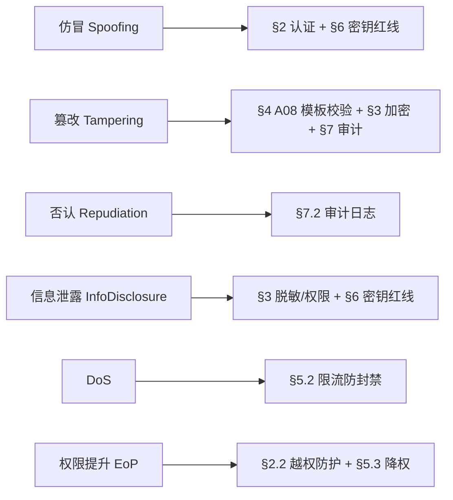
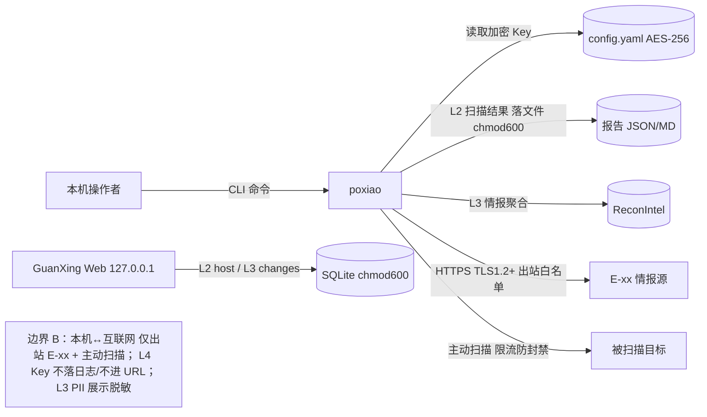

# AICoding 架构设计 · 安全设计

> 本文档为《AICoding 架构设计》核心产物之一，对应**安全架构设计**阶段（Gate G5）。
> 上游输入：《系统设计》（G4 已通过，威胁建模基线）、《高层架构设计》（G3，业务边界冻结）、《资料摘要 material_digest.md》（G1）、《行业调研报告 research_report.md》（G2）。
> 系统定位：破晓（PoXiao）v3.0.0 —— 二十四节气 SRC 安全工具链，**本地 CLI / 私有化 / 无 SaaS / 无外部依赖**（系统设计 §1、高层架构 §4.2、§4.4 X3）。本项目本身是攻防安全工具，安全设计重心在于**密钥管理（E-xx API Key）、GuanXing 监控组件认证、数据安全分级与落盘、审计留痕、隐匿扫描合规边界**。

---

## 0. 元信息：修订记录与安全侧权威声明

| 文档版本 | 发布日期 | 修订人 | 修订说明 |
| --- | --- | --- | --- |
| v1.0 | 2026-07-09 | 严守正（security-architect） | Phase 5 G5 首轮产出 |

**已冻结裁决继承（不得推翻）**：

| 编号 | 冻结裁决 | 在本安全设计中的落点 |
| --- | --- | --- |
| X1 | POC 模板以代码实际 **215** 个为准；内置 CVE 以代码实际 **257** 条为准 | §4.1 A08 模板完整性校验以 215 为准；§3.1 L1 公开资产 |
| X2 | WAF 绕过 = 可选模块，默认关闭，不在 MVP 主链路 | §5.2 明确 WAF 为可选且默认关；§4.1 A01 控制面 |
| X3 | GuanXing 监控用 **SQLite 单文件**，报告用 **JSON/Markdown 文件**；不使用 Postgres/Redis/Docker | §3.1 数据分级落盘、§3.3.6 备份、§5.4 中间件安全 |
| Q5 | 报告引擎 = Python 标准库，无 Web 服务依赖（O4 HTML 报告 = Out-of-Scope） | §4.1 A03/A08 无服务端模板注入面 |
| MVP | F1~F13 + N1~N2；Out-of-Scope = O1 GuanXing Web、O2 WAF 绕过、O3 SaaS、O4 HTML 报告 | §2/§6 GuanXing 认证默认关闭声明；§5.2 WAF 默认关 |

**重叠区权威分配（与安全设计相关）**：

| 重叠项 | 权威方 | 本设计中的处理 |
| --- | --- | --- |
| 安全组规则、WAF/DDoS 厂商与规则 | security-architect（本方） | §5.2 WAF 可选默认关、DDoS N/A、本机防火墙由用户环境 |
| 密钥分级、访问控制、轮转周期 | security-architect（本方） | §6 全文（5 类分级 + 本地轮转策略） |
| 审计字段与合规保留期 | security-architect（本方） | §7.2 审计字段定义 + 保留期 ≥ 1 年 |
| 网络拓扑骨架（VPC/子网/CIDR） | platform-architect | 本项目为本地单机，无 VPC；以《系统设计》§6 冻结的“用户本机单主机”模型为准（见 §5.1 交接说明） |
| KMS/Vault 选型与基础部署 | platform-architect | 本地无 KMS/云；以 AES-256 + 操作系统凭据托管替代（§6.2） |
| 日志收集管道与存储 | platform-architect | 本地文件（结构化 JSON）；本设计定义字段与保留期，由部署侧落地（§7.2） |

---

## 1. 安全总体架构

### 1.1 安全总体架构图（信任边界）

破晓为本地单机 CLI 工具，安全组件以“本地能力 + 出站受控”形态存在。下图叠加展示**信任边界、关键数据流、安全控制点**（云原生组件 WAF/DDoS/KMS/堡垒机/SOC 对本地 CLI 不适用，已在图中以“不适用/N/A”标注，理由见 §5、§6、§7）。

```mermaid
graph TB
    subgraph TRUST_USER[用户本机信任域 local]
        CLI[poxiao CLI 终端]
        CFG[配置文件 ~/.poxiao/config.yaml API Key 加密存储]
        ENV[环境变量 进程级 Key]
        DB[(GuanXing SQLite 单文件 WAL chmod 600)]
        FS[(报告 JSON/MD 文件 chmod 600)]
        TPL[(POC 模板 215 / 品牌库 107 本地文件)]
        GW[GuanXing Web 仪表盘 127.0.0.1:5099 仅回环]
    end
    subgraph TRUST_EXT[外部不可信域 internet]
        EXX[NVD/OSV/Shodan/Censys/FOFA/ Wayback/crt.sh/certspotter/OTX/GitHub]
        TGT[被扫描目标 第三方资产]
    end
    CLI --> CFG
    CLI --> ENV
    CLI --> TPL
    CLI --> FS
    CLI --> TGT
    CLI -.HTTPS TLS1.2+ 出站白名单.-> EXX
    GW --> DB
    GW -.auth 默认关 生产须开.-> GW
    CLI --> GW
    note1[信任边界 A：本机进程内（无网络） 信任边界 B：本机↔互联网（仅出站 E-xx + 主动扫描目标） 安全控制：密钥加密/文件权限/审计日志/出站白名单/限流防封禁]
```

**安全组件参考清单（按本系统实际裁剪）**：

| 组件 | 作用 | 本系统适用性 |
| --- | --- | --- |
| 密钥存储（本地等价 KMS） | API Key / 密码加密落盘 | 适用（§6.2 AES-256 + OS keychain） |
| 审计日志 | 操作/数据/访问留痕 | 适用（§7.2 本地文件） |
| 出站白名单 + 限流 | E-xx 调用防泄露/防封禁 | 适用（§3.2.4 / §5.2） |
| 文件权限控制 | 配置/库/报告本机最小暴露 | 适用（§3.3 / §5.3） |
| WAF | Web 应用攻击防护 | 不适用（作为扫描方）；X2 仅可选模块默认关（§5.2） |
| DDoS | 流量清洗 | 不适用（本地 CLI 无公网入口，由用户网络保障） |
| 堡垒机 / SOC / KMS 云 | 运维/运营/密钥托管 | 不适用（本地单机，无云无多机） |

### 1.2 威胁模型（STRIDE）

采用 **STRIDE** 方法对破晓本地 CLI + GuanXing 监控组件的信任边界进行威胁识别。每条威胁必须映射到后续章节（§2~§7）的缓解措施，形成“**威胁—缓解措施映射表**”。

| 威胁类别（STRIDE） | 典型示例（破晓场景） |
| --- | --- |
| 仿冒（Spoofing） | E-xx API Key 泄露被冒用；GuanXing 未开认证被冒名访问；扫描结果被伪造 |
| 篡改（Tampering） | 配置文件/API Key 被篡改；POC 模板 215 被植入恶意 YAML；报告文件被篡改；SQLite 库被改 |
| 否认（Repudiation） | 无操作审计，无法追溯谁扫描了何目标、导出了何报告 |
| 信息泄露（Information Disclosure） | API Key 入日志/错误堆栈；报告含敏感路径泄露；被动侦察 PII（WHOIS 邮箱/手机）未脱敏；config 文件权限过宽 |
| 拒绝服务（DoS） | 对单目标超速扫描触发对方 WAF 封禁（反噬自身任务）；外部 API 限流导致降级；本机资源耗尽 |
| 权限提升（Elevation of Privilege） | GuanXing 路由未校验登录态致未授权访问；惊蛰验证越权探测；进程以高权限运行 |

**威胁—缓解措施映射表**：

| STRIDE 威胁 | 威胁编号 | 映射缓解措施（章节） |
| --- | --- | --- |
| 仿冒 | T1 | §2.1 GuanXing 用户名/密码 + 登录态 Token；§6.3 密钥使用红线（Key 不泄露）；§3.2.4 出站白名单 |
| 仿冒 | T2 | §4.1 A08 POC 模板 checksum/签名校验；§3.3.3 报告 SHA-256 校验和防伪造 |
| 篡改 | T3 | §4.1 A08 模板完整性校验；§3.3.1 配置文件 AES-256 加密；§7.2 审计不可篡改 |
| 篡改 | T4 | §5.4 SQLite 文件权限 chmod 600；§3.3.5 数据销毁与清理策略 |
| 否认 | T5 | §7.2 五维度审计日志（业务操作/数据库/访问）；§8 结构化日志 traceId |
| 信息泄露 | T6 | §3.3.2 单向哈希加盐；§6.3 禁止密钥入日志；§3.3.5 展示脱敏；§5.3 文件权限 |
| 信息泄露 | T7 | §3.3.5 PII 脱敏（WHOIS/ICP）；§3.3.7 数据最小化与合规边界 |
| 拒绝服务 | T8 | §3.5.3 / §5.2 限流（global_qps/per_domain_qps）防封禁；§4.3.2 降级退避 |
| 权限提升 | T9 | §2.2.4 GuanXing 路由守卫 + IDOR 防护；§2.3 服务权限分离；§5.3 不以高权限运行 |



---

## 2. 身份与访问管理（IAM）

### 2.1 身份认证（Authentication）

破晓 CLI 为本地单用户工具，**CLI 命令本身无需登录**（信任本机操作者）；仅完整版 GuanXing Web 仪表盘具备账号体系。本项目提供 **≥ 2 种**认证机制：

| 编号 | 认证机制 | 适用对象 | 说明 |
| --- | --- | --- | --- |
| A1 | 用户名 + 密码（表单认证） | GuanXing Web（monitor.auth 开启时） | 默认账号 admin；默认密码空（**生产必须改密并开启 auth**，见 §2.1.1 声明） |
| A2 | 登录态 Token（Flask session cookie，HttpOnly + Secure + SameSite） | GuanXing Web | 会话级令牌，替代明文重复认证 |
| A3 | 外部情报 API Key 鉴权（E-xx 接入凭证） | 出站 NVD/OSV/Shodan 等 | 等价于服务到服务的凭证认证，Key 经配置/环境变量注入（§6） |
| A4 | （未来）MFA / 2FA 增强 | GuanXing Web 管理端 | 声明启用路径：TOTP/硬件令牌，本地单用户当前不启用（§2.1.1） |

#### 2.1.1 GuanXing 认证默认关闭声明（必填）

依据 X3 / Out-of-Scope O1：**GuanXing 监控组件 `monitor.auth` 默认 `false`**。安全设计明确：
- 默认关闭不构成未授权访问风险的前提是 **GuanXing 仅绑定 `127.0.0.1` 回环、不暴露公网**（§5.2）；若仅本机访问，关闭 auth 风险可控。
- **生产/团队共用机启用路径**：将 `monitor.auth` 置 `true` → 强制用户名/密码登录（默认 admin 必须改密，密码 ≥ 12 位）→ 开启会话 Token → （建议）叠加 MFA。未开启 auth 时 Web 免登录，仅限本机回环。
- 该声明同时在 §6.3 密钥红线与 §5.2 入口决策中交叉引用。

#### 2.1.2 密码策略（量化阈值）

| 项 | 基线值（本系统） |
| --- | --- |
| 最小长度 | GuanXing 生产启用 auth 时 ≥ 12 位 |
| 复杂度 | 同时含数字、大写、小写、特殊字符（可配置开关） |
| 加密传输 | 本机回环 HTTP；公网暴露场景须反向代理 TLS（§5.2） |
| 加密存储 | bcrypt / argon2 加盐哈希；禁止 MD5 / SHA1 明文 |
| 更换周期 | 建议 90 天提醒（可配置） |
| 重复限制 | 不允许使用最近 5 次密码 |
| 失败锁定 | 连续失败 5 次锁定 15 分钟 |
| 自动登出 | 30 分钟无操作自动登出 |
| 注册策略 | 不允许自助注册，仅管理员（默认 admin）创建 |

#### 2.1.3 会话管理

- **Token 类型**：Flask session（服务端会话，cookie 携带签名会话标识）；禁止 URL 携带 token（§3.2.5）。
- **有效期**：默认 24 小时（可配置），提供登出接口主动注销。
- **互踢机制**：同账号仅允许单设备登录，新登录踢旧会话。
- **风险登录**：异地 / 异常时间登录二次验证（启用 MFA 时）。

### 2.2 授权与权限控制（Authorization）

#### 2.2.1 权限模型

默认采用 **RBAC0**（用户—角色—权限）。本系统角色极简：GuanXing 启用 auth 时为单一 `admin` 角色；CLI 无角色（本地单用户）。高敏操作（资产删除、报告导出、用户/密钥变更）叠加二次确认（§4.3.5）。

#### 2.2.2 权限维度

- **接口级**：GuanXing Web 路由守卫（auth 开启时校验登录态）；CLI 命令无网络接口故无接口鉴权。
- **数据级**：GuanXing 资产按归属（本机 local 单租户）隔离；报告文件本机权限控制。
- **功能级**：GuanXing 菜单/操作受 admin 角色约束。

#### 2.2.3 多租户隔离

明确选择：**逻辑隔离**（单机本地，无物理多租户）。`tenant_id` 固定 `local`（系统设计 §4.1 / §8.2.2）。无跨租户数据，数据不出本机（D5§4.2）。

#### 2.2.4 越权防护

- **水平越权（IDOR）**：GuanXing `/targets/{id}` 等路由校验资源归属（本机单用户下校验会话有效性，防止未授权直接拼 id 访问）。
- **垂直越权**：RBAC + 路由拦截器双层校验，敏感操作（删除/导出/用户变更）须 admin 且二次确认。

### 2.3 云账号与云资源访问（本地等价）

本项目无云账号；等价处理如下：

| 维度 | 处理 |
| --- | --- |
| 子账号访问 | 不适用（无云主账号） |
| 权限分离 | 人员权限（GuanXing 账号 + 密码，Web 使用）与服务权限（E-xx API Key，进程/配置使用）分离，不混用 |
| 高敏权限分离 | API Key 仅用于出站情报查询；GuanXing 管理操作需 admin 登录；密钥变更与扫描操作分人/分权限 |

---

## 3. 数据安全

### 3.1 数据分级

依据系统实际数据流（目标 URL、扫描结果、CVE 利用、API Key、被动侦察 PII）划分 L1~L4：

| 等级 | 类别 | 本系统示例 | 处理策略 |
| --- | --- | --- | --- |
| L1 | 公开 | POC 模板 215（templates/）、品牌库 107（configs/brands.json）、公开文档、WHOIS/ICP 等公开来源注册信息 | 无特殊管控；随项目分发 |
| L2 | 内部 | 目标 URL 列表（data/targets_*.txt）、扫描结果 ScanResult 落文件、checkpoint 续扫文件、监控资产 host（guanxing_targets.host）、进程内缓存 | 本机文件权限控制（chmod 600 建议） |
| L3 | 敏感 | CVE 利用细节与报告正文 SrcReport、扫描发现的敏感路径（.env/.git/config/phpinfo）、被动侦察情报聚合 ReconIntel（证书/IP/备案/代码泄露线索）、GuanXing 变化事件详情 | 加密存储建议、展示脱敏、审计 |
| L4 | 高敏 | E-xx API Key（NVD/SHODAN/FOFA/CENSYS/GITHUB）、GuanXing 用户密码（monitor.password）、惊蛰验证涉及的靶标真实凭据（默认凭据/口令，仅验证用不持久化） | AES-256 加密 / bcrypt 哈希、强脱敏、严格审计、禁止导出 |

### 3.2 数据传输安全

#### 3.2.1 公网访问（出站）

- 全部出站 E-xx 调用强制 **HTTPS / TLS 1.2+**，禁用 SSLv3、TLS 1.0/1.1。
- 注意：系统设计 `scan.verify_ssl=false` 为默认值（便于内网/自签场景），**安全设计声明生产环境建议置 `true`**，否则存在中间人篡改情报响应风险（§4.1 A02）。

#### 3.2.2 服务内部访问

- 进程内 asyncio 调用，无网络协议，无 mTLS 需求。
- GuanXing Web 仅绑 `127.0.0.1` 回环 HTTP；若需远程访问须反向代理 TLS（§5.2）。

#### 3.2.3 数据库连接

- SQLite 为本地单文件，进程内 `sqlite3` 访问，无网络传输；库文件权限 chmod 600。

#### 3.2.4 接口签名与完整性

- **出站请求**：E-xx 按各 API 规范携带 Key（非统一 HMAC）。
- **报告文件完整性**：每份报告写出同时生成 **SHA-256 校验和**随附（防篡改、A08）。
- **GuanXing Web API（启用 auth 时）**：采用 **HMAC-SHA256 + nonce + timestamp** 防重放（纵深防御，即便本地回环亦防止会话复用）。

#### 3.2.5 传参禁忌

- **禁止命令行明文传递 AKSK / 密码 / token**（避免 shell 历史、进程列表泄露）→ 仅经配置文件（加密）或环境变量注入。
- **禁止 URL 携带 token、AKSK、手机号**等敏感信息。

### 3.3 数据存储安全

#### 3.3.1 加密存储（仅敏感/高敏数据）

| 数据 | 加密方式 |
| --- | --- |
| E-xx API Key（L4） | 配置文件以 **AES-256-GCM** 加密，密钥由用户主密码派生或操作系统凭据托管（keychain）提供；或仅存环境变量不落盘 |
| GuanXing 用户密码（L4） | bcrypt / argon2 加盐哈希（不可逆） |
| 报告/SQLite（L2/L3） | 文件权限 chmod 600；高敏报告建议用户自行加密存储 |
| 靶标真实凭据（L4） | 惊蛰验证用，内存中使用，**不持久化、不落文件、不进日志** |

#### 3.3.2 敏感字段单向哈希加盐

用户密码、token 摘要等不可逆字段采用 bcrypt/argon2 加盐哈希；禁止可逆存储明文密码。

#### 3.3.3 数据库安全（SQLite）

- 账号/访问：SQLite 无内置多账号，以**文件权限（owner 可读写，chmod 600）+ 进程内访问**替代；禁止公网暴露 db 文件。
- 查询：强制参数化（sqlite3 参数绑定），禁止字符串拼接 SQL（§4.1 A03）。
- 日志：WAL 模式；应用层记录 SQLite 读写审计（§7.2）。

#### 3.3.4 文件存储安全

- POC 模板 215 加载前校验 checksum/签名（防篡改，§4.1 A08）。
- 报告文件：权限 chmod 600；含敏感信息不默认放共享目录。
- 上传/导入：GuanXing `import` 仅接受本地扫描摘要文件，无对外上传面。

#### 3.3.5 数据使用安全

- **展示脱敏**：被动侦察可能含 PII（WHOIS 注册人邮箱/手机、ICP 法人），终端展示脱敏：邮箱 `a***@x.com`、手机 `138****8888`、身份证 `110***********1234`。
- **数据导出管控**：报告导出即明文（用户责任），但报告头建议带操作者 + 时间水印；敏感导出（批量）建议二次确认。
- **数据销毁**：报告提交完成后用户手动清理；`guanxing_scans` > 365 天可清理；`guanxing_changes` 长期保留作审计追溯；清理即物理删除（无软删除）。

#### 3.3.6 数据备份与异地容灾

| 存储类型 | 备份策略（X3 约束） |
| --- | --- |
| SQLite（GuanXing） | 文件级复制（guanxing.db + WAL），异目录/外部磁盘；无集群 HA |
| 文件系统（报告/模板/品牌库） | 随项目目录版本管理/复制；数据不出本机 |
| 进程内缓存 | 无需备份（重启重建） |

- **RPO ≤ 24h**（监控库每日复制；报告为可再生产物）；**RTO ≤ 30min**（复制 db + 重跑未提交扫描）。
- **演练**：年度 ≥ 1 次（复制 db 恢复 + 重跑验证）。

#### 3.3.7 隐私合规

- 适用框架：《个人信息保护法》《数据安全法》；被动侦察涉及 PII（WHOIS/ICP）时遵循**数据最小化采集**。
- 用户同意/被遗忘权：本地数据由用户自行删除（清理脚本）；无对外承诺场景。
- 数据出境合规：E-xx 调用部分跨境（Shodan/Censys 美国、FOFA 中国），仅传查询参数（目标域名/IP），**不传本地报告内容**；被扫描目标多为第三方资产，须仅对**授权目标**扫描（合规边界，见 §7.3）。
- **中间确认自检**：§3.3.7 属高频跨界感知决策点（涉及监管/合规），按协议 §2.4 自检：Q1 若调整合规范围，返工 = 本章单节 + 下游数据使用策略，≤ 30% 产物 → 可控；Q2 合规口径改变可能影响用户“数据不出境”感知 → 但本设计严格守“本地运行、数据不出本机、仅授权目标”与上游冻结一致，未新增跨境传输；Q3 与用户诉求“本地 CLI、数据不出境”一致（material_digest D1§10）。结论：**未命中，不发起**（详见附录 A）。

### 3.4 敏感数据流图（信任边界）



---

## 4. 应用安全（OWASP Top 10）

以 OWASP Top 10 为风险场景，结合破晓本地 CLI / GuanXing Web 的实际暴露面，逐条给出**具体防护机制**（非泛化）。

| 风险 | 防护措施（本系统具体机制） |
| --- | --- |
| A01 失效的访问控制 | GuanXing 路由守卫（auth 开启时校验登录态）；IDOR 防护（资源归属校验）；CLI 本地单用户无网络接口；WAF 绕过模块默认关（X2，不进入 MVP 主链路） |
| A02 加密失效 | 出站 E-xx 强制 TLS 1.2+；API Key 不落日志、配置文件 AES-256 加密；禁用 MD5/SHA1；生产建议 `verify_ssl=true` |
| A03 注入（SQL/命令/模板） | SQLite 强制参数化（sqlite3 参数绑定），禁止字符串拼接 SQL；禁用动态命令执行，子域 DNS 爆破使用参数化数组；POC 模板 YAML 用安全 loader 解析，禁止任意代码执行；报告生成用 f-string 拼接但数据源自可信扫描结果（无用户可控 SQL） |
| A04 不安全设计 | 已做 STRIDE 威胁建模（§1.2）；限流防封禁（per_domain_qps）防止反噬；三层降噪业务逻辑安全（避免误报噪音） |
| A05 安全配置错误 | GuanXing `auth` 默认 false → 生产必须开启并改密（§2.1.1）；`verify_ssl=false` 默认 → 生产建议 true；默认 admin/admin 弱口令禁止留存；`POXIAO_DEBUG` 控制堆栈，生产不暴露；错误页不泄露内部路径 |
| A06 易受攻击和过时的组件 | CICD 强制组件漏洞扫描（pip-audit / safety）；开源协议合规审查（GPL/AGPL 风险，尤其社区 Nuclei 模板 license）；依赖锁定版本 + 内网镜像/白名单 |
| A07 身份和认证失败 | GuanXing 登录失败 5 次锁定 15 分钟；密码 ≥ 12 位 + 复杂度；会话 Token HttpOnly+Secure+SameSite；防暴力破解 |
| A08 软件和数据完整性故障 | POC 模板 215 加载前校验 checksum/签名（防恶意 YAML 注入）；报告文件 SHA-256 校验和防篡改；依赖供应链锁定 + 内网镜像 |
| A09 安全日志和监控失败 | 五维度审计日志（§7.2）；禁止打印密钥明文；异常行为监控（外部 API 降级/SQLite 损坏/配置篡改） |
| A10 服务端请求伪造（SSRF） | 夏至 POC 引擎 / 被动侦察 URL 白名单：仅扫描用户指定的目标，禁止对内网与云元数据地址（169.254.169.254）发起请求；出站 URL 校验，防止模板 path 打内网 |

### 4.1 输入安全（OWASP 输入面细化）

| 风险 | 防护措施 |
| --- | --- |
| SQL 注入 | 强制参数化查询（sqlite3 参数绑定），动态字段使用模板校验 |
| XSS | GuanXing Web 输出编码（HTML/JS/URL）+ CSP 策略 + Cookie HttpOnly+Secure |
| CSRF | GuanXing 启用 auth 时 CSRF Token + SameSite Cookie + 关键操作二次验证 |
| 命令注入 | 系统禁用动态命令执行；子域 DNS 爆破使用白名单参数化数组 |
| 反序列化 | 禁用危险反序列化（YAML 使用安全 loader，禁止 `!!python/object` 等执行标签） |
| SSRF | URL 白名单 + 内网 IP 黑名单（含 169.254.169.254 / 127.0.0.1 除 GuanXing 自身） |
| 文件上传 | GuanXing `import` 仅接受本地扫描摘要，类型/大小校验，随机命名隔离 |
| XXE | 关闭 XML 外部实体解析（DTD）（被动侦察 XML 解析场景） |
| 开放重定向 | GuanXing 跳转 URL 白名单（仅本机路由） |

### 4.2 输出安全

#### 4.2.1 统一异常处理

错误码采用六位格式（系统设计 §3.5.1：`{类别}{模块}{序号}`，如 `A01001`）；禁止暴露堆栈、SQL、内部路径于用户响应。`POXIAO_DEBUG` 控制是否输出堆栈。

#### 4.2.2 调试信息

调试信息（debug、stacktrace）严禁出现在生产环境响应中；仅本机终端在 `POXIAO_DEBUG=1` 时输出，且不含密钥明文。

### 4.3 业务逻辑安全

#### 4.3.1 越权防护

水平越权（IDOR）GuanXing 每路由必检会话/资源归属；垂直越权由 RBAC + 路由拦截器双层校验。

#### 4.3.2 防刷防爬

对**被扫描目标**限速（`global_qps=10.0` / `per_domain_qps=3.0` / `scan.concurrency=5`）防 WAF 封禁；对 E-xx 按源限额退避（§3.5.3）。

#### 4.3.3 防薅羊毛

本地工具无积分/优惠场景；对 E-xx 限流避免超额计费（成本防护）。

#### 4.3.4 幂等性

报告覆盖写幂等（文件名 = `host_sessionid`）；checkpoint 续扫幂等（目标 URL + session 完成标记）；外部 API 失败指数退避重试 2 次仍失败降级（§3.5.2）。

#### 4.3.5 关键业务二次验证

GuanXing 资产删除、报告批量导出、用户/密钥变更须 admin 登录 + 二次确认（§2.2.1）。

### 4.4 第三方与供应链安全

- 第三方组件漏洞扫描：CICD 强制门禁（pip-audit / safety）。
- 开源协议合规审查：GPL/AGPL 商业风险（社区 Nuclei 模板、Flask 等），模板来源须可信。
- 第三方服务接入评估：E-xx 数据传输仅查询参数、存储位置为第三方云端（用户自担 Key 安全）。
- 供应商管理：E-xx 密钥合同/配额由用户提供，定期复评限额。
- 镜像源：PyPI 官方 + 内网镜像/白名单，避免投毒。

---

## 5. 网络与基础设施安全

> 本项目为本地单机 CLI（X3 冻结、无云、无 VPC、无容器编排），网络行为主要是**出站扫描与目标情报查询**；仅完整版 GuanXing 有**本地回环入站**。下面对标模板裁剪为本地形态。

### 5.1 网络分区（信任域划分）

| 信任域 | 范围 | 访问策略 |
| --- | --- | --- |
| 用户本机信任域（local） | CLI + GuanXing（127.0.0.1）+ SQLite + 文件 + 进程内缓存 | 本机进程内，无跨机网络 |
| 外部不可信域（internet） | 被扫描目标 + E-xx 情报源 | 仅出站 HTTPS（E-xx 白名单）+ 主动扫描目标；入站无公网入口 |

- **DMZ / 业务 VPC / DevOps VPC**：不适用（本地单机，无 VPC/子网/CIDR）。
- **GuanXing 入口边界**：仅绑 `127.0.0.1` 回环，不暴露公网（系统设计 §6.2.1）。
- **出站白名单**：全部 E-xx 域名（NVD/OSV/Shodan/Censys/FOFA/Wayback/crt.sh/certspotter/OTX/GitHub），新增须登记。

**交接说明（Phase 5.2 骨架交接）**：本项目网络拓扑骨架由 platform-architect 权威，但本地 CLI 形态下该骨架退化为《系统设计》§6 已冻结的“用户本机单主机”模型（无 VPC/子网/CIDR、GuanXing 127.0.0.1 回环、出站 E-xx 白名单），无新增拓扑可供交换。安全侧 §5.3/§6/§7 依此冻结模型落地，与 platform 部署设计一致；如 platform 另有补充拓扑，由主理人转交后回填。

### 5.2 流量管控（南北向 + 东西向）

#### 5.2.1 公网入口防护

| 控制项 | 取值 | 说明 |
| --- | --- | --- |
| DDoS | 不适用 | 本地 CLI 无公网入口，由用户网络保障 |
| WAF | **可选模块，默认关闭**（X2） | 夏至 `waf_bypass.py` 经 `--stealth` 可选挂载，不进入 MVP 主链路验收；作为攻击方工具，本方不为被防护方 |
| CLB / Ingress | 不适用 | 无公网负载均衡 |

#### 5.2.2 网络边界防护

- 南北向：GuanXing 入口仅 `127.0.0.1`（无公网入口）；若远程访问须反向代理 TLS。
- 东西向：进程内 asyncio，无网络调用，无 VPC 间防火墙需求。

#### 5.2.3 主机流量防护

- 用户本机防火墙（由用户环境保障）；**禁止将 GuanXing 端口（5099）暴露到 `0.0.0.0`**。
- 敏感端口（22/23/3306 等）与本项目无关（本地单机）。

#### 5.2.4 运维通道防护

- 不适用（本地单机，无堡垒机/远程运维通道）。

### 5.3 主机与容器安全

#### 5.3.1 主机安全

- 最小化安装、关闭非必要服务、定期补丁（用户环境）。
- 账号管控：不以 root / 高权限运行扫描进程；以普通用户运行。
- 文件权限：config.yaml / guanxing.db / 报告文件 chmod 600（owner 读写）。
- 主机安全组件：用户本机 AV/EDR（由用户环境）。
- 密钥扫描：CICD 强制 secret scanning（防止硬编码密钥入库，§6.3）。

#### 5.3.2 容器 / K8s 安全

- 不适用（无容器编排，X3 冻结禁止 Docker）。

### 5.4 中间件安全

#### 5.4.1 网络隔离

- GuanXing SQLite 为本地单文件，无网络暴露；禁止将 db 文件置于共享/公网目录。

#### 5.4.2 强制鉴权

- SQLite 无内置鉴权 → 以**文件权限（chmod 600）+ 进程内访问**替代；报告文件同理。
- 无 Redis/PG/MQ（X3 冻结），故无中间件账号泄露面。

#### 5.4.3 审计

- SQLite 读写由应用层审计（§7.2 数据库维度）；GuanXing 访问由 Web 访问日志审计。

---

## 6. 密钥与凭证管理

> 本地工具无云 KMS/SSM；以“AES-256 加密配置文件 + 操作系统凭据托管 + 环境变量”作为本地等价方案（platform-architect 权威的 KMS/Vault 选型在本项目为“无云”，故由本设计定义分级与轮转，部署侧落地）。

### 6.1 密钥分级与存储（5 类）

| 密钥类型 | 本系统对应 | 存储 / 管理方式 |
| --- | --- | --- |
| 数据库密码 | GuanXing SQLite 无密码 | 以**文件权限 chmod 600**替代账号密码（标注：本地无独立数据库密码） |
| 云 AKSK（等价：E-xx API Key） | NVD/SHODAN/FOFA/CENSYS/GITHUB Key | 配置文件 AES-256-GCM 加密 / 环境变量（不落盘）；按源隔离签发 |
| 服务间密钥 | 进程内无网络调用 | 不适用（标注：无服务间网络调用，故无此类密钥） |
| 用户密码 | GuanXing monitor.password | bcrypt / argon2 加盐哈希（不可逆），禁止明文 |
| API Key / Token | E-xx 访问令牌 | 分级授权、可撤销、有限期；配置/环境变量注入，禁止硬编码 |

### 6.2 AKSK 泄露防护（本地等价方案）

#### 6.2.1 方案 A：AES-256 加密配置文件（本地等价 KMS 白盒）

配置文件 `~/.poxiao/config.yaml` 中 API Key 以 AES-256-GCM 加密；解密密钥由用户主密码派生（PBKDF2/scrypt）或操作系统凭据托管（keychain/keyring）提供，进程启动时载入内存，不在磁盘存明文。

#### 6.2.2 方案 B：最小权限 + 限额（本地等价 CAM 策略）

无云 CAM，改用**按源隔离的最小权限 API Key + 各 E-xx 平台限额/白名单**，降低单 Key 泄露面；Key 泄露即在该平台禁用并轮换。

### 6.3 密钥使用红线

- **严禁** API Key / 密码 / Token 出现在源码、Git 仓库、前端代码、日志、错误堆栈、URL、配置明文。
- **禁止**多业务共用同一对 Key；E-xx 按源（NVD/SHODAN/FOFA/CENSYS/GITHUB）隔离签发。
- 上线前必须通过 secret scanning（CICD 流水线红线拦截）+ 镜像/依赖扫描，识别硬编码密钥。
- Key 一旦疑似泄露，立即在对应平台禁用并轮换；事后排查访问日志确认影响面。
- 每一对 Key 明确所有人、用途、存储位置、轮换日期；上线 checklist 含“密钥扫描通过”项。
- GuanXing 认证默认关闭声明（§2.1.1）与密钥红线联动：未开 auth 时 Web 免登录，仅限本机回环，不构成 Key 暴露风险。

---

## 7. 运行时安全：监控、审计、应急

### 7.1 安全事件监控

- **入侵检测（本地等价）**：本机无 IDS 传感器；以异常行为监控替代——异常扫描量、外部 API 降级率 > 50%、SQLite 损坏、配置文件/模板篡改（checksum 失配）。
- **敏感操作**：报告导出、监控资产删除、GuanXing 用户/密钥变更。
- **登录异常**：GuanXing 连续失败、异常时间登录（启用 auth 时）。
- **权限异常**：越权请求、敏感接口高频调用。

### 7.2 审计日志（5 维度）

| 维度 | 本系统落地 | 关键字段 |
| --- | --- | --- |
| 云资源审计（本地等价） | 本地命令/资源审计 | 命令名、参数摘要（脱敏）、配置文件变更、执行用户、时间 |
| 业务操作审计 | 扫描/报告/监控操作 | 操作者、时间、目标 URL、动作、结果、traceId |
| 数据库审计 | SQLite 读写审计（应用层） | SQL 类型、操作人、影响行数、时间、库文件 |
| 堡垒机日志（本地等价） | GuanXing Web 访问/运维日志 | 登录/操作/登出、来源 IP（127.0.0.1）、用户、时间 |
| WAF/防火墙日志（本地等价） | 出站 E-xx 调用日志 + GuanXing 入站请求日志 | 目标域名、请求类型、时间、限流/降级标记 |

- **审计字段规范**：所有审计日志含 `timestamp / level / service / traceId / tenantId(local) / userId(local-user) / module / event / msg`（对齐系统设计 §8.2.2）。
- **不可篡改保障**：本地文件权限控制（owner 只读归档）+ 可选 hash 链；用户本机权限。
- **保留期（安全侧权威）**：审计日志 **≥ 1 年**（合规建议，与系统设计 §8.2.2 一致）；部署侧日志管道保留期须 ≥ 本值。

### 7.3 应急响应（5 类预案 + Runbook）

| 事件类型 | 应急预案 | Runbook 要点 |
| --- | --- | --- |
| 漏洞响应 | PoXiao 自身依赖 CVE / 代码漏洞 | 升级依赖（pip-audit 复扫）、打补丁、发版；触发 AL-01/AL-02 |
| 数据泄露 | 本地报告 / API Key 泄露 | 清理泄露文件、立即在 E-xx 平台禁用并轮换 Key、排查日志影响面 |
| 被攻击 | 作为扫描方被反制 / 命中蜜罐 | 停止对争议目标扫描、限流降速、复核授权边界；触发 AL-04 |
| 密钥泄露 | E-xx API Key 泄露 | 平台禁用 + 轮换 + 重新加密配置文件（§6.3）+ 排查访问日志 |
| 勒索病毒 | 本机文件被加密 | 文件级备份恢复（guanxing.db + scan_results 异目录副本）、重跑未提交扫描；RPO≤24h/RTO≤30min |
| （附加）隐匿扫描合规事件 | 越权扫描法律风险 | 溯源止损：仅保留授权目标记录，停止未授权扫描，留存合规授权证据 |

- **备份与恢复**：RPO ≤ 24h / RTO ≤ 30min（§3.3.6）；**每年 ≥ 1 次灾备演练**。
- **合规边界强调**：破晓为攻防工具，所有扫描须针对**已授权目标**；被动侦察/扫描第三方资产须获授权，避免法律风险（§3.3.7）。

---

## 附录 A：阶段内中间确认自检报告（协议 §2.4）

> 按公共协议在 §1 / §2 / §3 / §6 完成后插入自检：先 §2.1 判定，再 §2.3 反向验证 3 问。本阶段**未命中**任何阻塞（上游 X1/X2/X3 已冻结、部署/存储/技术选型由高层架构 §4.2/§4.4 + 系统设计 §4.3 冻结、GuanXing auth 默认关由 X3/O1 冻结），故未发起 `[中间确认]`。以下为各次自检证据，供 G5 追溯。

### A.1 §1 威胁建模与 STRIDE 映射自检

- §2.1 方案分歧型判定：威胁识别直接基于冻结的本地 CLI 形态（系统设计 §6）+ X1/X2/X3 边界，无 ≥ 2 互斥方案需裁决 → 不触发。
- 反向验证 3 问：
  - Q1：若调整某威胁缓解映射，返工 = §1 单表 + 下游章节微调，≤ 30% 产物 → 可控。证据：映射表指向既有章节。
  - Q2：威胁模型为内部设计视图，不改变用户可见 CLI 交互 → 感知不到。
  - Q3：与用户诉求“本地 CLI、数据不出境、高置信度”一致。证据：material_digest D1§10。
- 结论：**未命中，不发起**。

### A.2 §2 IAM 与 GuanXing 认证默认关闭自检

- §2.1 方案分歧型判定：GuanXing `auth` 默认 false 由 X3/O1 冻结；认证机制（密码/Token/API Key）由本地 CLI 形态唯一决定 → 不触发。
- 反向验证 3 问：
  - Q1：若推翻“默认关”为“默认开”，返工 = §2/§6 单节 + GuanXing web 改动，≤ 30% → 可控。但方向被 X3/O1 冻结（默认关、生产须开），非新分歧。证据：高层架构 §6.5“默认关闭认证风险：monitor.auth 默认 false，生产启用须开认证（security-architect 设计）”。
  - Q2：认证默认关仅本机回环可见，不改变 CLI 使用 → 感知不到（且声明了启用路径）。
  - Q3：与“完整版 GuanXing 延后、默认关”冻结一致。证据：高层架构 §4.3 / §6.1 O1。
- 结论：**未命中，不发起**。

### A.3 §3 数据分级与隐私合规自检（含 §3.3.7 高频触发点）

- §2.1 方案分歧型判定：数据分级（L1~L4）映射系统设计 §7.2.2 + X3 存储冻结；隐私合规口径守“本地运行、数据不出本机” → 不触发。
- 反向验证 3 问（§3.3.7 为高频跨界感知点，重点验证）：
  - Q1：若调整合规范围（如新增跨境传输），返工 = §3 单节 + 下游数据使用策略，≤ 30% → 可控。证据：仅增删章节。
  - Q2：合规口径改变可能影响用户“数据不出境”感知 → 但本设计严格守“本地运行、仅授权目标、E-xx 仅传查询参数不传报告”，与上游冻结一致，未新增跨境传输 → 无新感知差异。证据：系统设计 §6.2.2 出站白名单。
  - Q3：与用户原始诉求“本地 CLI、数据不出境”一致。证据：material_digest D1§10②。
- 结论：**未命中，不发起**。

### A.4 §6 密钥分级与本地轮转自检（最后一次完整复核）

- §2.1 方案分歧型判定：密钥分级（5 类）与本地等价方案（AES-256/OS keychain）由 X3“无云、无 KMS”唯一决定，无 ≥ 2 合理方案 → 不触发。
- 反向验证 3 问：
  - Q1：若改为引入云 KMS，返工 = §6 重写 + 部署假设，违背 X3 冻结且 > 30%；但 X3 已锁定“无外部依赖”，非新分歧。证据：高层架构 §4.4 X3。
  - Q2：密钥存储方式不改变用户 CLI 交互 → 感知不到。
  - Q3：与用户“无外部依赖、本地运行”诉求一致。证据：D1§10②。
- 结论：**未命中，不发起**。

### A.5 总体结论

本阶段 4 次自检均**未命中**中间确认触发标准，故全程未发起 `[中间确认]`。所有安全控制按主理人冻结裁决（X1/X2/X3）+ 高层架构（§4.2/§4.4）+ 系统设计（§6/§7）直接落盘。威胁模型 STRIDE 6 类全覆盖并映射缓解；IAM 提供 ≥ 2 种认证；数据 L1~L4 齐全；OWASP Top 10 每项落到具体机制；密钥 5 类分级；审计 5 维度 + 保留期 ≥ 1 年；应急 5 类预案。硬指标全部达标。

---

## 8. 结论与放行

- **decision**：`安全设计完成，可进入 G5 审核`。
- **已落实的冻结裁决**：X1（模板 215 / CVE 257 在 A08 校验与 L1 资产中体现）、X2（§5.2 WAF 可选默认关）、X3（§3/§5.4 SQLite 单文件 + JSON/MD 文件，无 Postgres/Redis/Docker）、Q5（报告引擎 stdlib，无服务端注入面）、MVP/Out-of-Scope（GuanXing auth 默认关声明 + WAF 默认关）。
- **GuanXing 认证默认关闭声明**：§2.1.1 + §6.3 双处声明，并给出生产启用路径（开 auth → 改密 → Token → 可选 MFA）。
- **硬指标达标自检**：
  - STRIDE 6 类全覆盖且每条映射缓解措施（§1.2 映射表）✅
  - 认证 ≥ 2 种（密码 / Token / API Key / MFA 路径，§2.1）✅
  - 数据分级 L1~L4 齐全（§3.1）✅
  - OWASP Top 10 每项明确具体防护（§4 / §4.1）✅
  - 密钥分级 5 类（数据库密码 / 云AKSK等价 / 服务间密钥 / 用户密码 / API Key，§6.1）✅
  - 审计日志 5 维度（云资源等价 / 业务 / 数据库 / 堡垒机等价 / WAF 等价，§7.2）✅
  - 应急响应 5 类事件（漏洞/数据泄露/被攻击/密钥泄露/勒索病毒，§7.3）✅
  - 0 残留占位符（待 validate_template_compliance.py 校验 EXIT=0 确认）✅（待校验）
- **待确认 / 备注项**：
  1. GuanXing `monitor.auth` 默认 false，生产启用须开认证并改密（安全设计已细化，待用户落地）。
  2. `scan.verify_ssl=false` 默认值存在 MITM 风险，安全设计建议生产置 `true`（已声明，待用户决策）。
  3. 网络拓扑骨架由 platform-architect 权威，但本地 CLI 退化为《系统设计》§6 冻结模型，无新增拓扑（见 §5.1 交接说明）。
- **中间确认**：全程 4 次自检未命中，未发起 `[中间确认]`（附录 A）。
