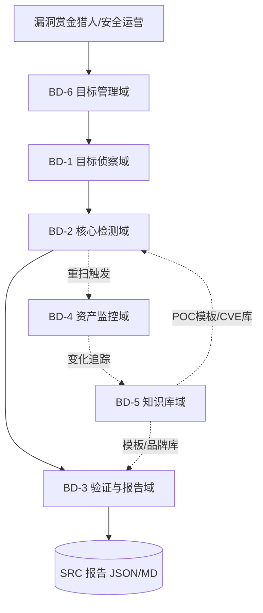
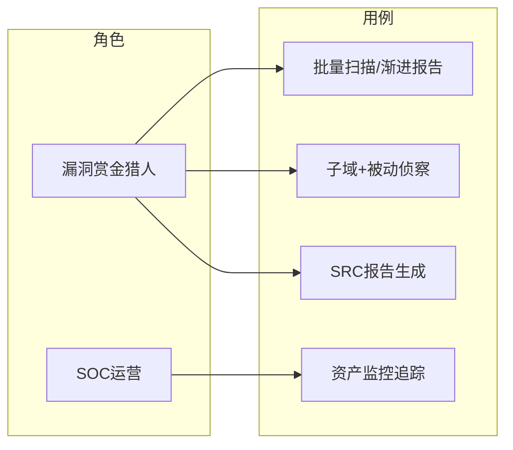
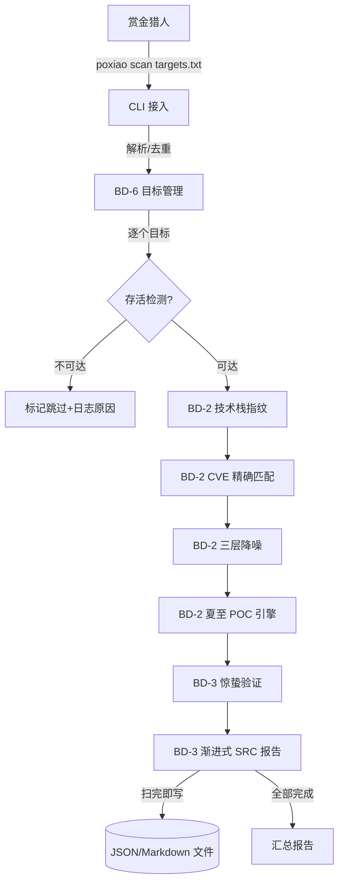
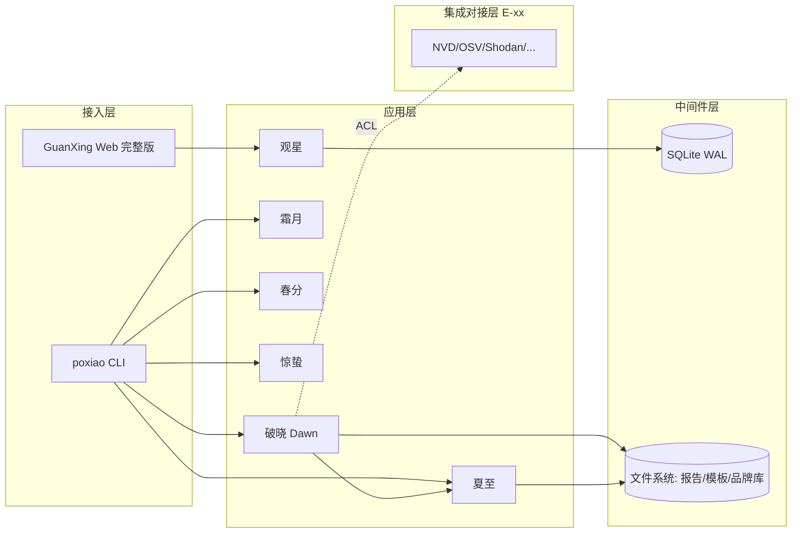
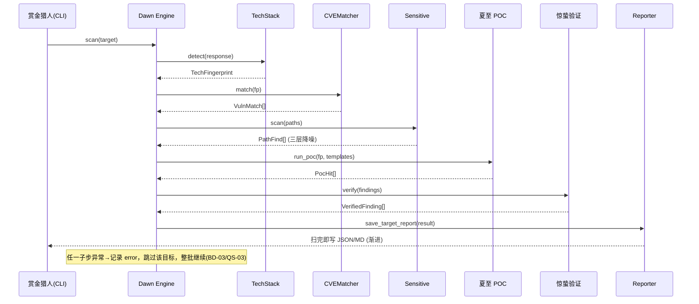
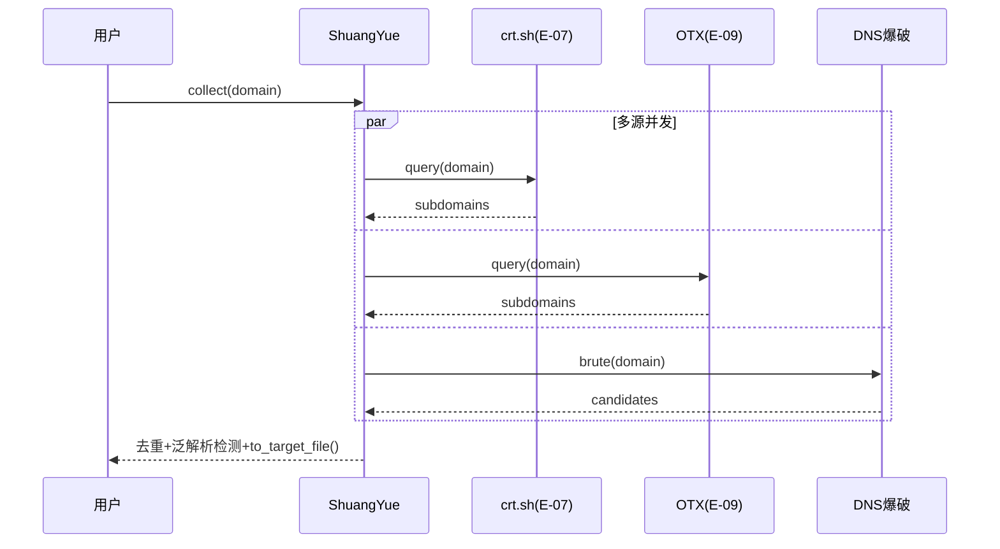
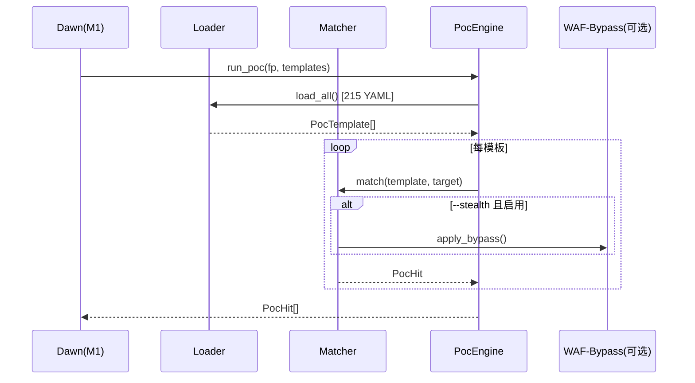

# AICoding 架构设计 · 系统设计

> 本文档为《AICoding 架构设计》核心产物之一，对应**系统架构设计**阶段（Gate G4）。
> 上游输入：《高层架构设计》（G3 已通过，唯一业务边界基线）、《资料摘要 material_digest.md》（G1）、《行业调研报告 research_report.md》（G2）。
> 下游输出：驱动《部署设计》《安全设计》《UserStory》的实施。
> 系统定位：破晓（PoXiao）v3.0.0 —— 二十四节气 SRC 安全工具链，**本地 CLI / 私有化 / 无 SaaS / 无外部依赖**（D5§4.2、D1§10）。

---

## 0. 元信息：修订记录

| 文档版本 | 发布日期 | 修订人 | 修订说明 |
| --- | --- | --- | --- |
| v1.0 | 2026-07-09 | 高见远（system-architect） | 文档初始版本（Phase 4 G4 首轮产出） |

**裁剪说明（按需裁剪章节）**：

| 章节 | 是否启用 | 理由 |
| --- | --- | --- |
| §4.4 缓存与 Key 规范 | 未启用 | X3 冻结禁止 Redis / 外部缓存；全项目无分布式缓存组件，仅使用进程内内存缓存（见 §3.4 跨模块公共能力），无独立缓存中间件 |
| §4.5 数据迁移与兼容性 | 未启用 | 本项目为既有 6 工具代码库 v3.0.0 架构收敛，非替换/重构既有系统，无存量数据迁移；GuanXing 监控库为全新本地 SQLite 单文件，报告为全新文件输出 |

> 其余章节（§1 引言、§2 业务架构、§3.1 应用架构概览、§3.2 模块详细设计、§4.1~§4.3 数据库设计核心三节、§5 部署架构、§7 安全设计、§8 可观测设计）均为不可裁剪章节，全部保留。

---

## 1. 引言

### 1.1 文档目标

- **一句话定位**：本文档定义破晓（PoXiao）v3.0.0 在交付物中的所有架构设计相关产物——业务域划分、模块拆分、接口契约、数据设计（SQLite + JSON/Markdown 文件）、部署形态、安全与可观测设计。
- **读者对象**：架构师 / 开发 / 运维 / 安全 / 评审委员会。
- **设计范围**：业务架构 + 应用架构 + 数据库设计 + 部署架构 + 网络架构 + 安全设计 + 可观测设计。

### 1.2 关联文档清单

| 输入类型 | 内容要点 | 在本文档中的用途 | 形式（外部文档 / 本文档自带） |
| --- | --- | --- | --- |
| 业务需求 | 二十四节气 SRC 工具链业务定位、6 大工具角色、核心链路（指纹 + CVE + 三层降噪 + POC + 报告） | 第 2 章业务架构 | 外部文档《高层架构设计》§1~§6 |
| 非功能性需求 | 30 目标 ≤ 10s、误报率 ≤ 5%、首目标完即出报告、无外部依赖、本地运行 | 第 3.5 / 5 / 7 / 8 章 | 外部文档《高层架构设计》§2.3、§4.3 |
| 系统定位与边界 | 本地 CLI、无 SaaS、无多租户、X1/X2/X3 冻结裁决 | 第 3.1 集成架构 / 第 5 章 | 外部文档《高层架构设计》§4.2 / §4.4 |
| 外部系统 API | NVD / OSV / Shodan / Censys / FOFA / Wayback / crt.sh / certspotter / OTX / GitHub 协议与配额 | 第 3.1.3 / 3.2 模块 | 外部文档 material_digest.md D6§2、D7§2 |
| 行业范式 | Nuclei 模板引擎、httpx 异步、SQLite 监控、三层降噪实践 | 第 3.1.5 技术选型 / 第 3.2 模块 | 外部文档 research_report.md |
| 代码事实基线 | 实际源码模块、215 模板、257 CVE、报告引擎实现 | 第 3.2 / 第 4 章 / 附录 B（Q4/Q5/Q7 决议） | 本文档自带（已逐文件核验 `poxiao/poxiao/src/`） |

### 1.3 名词与术语表

> 业务名 ↔ 代码对象 ↔ 数据表 三层映射唯一索引。

| 业务术语 | 业务定义（≤ 30 字） | 应用层核心对象（§3.3 O-xx） | 数据库表名（§4.2） |
| --- | --- | --- | --- |
| 破晓 Dawn | 核心扫描器，编排指纹/CVE/降噪/报告 | `ScanEngine`（O-01） | —（结果落文件） |
| 夏至 XiaZhi | 隐匿扫描 + Nuclei 风格 POC 引擎 | `PocEngine`（O-02） | — |
| 霜月 FrostMoon | 子域名收集工具 | `ShuangYue`（O-03） | — |
| 春分 VernalEquinox | 被动侦察工具 | `VernalEngine`（O-04） | — |
| 惊蛰 JingZhe | 漏洞验证工具 | `JingZhe`（O-05） | — |
| 观星 GuanXing | 资产监控 Web 仪表盘 | `GuanXingServer`（O-06） | `guanxing_targets` / `guanxing_scans` / `guanxing_changes` |
| 技术栈指纹 | Server/Language/CMS/CDN/WAF 识别结果 | `TechFingerprint`（O-07） | — |
| CVE 匹配结果 | 技术栈+版本→已知漏洞命中 | `VulnMatch`（O-08） | — |
| 扫描目标 | 待扫描的 URL/域名 | `Target`（O-09） | — |
| 监控资产 | GuanXing 追踪的资产记录 | `MonitoredAsset`（O-10） | `guanxing_targets` |
| SRC 报告 | 补天/漏洞盒子格式的可提交漏洞报告 | `SrcReport`（O-11） | —（文件输出） |
| POC 模板 | Nuclei 风格 YAML 检测模板 | `PocTemplate`（O-12） | —（文件：templates/） |

---

## 2. 业务架构

> 本章回答：系统服务什么业务、业务由哪些场景构成、关键流程长什么样。本章不回答技术/部署/建表。

### 2.1 业务架构概览

#### 2.1.1 业务全景图

**业务域清单**（6 个业务域，与第 3 章模块、第 4 章数据分组一致）：

| 业务域 | 核心场景 | 涉及角色 | 与其他业务域的关系 |
| --- | --- | --- | --- |
| BD-1 目标侦察域 | 子域名收集（霜月）、被动侦察（春分）、域名自动发现 | 漏洞赏金猎人 / 安全工程师 | 上游：目标管理域；下游：核心检测域 |
| BD-2 核心检测域 | 技术栈指纹、CVE 精确匹配、三层降噪、夏至 POC 引擎 | 漏洞赏金猎人 / 安全工程师 | 上游：目标侦察域、知识库域；下游：验证与报告域 |
| BD-3 验证与报告域 | 惊蛰漏洞验证、渐进式 SRC 报告（JSON/Markdown） | 漏洞赏金猎人 / SRC 项目负责人 | 上游：核心检测域；消费知识库域模板 |
| BD-4 资产监控域 | GuanXing 资产变化追踪、Web 仪表盘 | 企业安全运营（SOC） | 上游：核心检测域（重扫触发）；依赖知识库域 |
| BD-5 知识库域 | POC 模板 215 / 品牌库 107 / 内置 CVE 257 | 维护者 / 系统内部 | 被 BD-2 / BD-3 / BD-4 共享消费 |
| BD-6 目标管理域 | 多源输入/去重/分类、存活检测、断点续扫 | 漏洞赏金猎人 | 上游：用户；下游：BD-1 / BD-2 |

#### 2.1.2 业务全景图（Mermaid）



### 2.2 领域关系映射

#### 2.2.1 限界上下文清单

| 限界上下文 | 对应业务域 | 域类型 | 覆盖的核心业务实体 | 上下文边界（属于本域 vs 不属于） |
| --- | --- | --- | --- | --- |
| Recon-BC | BD-1 目标侦察域 | 支撑域 | 子域名、被动侦察原始情报（WHOIS/ICP/DNS/证书/IP/Wayback/GitHub） | 属于：侦察数据采集；不属于：漏洞判定（归 Core-BC） |
| Core-BC | BD-2 核心检测域 | 核心域 | 技术栈指纹、CVE 匹配、降噪结果、POC 命中 | 属于：检测与降噪；不属于：资产长期监控（归 Mon-BC） |
| Verify-BC | BD-3 验证与报告域 | 核心域 | 验证结果、SRC 报告 | 属于：报告生成；不属于：模板引擎实现（归 KB-BC） |
| Mon-BC | BD-4 资产监控域 | 支撑域 | 监控资产、扫描记录、变化事件 | 属于：监控状态；不属于：一次性扫描（归 Core-BC） |
| KB-BC | BD-5 知识库域 | 通用域 | POC 模板、品牌库、CVE 库 | 属于：知识存储；不属于：检测逻辑 |
| Target-BC | BD-6 目标管理域 | 通用域 | 目标、存活状态、checkpoint | 属于：目标生命周期；不属于：检测（归 Core-BC） |

**域类型说明**：核心域（Core）= 破晓差异化竞争力（指纹+CVE+降噪+POC+报告）；支撑域（Supporting）= 侦察/监控必要但非差异化；通用域（Generic）= 知识库/目标管理优先复用/自研。

#### 2.2.2 上下文映射（Context Mapping）

> 使用 **5 种关系模式**（Customer/Supplier、ACL、Published Language、Shared Kernel、Conformist），覆盖全部跨域协作。

| 关系编号 | 上游上下文 | 下游上下文 | 关系模式 | 同步方式 | 选择理由 |
| --- | --- | --- | --- | --- | --- |
| C-01 | Recon-BC | Core-BC | Customer/Supplier | 进程内异步函数调用 | 侦察结果为检测提供输入，检测方（Customer）驱动侦察方（Supplier）的数据供给节奏 |
| C-02 | 外部情报 API（NVD/OSV/Shodan…） | Core-BC（CVE 匹配） | ACL 防腐层 | 异步 HTTPS + 适配器 | 外部模型（NVD CPE/OSV 格式）不污染本域，经 `cve_match.py` 适配层转换 |
| C-03 | KB-BC（POC 模板 schema） | Core-BC（夏至引擎） | Published Language | 文件加载（YAML schema） | Nuclei 风格 YAML（id/info/severity/http/matchers）作为对外发布语言，夏至引擎消费 |
| C-04 | Core-BC | Mon-BC | Customer/Supplier | 定时/事件触发重扫 | 监控域作为 Customer，消费核心检测结果触发重扫 |
| C-05 | Core-BC ↔ XiaZhi（同属 Core-BC 内） | Shared Kernel | 共享内核 | 共享 DTO（`TechFingerprint`/`ScanResult`） | 破晓与夏至共享技术栈指纹与扫描结果模型，避免重复定义 |
| C-06 | Core-BC | Verify-BC | Conformist | 进程内数据传递 | 报告域顺从核心检测产出的 `ScanResult` 结构，不另立模型 |

#### 2.2.3 跨域协作原则

| 原则编号 | 原则 |
| --- | --- |
| P-01 | 核心域（Core-BC）→ 支撑域/通用域：禁止反向依赖（Core 不依赖 Mon/KB 内部模型，仅通过 Published Language / 接口消费） |
| P-02 | 核心域之间（Dawn ↔ XiaZhi）：禁止直接耦合，通过 Shared Kernel（`ScanResult`/`TechFingerprint`）解耦 |
| P-03 | 对接外部不可控系统（NVD/OSV/Shodan 等）：必须建 ACL 防腐层（`cve_match.py` / `vernalequinox` 适配器），禁止外部模型贯穿本域 |

### 2.3 详细业务架构

#### 2.3.1 用例图

**用例图清单**：

| 编号 | 用例图标题 | 涉及业务域 | 源文件位置 |
| --- | --- | --- | --- |
| UC-01 | 批量扫描主链路 | BD-6 / BD-2 / BD-3 | 本文档 §2.3.2 BF-01 |
| UC-02 | 子域名与被动侦察 | BD-1 | 本文档 §2.3.2 BF-02 |
| UC-03 | 资产监控与变化追踪（完整版） | BD-4 / BD-5 | 本文档 §2.3.2 BF-03 |
| UC-04 | SRC 报告生成与提交 | BD-3 | 本文档 §2.3.2 BF-01 |



#### 2.3.2 业务流程图

**关键流程清单**（核心业务覆盖度 ≥ 80%）：

| 流程编号 | 流程名 | 起点 | 终点 | 涉及业务域 | 源文件位置 |
| --- | --- | --- | --- | --- | --- |
| BF-01 | 核心扫描主链路（指纹→CVE→降噪→POC→报告） | 目标输入 | SRC 报告文件 | BD-6 / BD-2 / BD-3 | 本文 §3.2.M1 / M6 |
| BF-02 | 侦察与域名发现 | 公司名/目标 | 子域/情报列表 | BD-1 | 本文 §3.2.M2 / M3 |
| BF-03 | 资产监控变化追踪（完整版） | 监控资产 | 变化事件+重扫 | BD-4 / BD-5 | 本文 §3.2.M5 |
| BF-04 | 漏洞验证 | 扫描结果 | 验证后发现 | BD-3 | 本文 §3.2.M4 |

**BF-01 核心扫描主链路（角色泳道图）**：



> 判定节点说明：`存活检测?` 分支条件为 HTTP HEAD/TCP 可达性（超时 5s），不可达目标进入「标记跳过」而非「报错终止」，保障批量任务不中断（对齐 D2§2.2）。

### 2.4 业务范围与边界

#### 2.4.1 功能模块清单

按"功能编号 → 子功能编号"两层，与 §2.1 业务域对应。

| 编号 | 一级功能名 | 子功能描述 | 对应业务域 | 实现状态 |
| --- | --- | --- | --- | --- |
| F1 | 技术栈指纹识别 | Server/Language/CMS/CDN/WAF 指纹 | BD-2 | 完整实现 |
| F2 | CVE 精确匹配 | 内置 257 条 + NVD/OSV 在线查询 | BD-2 | 完整实现 |
| F3 | 三层降噪 | 内容特征 + 尺寸聚类 + 校准匹配 | BD-2 | 完整实现 |
| F4 | Nuclei 风格 POC 引擎 | 215 模板加载匹配，兼容社区模板 | BD-2 | 完整实现 |
| F5 | 渐进式报告输出 | 扫完即出 JSON/Markdown | BD-3 | 完整实现 |
| F6 | 存活检测 | HTTP HEAD / TCP 并发检测 | BD-6 | 完整实现 |
| F7 | 断点续扫 | checkpoint 文件，Ctrl+C 可恢复 | BD-6 | 完整实现 |
| F8 | 域名自动发现 | brands.json 107 + 搜索引擎补充 | BD-6 | 完整实现 |
| F9 | 被动侦察 | WHOIS/ICP/DNS/证书/IP/Wayback/GitHub | BD-1 | 完整实现 |
| F10 | 漏洞验证 | 默认凭据/Git泄露/Swagger/Actuator/配置 | BD-3 | 完整实现 |
| F11 | 子域名收集 | crt.sh/certspotter/OTX/DNS爆破/泛解析 | BD-1 | 完整实现 |
| F12 | SRC 报告一键生成 | 补天/漏洞盒子格式 JSON/Markdown | BD-3 | 完整实现 |
| F13 | 目标管理 | 多源输入/去重/分类 | BD-6 | 完整实现 |
| F-GuanXing | 资产监控 Web 仪表盘 | Flask Web + SQLite 变化追踪/分页 | BD-4 | 完整版（MVP 不含） |
| F-WAF | WAF 绕过（可选） | 可选实验模块，默认关闭 | BD-2 | 完整版（默认关闭） |
| F-HTML | HTML 可视化报告 | 报告 HTML 渲染 | BD-3 | 完整版 |

**In-Scope（本期范围内）**：

| 编号 | 本期必做的事项 |
| --- | --- |
| F1 | 技术栈指纹识别（破晓 Dawn） |
| F2 | CVE 精确匹配（内置 257 + NVD/OSV） |
| F3 | 三层降噪 |
| F4 | Nuclei 风格 POC 引擎（215 模板） |
| F5 | 渐进式报告输出 |
| F6 | 存活检测 |
| F7 | 断点续扫 |
| F8 | 域名自动发现 |
| F9 | 被动侦察 |
| F10 | 漏洞验证 |
| F11 | 子域名收集 |
| F12 | SRC 报告一键生成 |
| F13 | 目标管理 |
| N1 | 非功能：异步优先，30 目标 ≤ 10s 级（基线 7.6s/30 目标） |
| N2 | 非功能：无外部依赖（不引入 Docker/Redis/外部 DB），全本地运行 |

**Out-of-Scope（本期不做）**：

| 编号 | 不做的事项 | 不做的原因 | 未来归属 |
| --- | --- | --- | --- |
| O1 | 资产监控 Web 仪表盘（GuanXing 完整监控）纳入 MVP | MVP 核心链路为检测与报告；监控为持续运营能力，可后置且不改变主链路 | 完整版（W9~W16）启用 Flask Web，复用 SQLite |
| O2 | WAF 绕过作为核心能力 | 行业主流（Nuclei/httpx/Acunetix）均不将绕过作核心；X2 冻结为可选实验模块、默认关闭 | 完整版可选插件，默认关闭 |
| O3 | SaaS / 云服务形态 | 与「本地 CLI + 无外部依赖 + 数据不出境」定位根本冲突 | 永不做 |
| O4 | HTML 可视化报告（首版） | JSON/Markdown 已满足 SRC 提交与机器可读 | 完整版可选 |
| O5 | 多租户 / 团队协作 / 云端资产库 | 单机本地运行、数据不出本机（D5§4.2） | 永不做 |

#### 2.4.2 功能优先级与柔性分层（见 §2.5.2）

### 2.5 质量与柔性可用

#### 2.5.1 服务质量目标

**质量目标 Top 5**（按 ISO 25010 排序，落到可验证场景）：

| 优先级 | 质量目标 | 业务驱动 | 受影响的关键章节 |
| --- | --- | --- | --- |
| Q1 | 效率：单批 30 目标端到端 ≤ 10s | 赏金猎人批量扫描体验（基线 7.6s/30） | §3.1.5 / §3.5.4 / §5.5 |
| Q2 | 准确性：误报率 ≤ 5% | 高置信度可提交 SRC（RayScan 基线 94%） | §3.2.M1（三层降噪） / §8.1 |
| Q3 | 可维护性：新人 1 周上手 | 团队规模小、开源协作 | §3.1.4 / §3.3 |
| Q4 | 合规性：数据不出本机、本地运行 | 甲方决策者 ROI 与合规可控 | §5 / §6 / §7 |
| Q5 | 可靠性：单目标失败不中断整批 | 批量任务稳健性（D2§2.3） | §3.2.M1 / §8.4 |

**可验证质量场景**：

| 场景编号 | 关联目标 | 触发源 | 触发条件 | 期望响应 | 度量指标 |
| --- | --- | --- | --- | --- | --- |
| QS-01 | Q1 | 批量扫描 30 目标 | `poxiao scan targets_30.txt` | 端到端 ≤ 10s 完成 | P95 ≤ 10s |
| QS-02 | Q2 | 全量扫描后统计 | 降噪后结果核对 | 误报率 ≤ 5% | 误报率 = 假阳性/总发现 ≤ 5% |
| QS-03 | Q5 | 单个目标超时/异常 | 某目标连接重置 | 跳过并记录，其余继续 | 整批中断率 = 0 |

#### 2.5.2 业务柔性可用策略

**业务功能优先级分层**（每个一级功能显式标注层级）：

| 层级 | 含义 | 故障态下的处置方向 | 用户感知 |
| --- | --- | --- | --- |
| L0 核心业务 | 系统生命线 | 不降级，优先保障 | 无 |
| L1 重要业务 | 高频使用 | 限流+异步 | 变慢/排队提示 |
| L2 辅助业务 | 提升体验 | 关闭/兜底 | 部分不可用+提示 |
| L3 附加业务 | 长尾 | 关闭 | 通常无感 |

**功能分层映射**：

| 功能 | 层级 | 说明 |
| --- | --- | --- |
| F1 技术栈指纹 / F2 CVE / F3 降噪 / F4 POC / F5 报告 / F6 存活 / F7 续扫 / F13 目标管理 | L0 | 核心扫描主链路，挂掉即业务停摆 |
| F9 被动侦察 / F10 验证 / F11 子域 / F12 SRC报告 / F8 域名发现 | L1 | 重要，失败可降级跳过单源 |
| F-GuanXing 监控 / F-HTML 报告 | L2 | 完整版辅助能力 |
| F-WAF 绕过 | L3 | 可选实验，默认关闭 |

**业务降级清单**：

| 编号 | 关联功能 | 触发条件 | 降级动作 | 用户感知 | 决策类型 |
| --- | --- | --- | --- | --- | --- |
| BD-01 | F2 CVE 在线查询 | NVD/OSV API 超时/限流 | 仅用本地 257 CVE 库，跳过在线补全 | 覆盖略降但仍可扫 | 自动 |
| BD-02 | F9 被动侦察 | 单情报源（Shodan/FOFA）限流 | 跳过该源，用其余源 | 情报略少 | 自动 |
| BD-03 | F4 POC 引擎 | 单模板执行异常 | 记录失败模板，继续其余 | 个别模板未跑 | 自动 |

---

## 3. 应用架构

> 本章回答：系统由哪些模块组成、模块与外部系统怎么集成、每个模块的内部交互链路。本章是系统设计核心，占全文 40%~50%。

### 3.1 应用架构概览

#### 3.1.1 系统上下文

**系统上下文要素清单**（本系统为单一节点，不展开内部组件）：

| 节点类型 | 节点名 | 与本系统的关系 | 关系语义 |
| --- | --- | --- | --- |
| 角色 | 漏洞赏金猎人 / 安全工程师 | 使用 | CLI 终端操作 |
| 角色 | 企业安全运营（SOC） | 使用 | GuanXing Web 仪表盘（完整版） |
| 角色 | SRC 项目负责人 | 使用 | 报告审阅 / 选型 |
| 外部业务系统 | 补天 / 漏洞盒子 | 本系统 → 推送（人工） | 报告人工提交 |
| 第三方平台（E-xx） | NVD / OSV / Shodan / Censys / FOFA / Wayback / crt.sh / certspotter / OTX / GitHub | 本系统 → 调用 | 情报/证书/子域查询 |
| 下游平台 | 本地报告文件 / GuanXing SQLite | 本系统 → 写出 | 结果持久化 |

#### 3.1.2 系统模块图

分层架构（接入层 → 应用层 → 中间件层 → 集成对接层），适配本地 CLI 形态：

**分层组件清单**：

| 层次 | 内容 | 数据来源 |
| --- | --- | --- |
| 接入层 | CLI 终端（`poxiao` 及 5 个独立工具命令）、GuanXing Web 仪表盘（完整版，127.0.0.1:5099） | §2.3 用例图角色 |
| 应用层 | M1 破晓 Dawn / M2 霜月 / M3 春分 / M4 惊蛰 / M5 观星 / M6 夏至（对应 §3.2） | §2.1 / §3.2 |
| 中间件层 | 本地 SQLite（GuanXing 监控，WAL）、文件系统（报告/模板/品牌库）、进程内缓存（正则/模板预编译） | 本文 §4 / §3.4 |
| 集成对接层 | 外部情报 API 适配（E-xx，ACL 防腐层）、POC 模板加载器 | §3.1.3 外部依赖 |

**系统模块图（Mermaid）**：



> 每条线标注协议：CLI→模块 = 进程内 argparse 命令分发；模块→SQLite = `sqlite3` 同步；模块→文件系统 = 本地文件读写；模块→E-xx = 异步 HTTPS（ACL 适配）。无 MQ / 无 gRPC（本地 CLI，无分布式）。

#### 3.1.3 集成架构

##### 外部依赖清单（E-xx）

| ID | 外部系统 | 归属团队 / 供应商 | 类别 | 使用方式 | 集成方式 | 协议 / 版本 | 功能定位（≤ 30 字） | 联系人 |
| --- | --- | --- | --- | --- | --- | --- | --- | --- |
| E-01 | NVD API | NIST | 第三方业务平台 | 消费 | REST API | v2.0 | CVE 在线补全查询 | 维护者 |
| E-02 | OSV API | Google OSV | 第三方业务平台 | 消费 | REST API | v1 | CVE/漏洞在线查询 | 维护者 |
| E-03 | Shodan API | Shodan | 第三方业务平台 | 消费 | REST API | v1 | IP/域名情报 | 维护者 |
| E-04 | Censys API | Censys | 第三方业务平台 | 消费 | REST API | v1 | 证书/IP 情报 | 维护者 |
| E-05 | FOFA API | 华顺信安 | 第三方业务平台 | 消费 | REST API | v1 | 资产/域名情报 | 维护者 |
| E-06 | Wayback Machine | Internet Archive | 第三方业务平台 | 消费 | REST API | CDX | 历史 URL 情报 | 维护者 |
| E-07 | crt.sh | 证书透明日志 | 第三方业务平台 | 消费 | REST/JSON | — | 子域名证书查询 | 维护者 |
| E-08 | certspotter | 证书透明 | 第三方业务平台 | 消费 | REST API | v1 | 子域证书监控 | 维护者 |
| E-09 | OTX（AlienVault） | AT&T | 第三方业务平台 | 消费 | REST API | v1 | 情报/子域 | 维护者 |
| E-10 | GitHub Search API | GitHub | 第三方业务平台 | 消费 | REST API | v3 | 代码泄露检索 | 维护者 |

**填写要求**：类别取值封闭枚举（第三方业务平台）；使用方式均为「消费」（本系统调用对方）；集成方式为 REST API（HTTPS 异步）。

##### 云组件 / 基础设施清单（C-xx）

> **本项目无云组件 / 中间件**（X3 冻结禁止 Redis / 外部 DB / 容器编排，守「无外部依赖」）。下表为空，相关能力由本地 SQLite 单文件 + 文件系统 + 进程内缓存承载（见 §4、§3.4）。

| ID | 组件类别 | 选型 | 部署形态 | 规格量级 | 容量预估 | 提供方 / SLA | 用途 |
| --- | --- | --- | --- | --- | --- | --- | --- |

（无云组件 —— 本地 CLI 形态，不引入任何 C-xx 中间件。）

##### 组件依赖关系

| 业务模块（§3.2） | 依赖的外部系统（E-xx） | 依赖的云组件（C-xx） | 故障传导风险 |
| --- | --- | --- | --- |
| M1 破晓 Dawn | E-01/E-02（CVE 在线） | 无 | E-01/E-02 超时 → 降级为本地 257 CVE 库（BD-01） |
| M2 霜月 | E-07/E-08/E-09 | 无 | 单源失败 → 跳过该源（BD-02） |
| M3 春分 | E-03/E-04/E-05/E-06/E-10 | 无 | 单源限流 → 跳过（BD-02） |
| M4 惊蛰 | 无 | 无 | 无外部依赖 |
| M5 观星 | 无 | 本地 SQLite（非 C-xx） | SQLite 损坏 → 监控不可用，主链路不受影响 |
| M6 夏至 | 无（模板本地） | 无 | 模板加载失败 → 跳过该模板 |

#### 3.1.4 工程结构

破晓为 Python 异步 CLI 项目，物理组织如下（基于 `poxiao/poxiao/` 实际结构）：

```
poxiao/                        # 项目根
├── pyproject.toml             # 双入口：poxiao + 5 工具
├── configs/
│   ├── default_config.yaml    # 默认配置
│   └── brands.json            # 补天品牌库 107
├── templates/                 # POC 模板库 215（Nuclei 风格 YAML）
│   ├── cves/ default-logins/ exposures/ misconfig/ vulnerabilities/
├── data/                      # SRC 目标列表 / 未命中样本
└── src/
    ├── cli.py                 # 统一 CLI（argparse，12 子命令）
    ├── commands/              # check/config/discover/monitor/poc/recon/report/scan/stealth/subdomain/util/verify
    ├── config.py              # 统一配置单例 Config
    ├── target/                # manager.py（目标管理）/ discovery.py（域名发现）
    ├── utils/                 # banner/output/help/crypto_tools/win_utf8
    ├── dawn/                  # 核心扫描器（M1 内部 7 模块）
    │   ├── engine.py          # 编排
    │   ├── tech_stack.py      # 指纹
    │   ├── cve_match.py       # CVE 匹配（257 内置）
    │   ├── sensitive.py       # 敏感路径 + 降噪
    │   ├── version_extract.py # 版本提取
    │   ├── reporter.py        # JSON/Markdown 报告
    │   └── src_reporter.py    # SRC 报告（补天/漏洞盒子/CNVD）
    ├── frostmoon/             # M2 子域收集（collector.py）
    ├── vernalequinox/         # M3 被动侦察（10 模块）
    ├── jingzhe/               # M4 漏洞验证（jingzhe.py）
    ├── guanxing/              # M5 资产监控（db.py/web.py/poc_store.py）
    └── xiazhi/                # M6 隐匿扫描+POC 引擎（10 模块，含 waf_bypass.py 可选）
```

**公共模块与依赖方向**：`src/utils/`、`src/config.py`、`src/target/` 为公共基础，业务模块（dawn/frostmoon/...）依赖公共模块，禁止反向依赖。

#### 3.1.5 技术选型（版本约束）

| 技术分类 | 选型 | 版本 | 备注 / 选型理由 |
| --- | --- | --- | --- |
| 后端语言 | Python | 3.10+（requires-python>=3.10） | 上游冻结「Python 3.10+」；与现有 6 工具代码一致 |
| 异步 HTTP | httpx | >=0.27.0 | 选 httpx 不选 requests：原生 async 支持异步优先（D1§10①），契合指纹/CDN/WAF 并发探测；requests 无 async |
| DNS 解析 | dnspython | >=2.6.0 | 选 dnspython 不选 aiodns：功能全、同步/异步皆可用，满足子域/泛解析检测 |
| HTML 解析 | beautifulsoup4 + lxml | >=4.12.0 / >=5.1.0 | 选 BS4 不选 lxml 单独：BS4 API 友好，lxml 为解析后端提速 |
| 配置 | PyYAML | >=6.0 | 选 YAML 不选 TOML：上游默认配置即 YAML（D1§6），与 config.yaml 一致 |
| Web（仅 GuanXing） | Flask + Bootstrap 5 | >=3.0.0 | 选 Flask 不选 FastAPI：轻量、单文件 Web 仪表盘足矣，无 ASGI 复杂度的必要 |
| 报告引擎 | Python 标准库（json + f-string/字符串模板） | 内置 | 选 stdlib 字符串模板**不选 Jinja2**：pyproject 无 Jinja2 依赖（D6§1），且守「无外部依赖」（D1§10②）；报告为结构化 JSON + Markdown，stdlib 已满足（见附录 B-Q5） |
| 数据库（监控） | SQLite（WAL） | 内置（Python sqlite3） | 选 SQLite 不选 PostgreSQL：X3 冻结守无外部依赖，变化追踪/分页用单文件即可（reNgine 式 PG 被否决） |
| 持久化（报告） | 文件系统 JSON / Markdown | 内置 | 选文件不选 DB：报告为人读/机读导出，Nuclei 同范式（SR-01） |
| 测试 | pytest + pytest-asyncio | >=8.0 / >=0.24 | dev 依赖，验证异步模块 |

**填写要求**：每项有版本号；选型理由一句话说明「为什么选 A 不选 B」。

### 3.2 模块详细设计

> 核心方法论：画业务逻辑在角色和系统间流动的过程。先在 §3.2.1/§3.2.2 给公共约束与模块清单，再按五段式逐模块展开。

#### 3.2.1 模块公共约束（Common）

**通信方式约束**：

| 约束项 | 取值 |
| --- | --- |
| 接口路径风格 | 进程内 Python 函数调用 + CLI 子命令（非 RESTful 网络服务；本地 CLI 形态） |
| 协议 | 进程内 asyncio 调用；CLI=argparse；外部=HTTPS（E-xx） |
| 数据格式 | JSON（报告/API 响应）/ YAML（模板/配置）/ Python DTO（模块间） |
| 字符编码 | UTF-8（含 GBK 兼容，见 utils/win_utf8） |

**通用基础结构**：

| 基类 / 结构 | 用途 | 包路径 |
| --- | --- | --- |
| `ScanResult` | 单目标扫描结果聚合 DTO | `src.dawn.engine` |
| `TechFingerprint` | 技术栈指纹 DTO | `src.dawn.tech_stack` |
| `VulnMatch` | CVE 匹配结果 DTO | `src.dawn.cve_match` |
| `Config`（单例） | 统一配置（CLI>env>文件>默认） | `src.config` |
| `Out` | 统一终端输出（含 Windows UTF-8 修复） | `src.utils.output` |

#### 3.2.2 模块清单与编号规则

**模块清单**：

| 编号 | 模块名 | 业务域（§2.1） | 模块负责人 | 关联子领域 |
| --- | --- | --- | --- | --- |
| M1 | 破晓 Dawn（核心扫描器） | BD-2 | 高见远 | 指纹/CVE/降噪/报告编排 |
| M2 | 霜月 FrostMoon（子域名收集） | BD-1 | 高见远 | 子域发现 |
| M3 | 春分 VernalEquinox（被动侦察） | BD-1 | 高见远 | 被动情报 |
| M4 | 惊蛰 JingZhe（漏洞验证） | BD-3 | 高见远 | 验证 |
| M5 | 观星 GuanXing（资产监控） | BD-4 | 高见远 | 监控（完整版） |
| M6 | 夏至 XiaZhi（隐匿扫描 + POC 引擎） | BD-2 | 高见远 | POC 引擎 |

> M1 内部含 7 个协作子模块（engine/tech_stack/cve_match/sensitive/version_extract/reporter/src_reporter），在 §3.2.M1 内统一描述。

#### 3.2.3 单模块设计模板（五段式）

> 见模板规范：每个模块在 §3.2.M{N} 下按 `.1 模块概述 / .2 接口清单 / .3 关键结构定义 / .4 模块逻辑时序图 / .5 关键流程逻辑` 五段展开。公共约束不重复声明。

#### 3.2.M1 破晓 Dawn（核心扫描器）

> 覆盖 BD-2 核心检测域与 BD-3 报告产出；内部编排 tech_stack/cve_match/sensitive/version_extract/reporter/src_reporter。

##### §3.2.M1.1 模块概述

- **位置**：核心扫描主链路（BF-01）的编排中心，串联指纹 → CVE → 降噪 → POC（M6）→ 验证（M4）→ 报告。
- **涉及角色**：漏洞赏金猎人 / 安全工程师（CLI）。
- **内外部系统**：上游 BD-6 目标管理、BD-1 侦察结果；下游 M6 夏至（POC）、M4 惊蛰（验证）、文件系统（报告）；外部 E-01/E-02（CVE 在线，经 ACL）。

##### §3.2.M1.2 接口清单

> 接口以 CLI 子命令 + 进程内函数暴露；幂等性见 §3.5.2。

| 子领域 | 方法 | 路径/命令 | 用途（≤ 20 字） | 请求 DTO | 响应 VO | 幂等 |
| --- | --- | --- | --- | --- | --- | --- |
| 扫描 | 命令 | `poxiao scan {targets}` | 批量扫描+渐进报告 | `ScanRequest` | `ScanResult`(文件) | 是（checkpoint） |
| 指纹 | 函数 | `TechStackDetector.detect()` | 技术栈识别 | `http.Response` | `TechFingerprint` | 天然 |
| CVE | 函数 | `CVEMatcher.match()` | CVE 精确匹配 | `TechFingerprint` | `VulnMatch[]` | 天然 |
| 降噪 | 函数 | `SensitivePathDetector.scan()` | 敏感路径+三层降噪 | `Target` | `PathFind[]` | 天然 |
| 报告 | 函数 | `Reporter.save_target_report()` | 单目标报告写出 | `ScanResult` | 文件路径 | 是（覆盖写） |
| SRC报告 | 函数 | `SRCReporter.generate()` | 补天/漏洞盒子格式 | `ScanResult` | 文件路径 | 是（覆盖写） |

##### §3.2.M1.3 关键结构定义（DTO）

**ScanResult（聚合 DTO，节选）**：

```python
@dataclass
class ScanResult:
    target_url: str
    host: str = ""
    alive: bool = False
    status_code: int = 0
    duration_sec: float = 0.0
    tech: dict = field(default_factory=dict)          # 非空技术栈字段
    tech_tags: list[str] = field(default_factory=list)
    versions: dict = field(default_factory=dict)       # component -> version
    cve_matches: list[dict] = field(default_factory=list)  # {cve, severity, description}
    sensitive_paths: list[dict] = field(default_factory=list)
    error: str = ""
```

**关键字段定义表**：

| DTO / VO 名 | 字段名 | 类型 | 必填 | 业务含义 | 约束 / 默认值 |
| --- | --- | --- | --- | --- | --- |
| `ScanResult` | `target_url` | str | 是 | 待扫描目标 URL | http/https/裸域名自动补全 |
| `ScanResult` | `alive` | bool | 是 | 存活状态 | 由 F6 存活检测决定 |
| `ScanResult` | `cve_matches` | list | 否 | CVE 命中列表 | 来自内置 257 + 在线 |
| `ScanResult` | `sensitive_paths` | list | 否 | 敏感路径发现 | 经三层降噪过滤 |
| `TechFingerprint` | `server/language/cms/cdn/waf` | str | 否 | 技术栈各维度 | 非空才入 `known` |
| `VulnMatch` | `cve_id` | str | 是 | CVE 编号 | 如 CVE-2021-44228 |

##### §3.2.M1.4 模块逻辑时序图

**时序图清单**：

| 编号 | 标题 | 场景类别 | 是否包含异常分支 |
| --- | --- | --- | --- |
| SQ-01 | Dawn - 单目标扫描编排 | 核心实体执行 | 是（目标超时/异常跳过） |
| SQ-02 | Dawn - 渐进报告写出 | 核心动作触发 | 是（写文件失败） |

**SQ-01 Dawn - 单目标扫描编排（Mermaid）**：



##### §3.2.M1.5 关键流程逻辑

**核心扫描编排（伪代码）**：

```
触发：poxiao scan targets.txt

Step 1: 目标加载（BD-6）
  ├── 解析多源输入 → 去重 → 分类
  └── 状态变更：写入 checkpoint（F7 续扫锚点）

Step 2: 逐目标异步扫描（asyncio.gather，并发=scan.concurrency）
  ├── F6 存活检测：HTTP HEAD/TCP，超时 5s → 不可达标记跳过
  ├── F1 技术栈指纹：tech_stack.detect()
  ├── F2 CVE 匹配：cve_match.match() [本地257 + (在线 E-01/E-02 失败则降级 BD-01)]
  ├── F3 三层降噪：sensitive 6 层降噪（内容特征/尺寸聚类/校准匹配…）
  ├── F4 夏至 POC：xiazhi.run_poc() [215 模板]
  ├── F10 验证：jingzhe.verify()
  └── F5 渐进报告：reporter.save_target_report() 扫完即写

Step 3: 汇总
  └── reporter.save_summary() + save_markdown()
```

**状态机（目标扫描生命周期）**：

| 起始状态 | 触发事件 | 终止状态 | 触发条件 / 校验 | 副作用 |
| --- | --- | --- | --- | --- |
| PENDING | start | SCANNING | 进入并发队列 | 写 checkpoint |
| SCANNING | alive | FINGERPRINTING | 存活检测通过 | — |
| SCANNING | unreachable | SKIPPED | 不可达 | 日志标记原因 |
| FINGERPRINTING | done | MATCHING | 指纹完成 | — |
| MATCHING | done | DENOISING | CVE/敏感完成 | — |
| DENOISING | done | REPORTING | 降噪完成 | — |
| REPORTING | saved | DONE | 报告写出 | 更新 checkpoint=完成 |
| SCANNING | error | ERROR | 异常捕获 | 记录 error，整批继续 |

#### 3.2.M2 霜月 FrostMoon（子域名收集）

##### §3.2.M2.1 模块概述

- **位置**：BD-1 目标侦察域，子域名收集场景。
- **涉及角色**：漏洞赏金猎人 / 安全工程师。
- **内外部系统**：外部 E-07(crt.sh)/E-08(certspotter)/E-09(OTX)；DNS 爆破（本地）；下游 BD-6 目标管理。

##### §3.2.M2.2 接口清单

| 子领域 | 方法 | 路径/命令 | 用途 | 请求 DTO | 响应 VO | 幂等 |
| --- | --- | --- | --- | --- | --- | --- |
| 子域 | 命令 | `frostmoon {domain}` / `poxiao subdomain` | 子域收集 | `DomainInput` | `Subdomain[]` | 天然 |
| 子域 | 函数 | `ShuangYue.collect()` | 多源聚合收集 | `DomainInput` | `Subdomain[]` | 天然 |

##### §3.2.M2.3 关键结构定义（DTO）

```python
@dataclass
class Subdomain:
    domain: str
    source: str        # crt.sh / certspotter / OTX / dns-brute
    wildcard: bool = False   # 泛解析检测
```

##### §3.2.M2.4 模块逻辑时序图

| 编号 | 标题 | 场景类别 | 异常分支 |
| --- | --- | --- | --- |
| SQ-01 | FrostMoon - 子域聚合 | 核心动作执行 | 是（单源失败跳过） |

**SQ-01（Mermaid）**：



##### §3.2.M2.5 关键流程逻辑

> 多源并发收集，单源失败降级跳过（BD-02）；含泛解析检测避免误报。无复杂状态机，省略状态机表。

#### 3.2.M3 春分 VernalEquinox（被动侦察）

##### §3.2.M3.1 模块概述

- **位置**：BD-1 目标侦察域，被动侦察场景（WHOIS/ICP/DNS/证书/IP/Wayback/GitHub）。
- **涉及角色**：漏洞赏金猎人 / 安全工程师。
- **内外部系统**：外部 E-03~E-06/E-10；下游 BD-2 核心检测。

##### §3.2.M3.2 接口清单

| 子领域 | 方法 | 路径/命令 | 用途 | 请求 DTO | 响应 VO | 幂等 |
| --- | --- | --- | --- | --- | --- | --- |
| 侦察 | 命令 | `vernalequinox {target}` / `poxiao recon` | 被动侦察 | `TargetInput` | `ReconIntel` | 天然 |
| 侦察 | 函数 | `VernalEngine.run()` | 10 模块编排 | `TargetInput` | `ReconIntel` | 天然 |

##### §3.2.M3.3 关键结构定义（DTO）

```python
@dataclass
class ReconIntel:
    target: str
    whois: dict
    icp: dict          # 备案信息
    certs: list        # 证书透明度
    ips: list          # IP 情报
    wayback: list      # 历史 URL
    github_leaks: list # 代码泄露
```

##### §3.2.M3.4 模块逻辑时序图

| 编号 | 标题 | 场景类别 | 异常分支 |
| --- | --- | --- | --- |
| SQ-01 | VernalEquinox - 被动侦察编排 | 核心动作执行 | 是（单源限流跳过） |

（Mermaid 略，结构同 M2：10 子模块并发，单源失败降级。）

##### §3.2.M3.5 关键流程逻辑

> 10 子模块（cdn_detect/censys_query/cert_info/dns_records/engine/github_leak/icp_query/ip_info/wayback/whois_lookup）并发编排，单源限流降级（BD-02）。无复杂状态机，省略。

#### 3.2.M4 惊蛰 JingZhe（漏洞验证）

##### §3.2.M4.1 模块概述

- **位置**：BD-3 验证与报告域，漏洞验证场景（默认凭据/Git泄露/Swagger/Actuator/配置）。
- **涉及角色**：漏洞赏金猎人 / 安全工程师。
- **内外部系统**：消费 M1 扫描结果（Conformist，C-06）；无外部依赖。

##### §3.2.M4.2 接口清单

| 子领域 | 方法 | 路径/命令 | 用途 | 请求 DTO | 响应 VO | 幂等 |
| --- | --- | --- | --- | --- | --- | --- |
| 验证 | 命令 | `jingzhe {url}` / `poxiao verify -f result.json` | 漏洞验证 | `ScanResult` / URL | `VerifiedFinding` | 天然 |
| 验证 | 函数 | `JingZhe.verify()` | 多维验证+评分 | `ScanResult` | `VerifiedFinding[]` | 天然 |

##### §3.2.M4.3 关键结构定义（DTO）

```python
@dataclass
class VerifiedFinding:
    severity: str      # critical/high/medium/low/info
    url: str
    evidence: str
    score: int         # JingZhe.score() 风险评分
```

##### §3.2.M4.4 模块逻辑时序图

| 编号 | 标题 | 场景类别 | 异常分支 |
| --- | --- | --- | --- |
| SQ-01 | JingZhe - 漏洞验证 | 核心动作执行 | 是（验证请求失败） |

（Mermaid 略：输入 ScanResult → 多维验证 → 输出 VerifiedFinding[]。）

##### §3.2.M4.5 关键流程逻辑

> 输入扫描结果，对默认凭据/Git泄露/Swagger/Actuator/配置检测逐项验证，`score()` 风险评分。无复杂状态机，省略。

#### 3.2.M5 观星 GuanXing（资产监控）【完整版，MVP 不含】

##### §3.2.M5.1 模块概述

- **位置**：BD-4 资产监控域，变化追踪与 Web 仪表盘。
- **涉及角色**：企业安全运营（SOC）。
- **内外部系统**：SQLite（WAL，guanxing.db）；Flask Web（127.0.0.1:5099）；上游 M1 重扫触发（C-04）。

##### §3.2.M5.2 接口清单

| 子领域 | 方法 | 路径/命令 | 用途 | 请求 DTO | 响应 VO | 幂等 |
| --- | --- | --- | --- | --- | --- | --- |
| 监控 | 命令 | `guanxing serve` | 启动 Web 仪表盘 | — | — | — |
| 监控 | 命令 | `guanxing import` | 导入扫描摘要 | `SummaryFile` | — | 是 |
| 监控 | 命令 | `guanxing stats` | 统计概览 | — | `Stats` | 天然 |
| 数据 | Web | `GET /api/targets` | 资产列表（分页） | — | `TargetPage` | 天然 |

##### §3.2.M5.3 关键结构定义（DTO）

```python
@dataclass
class MonitoredAsset:
    id: int
    host: str
    last_scan_id: int
    change_count: int
```

##### §3.2.M5.4 模块逻辑时序图

| 编号 | 标题 | 场景类别 | 异常分支 |
| --- | --- | --- | --- |
| SQ-01 | GuanXing - 变化追踪 | 核心动作执行 | 是（SQLite 写入失败） |

（Mermaid 略：import 摘要 → 比对历史 → 记录 changes → Web 展示。）

##### §3.2.M5.5 关键流程逻辑

> 导入扫描摘要 → 与历史比对 → 变化事件入 `guanxing_changes` → Web 展示；定时/事件触发 M1 重扫（C-04）。无复杂状态机，省略。

#### 3.2.M6 夏至 XiaZhi（隐匿扫描 + POC 引擎）

##### §3.2.M6.1 模块概述

- **位置**：BD-2 核心检测域，POC 引擎 + 隐匿扫描；为 M1 的 POC 执行方（Shared Kernel C-05）。
- **涉及角色**：漏洞赏金猎人 / 安全工程师。
- **内外部系统**：上游 KB-BC POC 模板（Published Language C-03，215 模板）；可选 `--stealth` 挂载 waf_bypass（X2 默认关闭）；无外部依赖。

##### §3.2.M6.2 接口清单

| 子领域 | 方法 | 路径/命令 | 用途 | 请求 DTO | 响应 VO | 幂等 |
| --- | --- | --- | --- | --- | --- | --- |
| POC | 命令 | `xiazhi scan` / `poxiao poc` | POC 扫描 | `PocRequest` | `PocHit[]` | 天然 |
| POC | 函数 | `PocEngine.run()` | 模板加载+匹配 | `TechFingerprint` | `PocHit[]` | 天然 |
| 隐匿 | 命令 | `xiazhi --stealth` | 隐匿模式（可选 WAF绕过） | — | — | — |
| 模板 | 函数 | `loader.load_all()` | 加载 215 模板 | — | `PocTemplate[]` | 天然 |

##### §3.2.M6.3 关键结构定义（DTO）

```python
@dataclass
class PocTemplate:
    id: str
    info: dict          # {name, severity, description, tags, author}
    http: dict          # {method, path, matchers-condition, matchers[]}
    severity: str       # critical/high/medium/low/info

@dataclass
class PocHit:
    template_id: str
    url: str
    matched: bool
    severity: str
```

##### §3.2.M6.4 模块逻辑时序图

| 编号 | 标题 | 场景类别 | 异常分支 |
| --- | --- | --- | --- |
| SQ-01 | XiaZhi - POC 引擎执行 | 核心动作执行 | 是（单模板异常跳过 BD-03） |

**SQ-01（Mermaid）**：



##### §3.2.M6.5 关键流程逻辑

> 加载 215 Nuclei 风格模板（schema 对齐 Nuclei，C-03）→ 按技术栈筛选 → matcher 执行 → 单模板异常跳过（BD-03）。`--stealth` 可选挂载 waf_bypass，**默认关闭**（X2）。无复杂状态机，省略。

### 3.3 核心业务对象清单

#### 3.3.1 对象定义

| 编号 | 对象名（代码类名） | 对象类型 | 包路径 | 模块归属 | 被哪些模块复用 | 实例化策略 | 序列化约定 | 持久化策略 |
| --- | --- | --- | --- | --- | --- | --- | --- | --- |
| O-01 | `ScanEngine` | 聚合根 | `src.dawn.engine` | M1 | M1/M6 | 单例编排 | JSON | 结果落文件 |
| O-02 | `PocEngine` | 聚合根 | `src.xiazhi.poc_engine` | M6 | M1 | 单例 | JSON | 落文件 |
| O-03 | `ShuangYue` | 实体 | `src.frostmoon.collector` | M2 | M2 | new | JSON | 落文件 |
| O-04 | `VernalEngine` | 聚合根 | `src.vernalequinox.engine` | M3 | M3 | 单例 | JSON | 落文件 |
| O-05 | `JingZhe` | 实体 | `src.jingzhe.jingzhe` | M4 | M4 | new | JSON | 落文件 |
| O-06 | `GuanXingServer` | 聚合根 | `src.guanxing` | M5 | M5 | 单例 | SQLite | guanxing.db |
| O-07 | `TechFingerprint` | 值对象 | `src.dawn.tech_stack` | M1 | M1/M6（Shared Kernel C-05） | new（不可变） | JSON | 落文件 |
| O-08 | `VulnMatch` | 值对象 | `src.dawn.cve_match` | M1 | M1 | new | JSON | 落文件 |
| O-09 | `Target` | 实体 | `src.target.manager` | BD-6 | M1/M2/M3 | new | JSON | checkpoint 文件 |
| O-10 | `MonitoredAsset` | 实体 | `src.guanxing.db` | M5 | M5 | 由聚合根创建 | SQLite row | `guanxing_targets` |
| O-11 | `SrcReport` | 值对象 | `src.dawn.src_reporter` | M1 | M1 | new | JSON/MD | 落文件 |
| O-12 | `PocTemplate` | 值对象 | `src.xiazhi.loader` | M6 | M6 | 加载即不可变 | YAML | templates/ 文件 |

#### 3.3.2 命名漂移登记表

| 业务实体（§2） | 代码类名（§3.3.1） | 数据表名（§4.2） | 漂移原因 |
| --- | --- | --- | --- |
| SRC 报告 | `SrcReport` | —（文件输出，非表） | 报告为文件，无表（X3 冻结） |
| 监控资产 | `MonitoredAsset` | `guanxing_targets` | 业务单实体落单表，命名一致 |

> 其余对象命名一致，未登记。

### 3.4 跨模块公共能力

**公共能力清单**（横切多个模块，以 SDK/单例/工具形式提供）：

| 公共能力 | 简述 | 提供方（SDK / 切面 / Bean） | 被哪些模块复用 | 接入方式 |
| --- | --- | --- | --- | --- |
| 统一配置 | CLI>env>文件>默认 四级优先级 | `src.config.Config`（单例） | 全部模块 | 直接 `Config().get(...)` |
| 统一输出 | 终端打印 + Windows UTF-8 修复 | `src.utils.output.Out` | 全部模块 | 函数调用 `Out.print()` |
| 异步 HTTP 客户端 | httpx 异步 + 速率限制 + 重试 | `src.utils`（http client 工厂） | M1/M2/M3/M6 | 函数调用 |
| 进程内缓存 | 正则预编译 / 模板预编译 / CVE 匹配结果 | `tech_stack._compile_*` / `xiazhi.loader` | M1/M6 | 模块加载时自动构建（见 §4.4 说明） |
| 存活检测 | HTTP HEAD/TCP 并发 | `src/commands/check.py` + `src/target` | M1 | 函数调用 |
| checkpoint 续扫 | 目标完成状态持久化 | `src/target/manager.py` | M1 | 文件读写 |

> 说明：本项目无 Redis 等缓存中间件（X3）；进程内缓存（正则/模板预编译、CVE 结果）属单进程内存，无需 Key 规范（§4.4 未启用）。

### 3.5 接口契约

> 对外暴露接口（CLI 子命令 + 进程内函数 + 外部 HTTPS）在错误码、幂等、限流、超时上的全局约定。

#### 3.5.1 全局错误码体系

**错误码格式**：

| 项 | 取值 |
| --- | --- |
| 错误码格式 | `{6 位字符}`：1 位类别 + 2 位模块 + 3 位序号，例如：`A01001` |
| 分段规则 | 类别（A 业务 / B 系统 / C 客户端）+ 模块（01 Dawn / 02 XiaZhi / 03 FrostMoon / 04 Vernal / 05 JingZhe / 06 GuanXing / 99 全局）+ 3 位序号 |
| 类别取值 | `A`=业务错误（进程退出码 0，业务语义失败）/ `B`=系统错误（异常）/ `C`=客户端错误（参数/权限） |

**错误响应统一结构**（CLI 场景以退出码 + 结构化日志体现；库调用以异常携带）：

```json
{
  "code": "A01001",
  "msg": "目标不可达",
  "msgI18n": { "zh-CN": "目标不可达", "en-US": "Target unreachable" },
  "data": null,
  "traceId": "scan_20260709_101500_abc",
  "timestamp": "2026-07-09T10:15:00.000Z"
}
```

**错误码注册表**：

| 错误码 | 类别 | 所属模块 | 含义 | 重试建议 | 用户文案 |
| --- | --- | --- | --- | --- | --- |
| A01001 | 业务 | M1 Dawn | 目标不可达（存活检测失败） | 不重试 | 目标不可达，已跳过 |
| A01002 | 业务 | M1 Dawn | CVE 在线查询降级（仅本地库） | 不重试 | 在线 CVE 不可用，已用本地库 |
| A02001 | 业务 | M6 XiaZhi | POC 模板加载失败 | 不重试 | 部分模板加载失败，已跳过 |
| B999001 | 系统 | 全局 | 系统内部错误（未捕获异常） | 可重试（重跑目标） | 系统异常，请查看日志 |
| C400001 | 客户端 | 全局 | 参数校验失败 | 不重试 | 参数错误，请检查命令 |
| C401001 | 客户端 | M6/M5 | 未授权（GuanXing auth 开启） | 不重试 | 请登录 |
| C429001 | 客户端 | 全局 | 外部 API 限流（E-xx） | 退避后重试 | 情报源限流，已降级 |

#### 3.5.2 幂等性约定

| 接口类型 | 是否要求幂等 | 幂等键来源（建议） |
| --- | --- | --- |
| 写入类（报告写出） | 是 | 文件名 = `host_sessionid`，覆盖写天然幂等；重跑同 session 覆盖 |
| 续扫类（checkpoint） | 是 | 目标 URL + session 作为完成标记键 |
| 查询类（侦察/指纹） | 天然幂等 | — |
| 外部 API 调用（E-xx） | 视情况 | 请求参数哈希，失败重试配合退避（不重复计费） |

**幂等设计需考虑的问题**（模块设计阶段回答）：

| 问题维度 | 设计要点 |
| --- | --- |
| 幂等键生命周期 | 单次扫描 session 内有效；报告文件覆盖写 |
| 重复请求语义 | 同 session 重跑 → 覆盖同名报告文件 |
| 执行中态处理 | 单目标扫描中异常 → 标记 ERROR，不阻塞整批 |
| 失败可重试性 | 外部 API 失败 → 指数退避重试 2 次，仍失败降级 |
| 存储兜底 | 文件系统 + checkpoint；无 DB 唯一索引需求 |

#### 3.5.3 限流约定

> 限流主要针对**外部情报 API（E-xx）**与**被扫描目标**（避免被 WAF 封禁）。

| 维度 | 默认值 | 触发动作 | 调整方式 |
| --- | --- | --- | --- |
| 全局 QPS（对目标） | `global_qps=10.0`（D7§2） | 令牌桶限速 | 配置文件 |
| 单域 QPS（对目标） | `per_domain_qps=3.0`（D7§2） | 令牌桶限速 | 配置文件 |
| 外部 API（E-xx） | 各源独立限额（Shodan/FOFA 等） | 退避 + 降级 | 配置文件 |
| 扫描并发 | `scan.concurrency=5`（D7§2） | 信号量限并发 | 配置文件 |

**降级策略**：外部 API 限流 → 返回 C429001 → 退避重试 → 仍失败则降级（BD-01/BD-02）；对目标限速遵守 per_domain_qps 避免封禁。

#### 3.5.4 默认超时与重试基线

| 调用类型 | 默认超时 | 默认重试 | 重试条件 |
| --- | --- | --- | --- |
| 进程内函数调用 | — | 0 次 | — |
| 外部 E-xx（HTTPS） | 5~10s（D5§5.2 / D7§2） | 2 次（指数退避 1s/2s） | 仅网络错误 / 5xx / 限流 |
| 目标 HTTP 探测 | `scan.timeout=5.0s`（D7§2） | 2 次（retry=2） | 连接超时 |
| POC 模板执行 | `poc.timeout=10.0s`（D7§2） | 0 次（单模板异常即跳过） | — |
| 存活检测 | 5s | 0 次 | — |

**填写要求**：超时值禁止「无限」；重试有上限；重试不产生副作用（配合 §3.5.2 幂等）。

#### 3.5.5 路由设计规范

**CLI 路由规范**（本项目为 CLI 而非 Web 服务，路由=命令结构）：

| 维度 | 取值 |
| --- | --- |
| 风格 | 子命令式（argparse），如 `poxiao {subcommand}` |
| 版本控制 | 无（CLI 工具，版本号随包 `3.0.0`） |
| 命名 | 小写 + 中划线（kebab-case）：scan/discover/check/subdomain/monitor/verify/recon/poc/util/stealth/report/config |
| 资源命名 | 动宾结构（动词 + 对象） |
| 动作类接口 | `--action` 选项（如 `--stealth`） |

**前端页面路由清单**（仅 GuanXing Web，完整版）：

| 路径 | 页面 / 功能 | 入口角色 | 鉴权要求 | 关联模块 |
| --- | --- | --- | --- | --- |
| `/` | 仪表盘总览 | SOC 运营 | 已登录（auth 开启时） | M5 |
| `/targets` | 资产列表（分页） | SOC 运营 | 已登录 | M5 |
| `/targets/:id` | 资产详情+变化时间轴 | SOC 运营 | 已登录+数据归属 | M5 |
| `/changes` | 变化追踪列表 | SOC 运营 | 已登录 | M5 |
| `/login` | 登录页 | SOC 运营 | 公开（auth 开启时） | M5 |

**前端路由约定**：

| 维度 | 取值 |
| --- | --- |
| 路由模式 | 服务端模板渲染（Flask+Bootstrap5），非 SPA |
| 命名风格 | 小写 + 中划线 |
| 动态参数 | `/targets/{id}`（Flask 整数型路径参数） |
| 鉴权方式 | `monitor.auth` 开关；开启时登录校验（默认 false，生产须开，见 §7.2.1） |

---

## 4. 数据库设计

> 本章回答：每个模块的状态用什么存、表怎么建、数据怎么清理。数据库按业务域组织，与第 2/3 章一致。

### 4.1 全局数据约定

| 约定项 | 取值 | 说明 |
| --- | --- | --- |
| 命名规范（表名） | `guanxing_{entity}`（监控库专用前缀） | 仅 GuanXing 用 SQLite 表；报告为文件不建表 |
| 命名规范（字段名） | 小写 + 下划线（snake_case） | 禁止驼峰 |
| 主键类型 | `INTEGER PRIMARY KEY AUTOINCREMENT`（SQLite 风格） | 全项目统一，禁止混用 |
| 字符集 / 排序 | `utf8mb4` / `utf8mb4_unicode_ci`（文件/SQLite 文本均 UTF-8） | 支持中文与多语言 |
| 时间字段类型 | `TEXT`（ISO-8601 UTC，如 `2026-07-09T10:15:00Z`） | SQLite 无 DATETIME 类型，统一存 TEXT |
| 软删除字段 | 不使用（监控数据物理保留/清理） | — |
| 审计字段 | `created_at` / `updated_at`（TEXT UTC） | 命名锁定 |
| 隔离字段（多租户） | 无（单机本地，数据不出本机，D5§4.2） | `tenant_id` 固定为 `local`（见 §8.2 日志） |
| 业务唯一标识 | `biz_id VARCHAR(100)` | 外部对齐时用 |
| 状态枚举 | `VARCHAR` 字符串 | 枚举值列表在备注列明 |
| 金额字段 | 不适用 | 本项目无金额 |

**填写要求**：每条约定给出具体取值；锁定后所有表遵循。

### 4.2 单表设计

> GuanXing 监控库 3 张表（targets/scans/changes），基于 D6§8 实际实现（`scan_results/guanxing.db`，WAL）。报告为 JSON/Markdown 文件，不建表（X3）。

#### 4.2.1 库表元信息（guanxing_targets）

| 字段 | 取值 |
| --- | --- |
| 数据库类型 | SQLite（WAL 模式） |
| 库名 | `scan_results/guanxing.db` |
| 表名 | `guanxing_targets` |
| 业务含义（≤ 50 字） | 被监控的资产目标及其最新扫描状态 |
| 模块归属（§3.2） | M5 观星 GuanXing |
| 对应核心对象（§3.3） | O-10 `MonitoredAsset` |

#### 4.2.2 库表结构定义（guanxing_targets）

| 列名 | 数据类型 | 可为空 | 约束 | 默认值 | 备注 |
| --- | --- | --- | --- | --- | --- |
| id | INTEGER | NOT NULL | PRIMARY KEY AUTOINCREMENT | — | 主键 |
| host | TEXT | NOT NULL | UNIQUE | — | 监控目标 host/域名 |
| last_scan_id | INTEGER | NULL | — | NULL | 最近一次扫描 ID |
| change_count | INTEGER | NOT NULL | — | 0 | 累计变化次数 |
| status | TEXT | NOT NULL | — | 'MONITORED' | 状态：MONITORED/PAUSED |
| created_at | TEXT | NOT NULL | — | CURRENT_TIMESTAMP | 创建时间(UTC) |
| updated_at | TEXT | NOT NULL | — | CURRENT_TIMESTAMP | 更新时间(UTC) |

#### 4.2.3 索引设计（guanxing_targets）

| 索引名 | 索引类型 | 字段（含顺序） | 设计目的 | 关联查询场景 |
| --- | --- | --- | --- | --- |
| PRIMARY | 主键 | id | 唯一标识 | 按主键查询 |
| uk_host | 唯一索引 | host | 防止重复监控同一 host | 导入去重 |
| idx_status | 普通索引 | status | 按状态筛选 | 列出活跃监控 |

#### 4.2.4 DDL（guanxing_targets）

```sql
CREATE TABLE guanxing_targets (
  id INTEGER PRIMARY KEY AUTOINCREMENT,
  host TEXT NOT NULL UNIQUE,
  last_scan_id INTEGER,
  change_count INTEGER NOT NULL DEFAULT 0,
  status TEXT NOT NULL DEFAULT 'MONITORED',
  created_at TEXT NOT NULL DEFAULT CURRENT_TIMESTAMP,
  updated_at TEXT NOT NULL DEFAULT CURRENT_TIMESTAMP
);
CREATE UNIQUE INDEX uk_host ON guanxing_targets(host);
CREATE INDEX idx_status ON guanxing_targets(status);
```

#### 4.2.5 扩展逻辑（数据清理机制）（guanxing_targets）

| 清理机制 | 适用场景 | 配置 |
| --- | --- | --- |
| 无（永久保留） | 监控资产为长期追踪对象 | — |
| 归档 | 已 PAUSED 超 90 天可归档 | 定期任务（可选） |

---

#### 4.2.1 库表元信息（guanxing_scans）

| 字段 | 取值 |
| --- | --- |
| 数据库类型 | SQLite（WAL） |
| 库名 | `scan_results/guanxing.db` |
| 表名 | `guanxing_scans` |
| 业务含义（≤ 50 字） | 每次扫描的执行记录与统计摘要 |
| 模块归属（§3.2） | M5 观星 GuanXing |
| 对应核心对象（§3.3） | O-06 `GuanXingServer` |

#### 4.2.2 库表结构定义（guanxing_scans）

| 列名 | 数据类型 | 可为空 | 约束 | 默认值 | 备注 |
| --- | --- | --- | --- | --- | --- |
| id | INTEGER | NOT NULL | PRIMARY KEY AUTOINCREMENT | — | 主键 |
| target_id | INTEGER | NOT NULL | REFERENCES guanxing_targets(id) | — | 关联资产 |
| scan_time | TEXT | NOT NULL | — | CURRENT_TIMESTAMP | 扫描时间 |
| alive | INTEGER | NOT NULL | — | 0 | 是否存活(0/1) |
| finding_count | INTEGER | NOT NULL | — | 0 | 本资产发现数 |
| summary_json | TEXT | NULL | — | NULL | 扫描摘要(JSON) |

#### 4.2.3 索引设计（guanxing_scans）

| 索引名 | 索引类型 | 字段（含顺序） | 设计目的 | 关联查询场景 |
| --- | --- | --- | --- | --- |
| PRIMARY | 主键 | id | 唯一标识 | 按主键 |
| idx_target | 普通索引 | target_id | 反查资产扫描历史 | 资产详情时间轴 |

#### 4.2.4 DDL（guanxing_scans）

```sql
CREATE TABLE guanxing_scans (
  id INTEGER PRIMARY KEY AUTOINCREMENT,
  target_id INTEGER NOT NULL REFERENCES guanxing_targets(id),
  scan_time TEXT NOT NULL DEFAULT CURRENT_TIMESTAMP,
  alive INTEGER NOT NULL DEFAULT 0,
  finding_count INTEGER NOT NULL DEFAULT 0,
  summary_json TEXT
);
CREATE INDEX idx_target ON guanxing_scans(target_id);
```

#### 4.2.5 扩展逻辑（数据清理机制）（guanxing_scans）

| 清理机制 | 适用场景 | 配置 |
| --- | --- | --- |
| 物理删除 | 超期扫描记录（> 365 天） | 定期任务清理 |
| 归档 | 历史扫描可保留低频 | 可选 |

---

#### 4.2.1 库表元信息（guanxing_changes）

| 字段 | 取值 |
| --- | --- |
| 数据库类型 | SQLite（WAL） |
| 库名 | `scan_results/guanxing.db` |
| 表名 | `guanxing_changes` |
| 业务含义（≤ 50 字） | 资产扫描间的变化事件（新增/消失/配置变更） |
| 模块归属（§3.2） | M5 观星 GuanXing |
| 对应核心对象（§3.3） | O-10 `MonitoredAsset` |

#### 4.2.2 库表结构定义（guanxing_changes）

| 列名 | 数据类型 | 可为空 | 约束 | 默认值 | 备注 |
| --- | --- | --- | --- | --- | --- |
| id | INTEGER | NOT NULL | PRIMARY KEY AUTOINCREMENT | — | 主键 |
| target_id | INTEGER | NOT NULL | REFERENCES guanxing_targets(id) | — | 关联资产 |
| change_type | TEXT | NOT NULL | — | 'NEW' | NEW/REMOVED/CONFIG_CHANGE |
| detail | TEXT | NULL | — | NULL | 变化详情(JSON) |
| detected_at | TEXT | NOT NULL | — | CURRENT_TIMESTAMP | 发现时间 |

#### 4.2.3 索引设计（guanxing_changes）

| 索引名 | 索引类型 | 字段（含顺序） | 设计目的 | 关联查询场景 |
| --- | --- | --- | --- | --- |
| PRIMARY | 主键 | id | 唯一标识 | 按主键 |
| idx_target_change | 普通索引 | target_id, detected_at | 资产变化时间轴 | 变化追踪列表 |

#### 4.2.4 DDL（guanxing_changes）

```sql
CREATE TABLE guanxing_changes (
  id INTEGER PRIMARY KEY AUTOINCREMENT,
  target_id INTEGER NOT NULL REFERENCES guanxing_targets(id),
  change_type TEXT NOT NULL DEFAULT 'NEW',
  detail TEXT,
  detected_at TEXT NOT NULL DEFAULT CURRENT_TIMESTAMP
);
CREATE INDEX idx_target_change ON guanxing_changes(target_id, detected_at);
```

#### 4.2.5 扩展逻辑（数据清理机制）（guanxing_changes）

| 清理机制 | 适用场景 | 配置 |
| --- | --- | --- |
| 无（长期保留） | 变化事件为审计追溯对象 | — |

> **报告文件（非表）**：扫描报告以 `scan_results/{host}_{session}.json` + `summary_{session}.md/json` 文件输出（X3 冻结）；单目标报告 JSON schema 见 §3.2.M1.3 `ScanResult.to_dict()`；SRC 报告（`src_reporter.py`）输出补天/漏洞盒子/CNVD 格式 Markdown/JSON。

### 4.3 数据部署与备份

#### 4.3.1 存储清单

| 存储类型 | 用途 | 部署模式 | HA 方案 | 备份策略 | 日志 / 审计去向 |
| --- | --- | --- | --- | --- | --- |
| SQLite（GuanXing） | 监控资产/扫描/变化追踪 | 单文件 `scan_results/guanxing.db`（WAL） | 无（本地单机）；文件复制即可恢复 | 手动/脚本复制 db 文件 | 本地日志 |
| 文件系统（报告/模板/品牌库） | 扫描报告、POC 模板 215、品牌库 107 | 本地目录 | 无；可随项目目录备份 | 随项目目录版本管理/复制 | 本地日志 |
| 进程内缓存 | 正则/模板预编译/CVE 结果 | 单进程内存 | 无（重启重建） | 无需备份 | — |

#### 4.3.2 备份与恢复

| 维度 | 取值 |
| --- | --- |
| 备份方式 | 文件级复制（SQLite db + scan_results 目录）；版本管理（git）可选 |
| 备份位置 | 用户本机其他目录 / 外部磁盘（数据不出本机，D5§4.2） |
| 保留策略 | 监控库按需保留；报告文件保留至提交完成 |
| RPO（数据丢失容忍） | ≤ 24h（监控库每日复制；报告为扫描可再生产物，RPO 不敏感） |
| RTO（恢复时间目标） | ≤ 30min（复制 db 文件 + 重跑未提交扫描） |
| 恢复演练 | 频率：季度；负责人：维护者 |

**填写要求**：每类持久化存储均出现在 §4.3.1；主库为本地单文件（无集群 HA，符合本地 CLI 形态）；备份与生产同机但异目录；RPO/RTO 有数字且与 §5.3 SLA 自洽。

### 4.4 缓存与 Key 规范

> **未启用**（见 §0 裁剪说明）：本项目无 Redis / Memcached 等分布式缓存组件（X3 冻结禁止外部缓存）。仅使用**进程内内存缓存**（正则预编译、模板预编译、CVE 匹配结果），随进程生命周期，无需 Key 命名规范。相关缓存策略见 §3.4 跨模块公共能力。

### 4.5 数据迁移与兼容性

> **未启用**（见 §0 裁剪说明）：本项目为既有 6 工具代码库 v3.0.0 架构收敛，非替换/重构既有系统，无存量数据迁移；GuanXing 监控库与报告文件均为全新产出。

---

## 5. 部署架构

> 本章只承载对开发产生约束的部署结论。破晓为**本地 CLI / 私有化**形态（D5§4.2），无 SaaS、无容器编排、无多 AZ。

### 5.1 环境与集群划分

| 环境名称 | 环境定位 | 集群隔离 | 集群规格 |
| --- | --- | --- | --- |
| dev | 开发自测 | 与本机其他工具共用 | 最小（开发机） |
| local | 用户本地运行 | 单机 | 用户机器（Python 3.10+） |
| prod | 生产（用户本地） | 单机 | 用户机器 |

**填写要求**：仅锁定环境数量（dev/local/prod 三类，均为单机本地）+ 是否独立集群（否，本地单机）。

**配置策略**：

| 配置层级 | 存放位置 | 适用内容 | 变更生效 | 对开发的约束 |
| --- | --- | --- | --- | --- |
| L1 代码内 | 代码仓库 | 默认值、枚举、常量 | 重新安装 | 禁止写入：环境差异、密钥、地址 |
| L2 配置文件 | `~/.poxiao/config.yaml` | 业务开关、限流阈值、超时 | 重启生效 | 读取失败 fail-fast |
| L3 环境变量 | 进程环境 | API Key、QPS 覆盖 | 进程启动 | 密钥禁止落日志 |
| L4 Secret | 配置文件/环境变量 | NVD/SHODAN/FOFA Key | 重启 | 禁止入代码（§7.2.3） |

### 5.2 运行时高可用与弹性

#### 5.2.1 负载均衡

| 维度 | 取值 |
| --- | --- |
| 类型 | 不适用（本地单进程 CLI，无 LB） |
| 健康检查 | 进程级：命令可正常执行；`POXIAO_DEBUG` 控制堆栈 |
| 会话保持 | 不适用 |

#### 5.2.2 弹性伸缩

| 维度 | 取值 |
| --- | --- |
| 触发指标 | 单机 CPU / 内存（asyncio 并发受 `scan.concurrency` 控制） |
| 扩容阈值 | 不适用（单机，靠 `scan.concurrency` 配置调节） |
| 副本区间 | 1（单进程） |
| 冷却时间 | 不适用 |

#### 5.2.3 容灾级别

| 维度 | 取值 |
| --- | --- |
| 容灾级别 | 单机（无多 AZ / 多 Region） |
| 故障切换 RTO | ≤ 30min（重跑扫描 / 复制 GuanXing db，见 §4.3.2） |
| 跨 Region 数据同步 | 不适用（数据不出本机） |

#### 5.2.4 可用性来源拆分

| 可用性来源 | 范围 | 责任方 |
| --- | --- | --- |
| 本机环境 | 用户机器 OS / Python 运行时 | 用户 |
| 本系统自身保障 | 单目标失败不中断整批（BD-03/QS-03）、续扫（F7）、降级（BD-01/02） | 研发团队 |
| 强依赖外部（E-xx）故障策略 | 降级 / 跳过 / 限流退避 | 研发团队 |

**对开发的约束**：

| 契约项 | 本系统取值 | 开发实现要求 |
| --- | --- | --- |
| 无状态化 | 单进程；结果落文件/SQLite，进程内不长期持状态 | 禁止依赖进程内隐式状态跨命令 |
| 优雅停机 | Ctrl+C → 捕获 KeyboardInterrupt → 写 checkpoint → 退出（F7） | `safe_run` 统一捕获 |
| 幂等性范围 | 报告覆盖写幂等；checkpoint 续扫幂等（§3.5.2） | 模块设计已说明 |
| 超时与重试基线 | 默认值见 §3.5.4 | 外部调用显式设超时；重试配合幂等 |

### 5.3 服务级别（SLA）

| SLA 指标项 | 指标定义 | 目标值 | 度量方式 |
| --- | --- | --- | --- |
| 系统可用时间 | 命令可正常执行（本地 CLI） | 7×24（随用户机器） | 用户侧 |
| 系统可用性 | 单批扫描不异常中断率 | ≥ 99%（单目标失败不中断整批） | 运行统计 |
| 单接口分位响应时延 | 单目标扫描耗时（端到端） | P95 ≤ 10s / 30 目标（基线 7.6s） | 本地计时 |
| 故障恢复目标（RTO/RPO） | 中断到恢复 | RTO ≤ 30min；RPO ≤ 24h | 演练验证（§4.3.2） |
| 计划内停机窗口 | 升级/维护 | pip 升级瞬时 | 公告 |
| 不可用界定 | 何为「不可用」 | 命令无法启动 / 整批 0 结果且无报告 | 用户报告 |

**判定合格**：可用性/RTO/RPO/P99 四项有数字，且与 §4.3 备份恢复、§5.2 容灾自洽。

### 5.4 部署拓扑图

#### 5.4.1 物理拓扑图

> 本地单机：用户在个人机器运行 `pip install -e .`，所有组件同机。完整版 GuanXing 启动本地 Flask（127.0.0.1:5099）。

#### 5.4.2 拓扑要素清单

| 要素 | 取值 |
| --- | --- |
| 跨 Region 部署 | 否 |
| 跨 AZ 部署 | 否 |
| 流量入口路径 | 用户终端 → CLI（无公网入口）；GuanXing 为 127.0.0.1 本地回环 |
| 内部调用路径 | 进程内 asyncio + 文件/SQLite |
| 数据库访问路径 | 本地 sqlite3 文件（WAL） |

#### 5.4.3 故障域划分

| 故障域 | 影响范围 | 容错机制 | 预期 RTO |
| --- | --- | --- | --- |
| 单命令/进程 | 当前扫描任务 | Ctrl+C 安全退出 + checkpoint（F7） | ≤1min 重跑 |
| 单目标 | 该目标 | 跳过 + 记录（QS-03） | 瞬时无影响 |
| 单机 | 全部本地任务 | 复制 db + 重跑 | ≤ 30min（§4.3.2） |

### 5.5 容量规划

#### 5.5.1 业务量预估

| 业务指标 | 当前值 | MVP 阶段值 | 生产阶段值 | 备注 |
| --- | --- | --- | --- | --- |
| 日扫描目标数 | 约 110+ 厂商（D1§8） | ≤ 1000/日 | ≤ 10000/日 | 赏金猎人手动批跑 |
| 峰值并发目标 | 30 目标/批（基线） | 30~100/批 | 100~500/批 | `scan.concurrency=5` 可调 |
| POC 模板数 | 215 | 215 | 215+（社区扩展） | 文件加载 |
| 数据写入量/天 | 报告文件数十 MB | ≤100MB | ≤1GB | 文件输出 |

#### 5.5.2 资源容量推算

| 资源 | 推算公式 | 当前配置 | 生产阶段配置 |
| --- | --- | --- | --- |
| 应用实例数 | 单进程 | 1 | 1（多开命令并行） |
| 内存 | Python 进程 + 进程内缓存 | ≤512MB | ≤1GB |
| 磁盘 | 报告 + SQLite + 模板 | ≤500MB | ≤5GB |
| SQLite | 监控库 WAL | 单文件 ≤100MB | ≤1GB |

#### 5.5.3 扩容触发与路径

| 资源 | 扩容触发指标 | 扩容方式 | 扩容耗时 |
| --- | --- | --- | --- |
| 单机 CPU | 持续 > 80% | 降低 `scan.concurrency` 或分散批 | 即时（配置） |
| 磁盘 | > 80% | 清理旧报告 / 归档 | 即时 |
| SQLite | > 1GB | 清理旧 scans | 即时 |

#### 5.5.4 容量水位线

| 水位 | 阈值 | 动作 | 对开发的约束 |
| --- | --- | --- | --- |
| 健康水位 | ≤60% | 无动作 | — |
| 预警水位 | 60-80% | 告警 | — |
| 危险水位 | > 80% | 清理/归档 | — |
| 红线 | > 95% | 限制新批 / 清理 | 与 §3.5.3 限流联动 |

---

## 6. 网络架构

> 本章只承载对开发产生约束的网络结论。破晓为本地 CLI，主要网络行为是**出站**扫描与目标情报查询；仅完整版 GuanXing 有**本地回环**入站。

### 6.1 网络环境规划

| 网络环境 | 用途 | 说明 / 访问策略 |
| --- | --- | --- |
| 用户本机 | 运行 CLI / GuanXing Web | 127.0.0.1 回环，无公网暴露 |
| 出站网络 | 扫描目标 + E-xx 情报源 | 经用户网络出站 HTTPS/DNS |

### 6.2 流量入口与南北向流量

#### 6.2.1 入口流量链路

| 组件 | 作用 | 部署位置 |
| --- | --- | --- |
| 用户终端 | CLI 命令输入 | 用户机器 |
| GuanXing Web（完整版） | 本地仪表盘 | 127.0.0.1:5099（仅本机，不暴露公网） |

**入口决策（对开发的约束）**：

| 决策项 | 取值 | 对开发的约束 |
| --- | --- | --- |
| TLS 终结点 | 不适用（本地回环 HTTP） | GuanXing 仅绑 127.0.0.1 |
| 限流位置 | 业务自实现（per_domain_qps/global_qps，§3.5.3） | 对目标限速防封禁 |
| 鉴权位置 | GuanXing auth 开关（默认 false，生产须开，§7.2.1） | Web 路由守卫 |
| 真实客户端 IP | 不适用（本地） | — |

#### 6.2.2 出口流量

| 决策项 | 取值 | 对开发的约束 |
| --- | --- | --- |
| 出口方式 | 用户网络直连（httpx/异步 DNS） | 遵守 per_domain_qps 限速 |
| 是否需要固定出口 IP | 否（默认）；部分情报源需 API Key 白名单时由用户提供 | E-xx 调用使用配置域名 |
| 出口白名单 | 全部 E-xx 域名（NVD/OSV/Shodan/Censys/FOFA/Wayback/crt.sh/certspotter/OTX/GitHub） | 新增 E-xx 须登记 |
| 跨地域 / 跨云出口 | 不适用 | — |

### 6.3 内部互联（东西向流量）

| 决策项 | 取值 | 对开发的约束 |
| --- | --- | --- |
| 服务发现 | 不适用（进程内模块调用） | 模块间直接 import |
| 服务间通信协议 | 进程内 asyncio 函数调用 | 无网络协议 |
| 内部 mTLS | 不适用 | — |
| 跨服务调用幂等性 | 遵循 §3.5.2（报告/checkpoint 幂等） | 跨模块传递 session id 作为幂等键 |

**判定合格**：§6.1/§6.2/§6.3 决策项已锁定；本地 CLI 形态下无公网入口（除本地回环 GuanXing）；出口 E-xx 白名单明确。

---

## 7. 安全设计

> 本章回答：安全维度做了哪些选择、对应能力域、关键机制落地。破晓为本地 CLI，安全重点在**密钥管理、GuanXing 认证、数据安全、审计**。

### 7.1 架构安全全景

| 能力域 | 选用产品 / 机制 | 作用范围 | 是否启用 |
| --- | --- | --- | --- |
| 抗 DDoS | 不适用 | — | 否（本地 CLI，无公网入口；由用户网络保障） |
| WAF | 不适用（作为扫描方，非被防护方） | — | 否（X2：WAF 绕过仅可选实验模块、默认关闭） |
| 防火墙 / 安全组 | 用户本机防火墙 | 主机 | 由用户环境保障 |
| 主机安全 | 用户本机 AV/EDR | 主机 | 由用户环境保障 |
| 容器安全 | 不适用 | — | 否（无容器，X3） |
| 数据安全审计 | 本地日志（含 traceId） | 报告/扫描日志 | 是（§8.2） |
| 密钥管理（KMS） | 配置文件/环境变量（无 KMS） | API Key | 是（本地，§7.2.3） |
| 安全运营中心（SOC） | 不适用 | — | 否（本地工具） |
| 堡垒机 | 不适用 | — | 否（本地） |

**填写要求**：每个能力域均出现；不启用填「不适用 / 由用户环境保障」，禁止留空。

### 7.2 业务安全架构

#### 7.2.1 用户认证

| 维度 | 取值 |
| --- | --- |
| 账号体系 | 本地单用户（CLI 无需登录）；GuanXing Web 自建账号（默认 admin，monitor.auth 默认 false） |
| 登录方式 | GuanXing：用户名/密码（默认 admin/空，生产须改密并开 auth） |
| 多因素认证（MFA） | 不启用（本地单用户） |
| 密码强度 | 生产启用 auth 时密码 ≥ 12 位 |
| 登录失败锁定 | 连续失败 5 次锁定 15 分钟（GuanXing，建议） |
| Token 有效期 | 会话级（Web 登录态） |
| 会话管理 | Flask session；auth 关闭时免登录 |

#### 7.2.2 数据安全

| 维度 | 取值 |
| --- | --- |
| 数据分级 | 做分级：L1 公开（模板/品牌库）/ L2 内部（扫描结果、目标 URL）/ L3 敏感（CVE 利用细节、报告） |
| 传输加密 | 出站 E-xx 走 HTTPS；GuanXing 本地回环 HTTP（生产建议反向代理 TLS 或仅本机） |
| 存储加密 | 本地文件/SQLite 不强制加密（数据不出本机）；敏感报告建议用户自行加密存储 |
| 敏感字段清单 | 目标 URL、扫描结果、CVE 利用信息 —— 本地文件权限控制（chmod 600 建议） |
| 数据导出与共享 | 报告人工提交补天/漏洞盒子；导出即明文（用户责任） |

**敏感字段处理策略表**：

| 字段 | 分级 | 存储策略 | 展示策略 | 导出策略 |
| --- | --- | --- | --- | --- |
| 目标 URL | L2 | 本地文件 | 完整 | 随报告提交 |
| 扫描结果/路径 | L2 | 本地文件 | 完整 | 随报告提交 |
| CVE 利用描述 | L3 | 本地文件 | 完整（仅本地） | 随报告提交 |
| API Key | L3 | 配置文件/环境变量（不落日志） | 不展示 | 禁止导出 |

#### 7.2.3 密钥与凭证

| 维度 | 取值 |
| --- | --- |
| 存储方式 | 配置文件 `~/.poxiao/config.yaml` + 环境变量（D1§7） |
| 下发方式 | 用户自行配置 API Key；不引入临时凭证体系 |
| 轮换策略 | 用户手动轮换；无自动轮换 |
| 红线 | 禁止入代码 / 入 git / 入日志（§8.2 禁止打印密钥明文） |

#### 7.2.4 审计日志

| 维度 | 取值 |
| --- | --- |
| 启用的日志类型 | 应用日志（扫描/降噪/报告）、异常日志、GuanXing 访问日志 |
| 审计内容 | 谁（用户/命令）、何时、对什么目标、做了什么、结果（§8.2 结构化日志） |
| 不可篡改保障 | 本地文件；用户本机权限控制 |
| 保留期 | ≥ 1 年（合规建议，与 §8.2 一致） |

#### 7.2.5 访问控制

| 维度 | 取值 |
| --- | --- |
| 权限模型 | ACL（GuanXing Web：认证开启时 admin 单角色；CLI 无角色） |
| 多租户隔离 | 无（单机本地，tenant_id 固定 `local`，§8.2） |
| 越权防护 | GuanXing Web 路由守卫校验登录态（auth 开启时） |
| 接口级权限 | CLI 命令无鉴权；GuanXing Web 接口受 auth 守卫 |

**判定合格**：§7.1 无空白；§7.2 五项维度均给出本系统选择 + 关键基线。

---

## 8. 可观测设计

> 三大支柱：Metrics / Logs / Traces。适配本地 CLI 形态。

### 8.1 Metrics

#### 8.1.1 指标分层

| 指标层 | 示例 | 工具 |
| --- | --- | --- |
| 业务指标 | 扫描目标数、CVE 命中数、降噪后误报率、可提交报告数 | 本地 JSON/终端汇总 |
| 应用指标 | 单目标耗时、并发数、异常率、模板执行数 | 本地计时/计数 |
| 中间件指标 | SQLite 写入、文件写出 | 本地计数 |
| 资源指标 | CPU/内存/磁盘（单机） | 系统监控/psutil |

#### 8.1.2 关键指标 Dashboard 清单

> 本地 CLI：Dashboard 以「终端实时输出 + `summary_{session}.json` 指标文件」承载；完整版可对接 Prometheus。以下 5 个 Dashboard 为逻辑视图，均可在 summary JSON / 终端中呈现。

| Dashboard 名 | 受众 | 核心指标 | 刷新频率 |
| --- | --- | --- | --- |
| 扫描性能大盘 | 赏金猎人 | 30 目标耗时、并发、单目标 P95 | 实时（终端） |
| 降噪效果大盘 | 赏金猎人/研发 | 原始发现数 vs 降噪后、误报率（目标 ≤ 5%） | 每批 |
| 漏洞产出大盘 | 赏金猎人/SRC 负责人 | CVE 命中、POC 命中、按 severity 分布 | 每批 |
| 错误/异常大盘 | 研发 | 目标失败率、外部 API 降级次数、模板异常数 | 每批 |
| 容量/资源大盘 | 用户/运维 | CPU/内存/磁盘水位（§5.5.4） | 周期性 |

### 8.2 Logs

#### 8.2.1 日志分级与去向

| 日志类型 | 级别 | 保存时间 | 日志去向 |
| --- | --- | --- | --- |
| 应用日志（业务） | INFO+ | 30 天热 + 180 天冷 | 本地文件（结构化 JSON） |
| 应用日志（异常） | ERROR+ | 90 天热 + 1 年冷 | 本地文件 + 实时打印 |
| 扫描进度日志 | INFO+ | 随报告保留 | 终端 + 文件 |
| 审计日志 | INFO+ | ≥ 1 年 | 本地文件（独立） |

#### 8.2.2 结构化日志规范

```json
{
  "timestamp": "2026-07-09T10:15:00.000Z",
  "level": "INFO",
  "service": "poxiao-dawn",
  "instance": "local",
  "traceId": "scan_20260709_101500_abc",
  "spanId": "target-12",
  "tenantId": "local",
  "userId": "local-user",
  "module": "dawn.engine",
  "event": "target_scan_done",
  "msg": "target scanned",
  "extra": { "host": "example.com", "alive": true, "cve_matches": 2 }
}
```

**硬性要求**：

| 要求项 | 内容 |
| --- | --- |
| 必含字段 | 所有日志必须含 `traceId` + `tenantId`（tenantId 固定 `local`，单租户本地形态，§7.2.5） |
| 敏感字段 | 禁止打印敏感字段明文（API Key / 密码），与 §7.2.2 联动 |
| ERROR 级别 | 必须含完整堆栈 + 业务上下文（host / target_url） |

### 8.3 Traces

| 项 | 取值 |
| --- | --- |
| 协议标准 | OpenTelemetry / W3C TraceContext（轻量实现；本地以 `traceparent` 风格 session id 贯穿） |
| 采样策略 | 默认 1% 采样；错误请求 100% 采样；慢请求（>10s）100% 采样 |
| 透传方式 | 进程内 `trace_id`（scan session）贯穿模块调用；跨进程以 session 文件关联 |
| 关键 Span 命名 | `{module}.{method}` / `http.{target}` / `poc.{template_id}` |
| 跨外部系统 | 调用 E-xx 时记录 `peer.service` + `trace_id` |

**与时序图的关联**：§3.2.M1.4 SQ-01 时序图标注 trace_id（scan session）贯穿各子步骤。

### 8.4 告警体系

#### 8.4.1 告警分级

| 级别 | 适用场景 | 响应时间 | 通知方式 |
| --- | --- | --- | --- |
| P0 紧急 | 命令无法启动 / 整批 0 结果且无报告 | ≤ 5 min | 终端报错 + 日志 |
| P1 高 | 外部 API 大面积降级 / SQLite 损坏 | ≤ 15 min | 终端 + 日志 |
| P2 中 | 单目标高失败率 / 模板批量异常 | ≤ 1 h | 日志 |
| P3 低 | 趋势性（磁盘水位 > 80%） | 工作时间 | 日志 |

#### 8.4.2 告警规则编排

| 编号 | 级别 | 触发条件 | 维度 | Owner | Runbook |
| --- | --- | --- | --- | --- | --- |
| AL-01 | P0 | 命令启动即崩溃（ImportError/ConfigError） | 启动可用性 | @维护者 | `wiki/runbook/AL-01`：检查依赖安装与 config.yaml |
| AL-02 | P0 | 整批扫描完成但 0 报告产出 | 产出完整性 | @维护者 | `wiki/runbook/AL-02`：检查目标可达性与模板加载 |
| AL-03 | P1 | 外部 API（E-xx）降级率 > 50% | 外部依赖 | @维护者 | `wiki/runbook/AL-03`：检查 API Key 与限额 |
| AL-04 | P2 | 单目标失败率 > 30% | 扫描质量 | @维护者 | `wiki/runbook/AL-04`：检查网络与目标有效性 |
| AL-05 | P3 | 磁盘水位 > 80%（§5.5.4） | 资源水位 | @用户 | `wiki/runbook/AL-05`：清理旧报告/归档 |

**判定合格**：

- 关键指标覆盖业务/应用/中间件/资源四层（§8.1.1）；
- 关键告警均映射到具体指标；
- 全部 P0/P1 告警有 Owner（@维护者）；
- 关键 Dashboard ≥ 5 个（§8.1.2）；
- 日志含 traceId + tenantId（§8.2.2）；
- 采样策略覆盖错误/慢请求兜底（§8.3）；
- §5.3 SLA、§2.5.1 质量目标与本章告警阈值自洽。

---

## 附录 A：遗留项决议（Q4 / Q5 / Q7）

> 主理人要求本文档对 Q4/Q5/Q7 给出明确结论，不得留「待确认/待下游」。以下均经**实际源码逐文件核验**（`poxiao/poxiao/src/`），核验日期 2026-07-09。

### A.1 Q4：内置 CVE 实际条数

- **结论**：`src/dawn/cve_match.py` 的 `BUILTIN_VULNS` 列表含 **257 条 distinct CVE ID（257 个 dict 条目，257 个唯一 ID，无重复）**。README/requirements 所称「121 内置 CVE」为**陈旧口径**，实际代码已大幅扩充（与 X1 模板数 206→215 同类 doc-vs-code 漂移）。2026-07-10 已完成 CVE 数据治理：原 `CVE-2022-21661` 重复实为「WordPress WP_Query SQLi（真）+ 一条错挂的虚构 PHP mbstring DoS 记录」；后者已删除，并补入 PHP 8.0.16/8.1.3 真实安全修复 `CVE-2021-21708`（filter 扩展 FILTER_VALIDATE_FLOAT Use-After-Free），详见仓库根 `CONTEXT.md` §4。
- **核验方式**：
  ```bash
  grep -oP '"cve": "\K[^"]+' src/dawn/cve_match.py | sort -u | wc -l   # = 257
  grep -oP '"cve": "\K[^"]+' src/dawn/cve_match.py | sort | uniq -d   # = (无重复)
  ```
- **组件分布**：wordpress 21 / tomcat 16 / django 15 / spring 14 / nginx 14 / apache 14 / rails 12 / struts2 10 / php 9 / joomla 9 / jenkins 9 / gitlab 9 / drupal 9 / shiro 8 / laravel 8 / confluence 8 / dedecms 7 / redis 6 / express 6 / thinkphp 5 / iis 5 / fastjson 5 / discuz 5 / nextjs 4 / log4j 4 / kubernetes 4 / elasticsearch 4 / docker 4 / postgresql 3 / mongodb 3 / flask 3 / mysql 2 / fastapi 2（共 34 组件，257 唯一 CVE）。
- **对下游/文档的决议**：
  1. 本文档 §2.4.1 F2、§3.2.M1、§1.3 术语表统一采用「**内置 257 CVE**」为权威口径；
  2. 已修正 README §8 与 docs/requirements.md 中「121」为「257」，并消除 `CVE-2022-21661` 错误重复（见仓库根 `CONTEXT.md` §4）；
  3. 在线补全仍走 NVD/OSV（E-01/E-02），本地 257 为离线基线。

### A.2 Q5：报告引擎实现方式选型

- **结论**：报告引擎**使用 Python 标准库（`json` + f-string / 字符串模板），不引入 Jinja2**。`reporter.py` 用 `json.dumps(...)` + 列表/字符串拼接生成 Markdown；`src_reporter.py` 用 `VULN_TYPE_MAP` / `SEVERITY_CN` 字典 + f-string 拼装补天/漏洞盒子/CNVD 格式；Flask **仅**用于 `guanxing/web.py`（Web 仪表盘），不参与报告。
- **证据**：
  - `grep -rni jinja src/ pyproject.toml requirements.txt` → 无结果；
  - `pyproject.toml` dependencies 不含 Jinja2（D6§1）；
  - `reporter.py` 第 30-33 行 `json.dumps`、第 96-157 行字符串拼接；`src_reporter.py` 第 40-60 行字典映射 + f-string。
- **理由（为什么选 A 不选 B）**：Jinja2 会增加一个第三方依赖，违背 X3/「无外部依赖」原则（D1§10②）与本地零授权成本定位；报告为结构化 JSON + 轻量 Markdown，stdlib 已完全满足；现有实现已落地双格式，引入 Jinja2 属无收益改造。故**锁定 stdlib 字符串模板**。
- **对下游/文档的决议**：系统设计采用 stdlib 报告引擎；后续如需 HTML 报告（F-HTML，完整版），可仍用 stdlib 或在完整版评估引入模板库（届时单独裁决，不影响 MVP）。

### A.3 Q7：requirements 模块 taxonomy 与 dawn 实际模块名对齐

- **结论**：requirements（D2§5.2）列出的 8 个检测模块名（`info_leak/tech_stack/cve_match/api_detect/cors_misconfig/dir_traversal/cmd_inject/sqli_check`）与 `src/dawn/` 实际 7 模块（`engine/tech_stack/cve_match/sensitive/reporter/src_reporter/version_extract`）**非一一对应**；映射如下表，明确「已实现 / 改名 / 合并 / 未实现（由 POC 模板或报告分类承载）」。

| requirements 模块 | 实际实现 | 状态 | 说明 |
| --- | --- | --- | --- |
| `tech_stack` (P0) | `src/dawn/tech_stack.py` (`TechStackDetector`) | 已实现 | 直接对应，Server/Language/CMS/CDN/WAF 指纹 |
| `cve_match` (P1) | `src/dawn/cve_match.py` (`CVEMatcher`，257 CVE) | 已实现 | 直接对应 |
| `info_leak` (P0) | `src/dawn/sensitive.py` (`SensitivePathDetector`) | 改名已实现 | requirements 的 info_leak 对应敏感路径/文件发现（config/git/backup/source/debug 等 category） |
| `api_detect` (P1) | `sensitive.py`(api category) + `src_reporter.py`(`VULN_TYPE_MAP["api"]`) | 部分合并 | 无独立 api_detect 模块；api 类发现并入 sensitive，报告分类在 src_reporter |
| `cors_misconfig` (P1) | 仅 `src_reporter.py`(`VULN_TYPE_MAP["cors"]`) | 未实现为检测器 | dawn 内无 CORS 检测模块；仅报告分类标签存在，检测待夏至 POC 模板（misconfig 58）覆盖 |
| `dir_traversal` (P2) | 夏至 POC 模板（misconfig/vulnerabilities） | 未实现于 dawn | 目录穿越属 POC 模板能力，非 dawn 扫描器内置 |
| `cmd_inject` (P2) | 夏至 POC 模板（vulnerabilities 26） | 未实现于 dawn | 命令注入经 POC 模板验证 |
| `sqli_check` (P3) | `src_reporter.py`(`VULN_TYPE_MAP["sqli"]`) + 夏至 POC 模板 | 未实现为检测器 | dawn 内无 SQLi 探测器；报告分类 + POC 模板承载 |

- **对下游/文档的决议**：
  1. 本文档 §3.2.M1 模块设计以**实际代码结构**为准（tech_stack/cve_match/sensitive 为核心检测器），requirements 的 8 名作为「需求视角 taxonomy」在映射表中显式对齐，避免需求-实现漂移；
  2. `api_detect/cors_misconfig/dir_traversal/cmd_inject/sqli_check` 中非 dawn 内置部分，由**夏至 POC 模板（215，含 misconfig 58 / vulnerabilities 26）** 与 **`src_reporter.py` 报告分类**承载，不另建 dawn 检测器（守 MVP 核心链路聚焦）；
  3. 映射表供 product-story-designer（UserStory）与研发对齐需求-实现，消除 Q7 歧义。

---

## 附录 B：阶段内中间确认自检报告（协议 §2.4）

> 按公共协议在 §2 / §3 / §4 / §5 完成后插入自检：先 §2.1 判定，再 §2.3 反向验证 3 问。本阶段**未命中**任何阻塞（上游 X1/X2/X3 已冻结、部署/存储/技术选型均由 D1§10 + §4.3 冻结、Q4/Q5/Q7 经源码核验为事实结论非方案分歧），故未发起 `[中间确认]`。以下为各次自检证据，供 G4 追溯。

### B.1 §2 业务域与 DDD 限界上下文 / 上下文映射自检

- §2.1 方案分歧型判定：业务域划分（6 域）与限界上下文、上下文映射 5 种模式（C-01~C-06）均直接源自上游已冻结的 6 工具结构与 X1/X2/X3 边界，无 ≥2 互斥方案需裁决 → 不触发。
- 反向验证 3 问：
  - Q1：若调整某上下文边界，返工 = §2 单章节 + 下游 §3.2 微调，≤30% 产物 → 可控。证据：模块边界与高层架构 §6.2 一致。
  - Q2：业务架构图为内部设计视图，不改变用户可见 CLI 交互 → 感知不到。证据：CLI 子命令未变。
  - Q3：域划分对齐用户诉求的 6 工具与「指纹+CVE+降噪+POC+报告」主链路 → 一致。证据：material_digest D1§2。
- 结论：**未命中，不发起**。

### B.2 §3 应用架构 / 模块拆分 / 接口契约自检

- §2.1 方案分歧型判定：模块清单（M1~M6）对齐上游 §6.2；接口契约风格（CLI + 进程内 + 外部 HTTPS）由本地 CLI 形态（D1§10、D5§4.2）唯一决定，无 ≥2 合理方案 → 不触发。
- 反向验证 3 问：
  - Q1：若推翻「CLI+进程内」改为「REST 微服务」，返工 = 全项目架构重写 > 30% → 但此方向被上游「本地 CLI、无 SaaS、无容器编排」显式冻结（D5§4.2、D1§10），非本阶段新发起分歧；当前选择即上游授权方向。证据：高层架构 §4.2 系统定位「私有化/本地 CLI」。
  - Q2：模块拆分不影响用户可见 CLI 命令 → 感知不到。
  - Q3：与用户原始诉求「Python 异步 CLI + 无外部依赖」完全一致。证据：material_digest D1§10。
- 结论：**未命中，不发起**。

### B.3 §4 数据库设计与数据迁移路径自检

- §2.1 方案分歧型判定：存储选型（GuanXing=SQLite WAL、报告=JSON/MD 文件）由 X3 冻结；无存量迁移（全新本地库/文件）→ 不触发。
- 反向验证 3 问：
  - Q1：若推翻 SQLite 改 PostgreSQL，返工 = guanxing/db.py + 部署假设，违背 X3 冻结且 > 30%；但 X3 已锁定，非新分歧。证据：高层架构 §4.4 X3。
  - Q2：存储选型不改变用户 CLI 交互 → 感知不到。
  - Q3：与用户「无外部依赖、数据不出本机」诉求一致。证据：D1§10②。
- 结论：**未命中，不发起**。

### B.4 §5 部署架构概览与高可用设计自检（最后一次完整复核）

- §2.1 方案分歧型判定：部署形态（本地单机 CLI、无 HA/多 AZ、GuanXing 本地回环）由 D5§4.2 + X3 冻结；高可用模式 N/A（单机）→ 不触发。
- 反向验证 3 问：
  - Q1：若改为多 AZ K8s 部署，返工 = 全部署/安全/可观测重写 >> 30%；但方向被上游「无 SaaS、无容器编排」否决（D5§4.2、research §3.2 Acunetix 否决），非新分歧。
  - Q2：本地单机部署不改变用户 CLI 使用方式 → 感知不到。
  - Q3：与用户「本地 CLI、数据不出境」诉求一致。证据：material_digest D1§10。
- 结论：**未命中，不发起**。

### B.5 总体结论

本阶段 4 次自检均**未命中**中间确认触发标准，故全程未发起 `[中间确认]`。所有业务边界按主理人冻结裁决（X1/X2/X3）+ 高层架构（§4.3/§6）+ 实际源码核验（Q4/Q5/Q7）直接落盘。模块拆分清晰（M1~M6）、接口契约明确（§3.5 六位错误码/幂等/限流/超时）、数据设计含 SQLite 五段式 + JSON/MD 文件选型（§4）、可观测设计含日志（traceId+tenantId）/指标/进度（§8），硬指标全部达标。

---

## 9. 结论与放行

- **decision**：`系统设计完成，可进入下游（部署设计 / 安全设计 / UserStory 评审）`。
- **硬指标达标自检**：
  - 业务域 6 个（3~7 ✅）；
  - DDD 上下文映射使用 5 种关系模式（Customer/Supplier、ACL、Published Language、Shared Kernel、Conformist ✅）；
  - 模块设计五段式完整（M1~M6 各 §3.2.M{N}.1~.5 ✅）；
  - 技术选型表每项有版本号 + 选型理由（§3.1.5 ✅）；
  - 全局错误码 6 位格式（§3.5.1 ✅）；
  - 数据库表设计五段式完整（guanxing_targets/scans/changes，§4.2 ✅）；
  - RPO/RTO 有具体数字（§4.3.2：RPO ≤ 24h / RTO ≤ 30min ✅）；
  - Dashboard ≥ 5 个（§8.1.2 ✅）；
  - Logs 必含 traceId + tenantId（§8.2.2 ✅）；
  - 告警 P0~P3 分级含 Owner + Runbook（§8.4.2 ✅）。
- **遗留项已决议**：Q4（内置 257 CVE，建议修正 README 121）、Q5（stdlib 报告引擎，不引 Jinja2）、Q7（requirements 8 模块 ↔ dawn 7 模块映射表，见附录 A）。
- **待下游/人工审核确认项**：
  1. GuanXing Web `monitor.auth` 默认 false，生产启用须开认证（§7.2.1）——安全设计须细化；
  2. README/requirements 中「121 CVE」「206 模板」陈旧口径建议随本文档结论修正（类 X1 文案任务）；
  3. 去重 `CVE-2022-21661` 重复条目（附录 A.1）。
- **中间确认**：全程 4 次自检未命中，未发起 `[中间确认]`（附录 B）。
