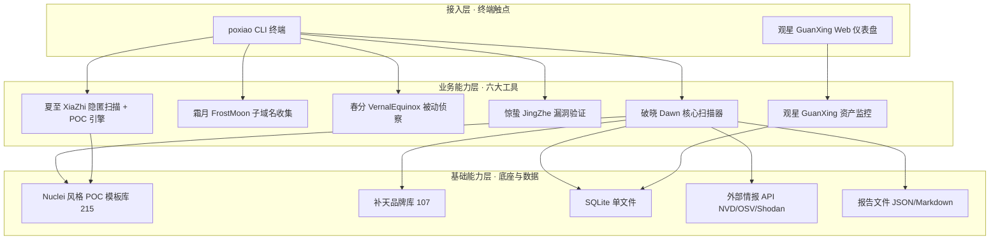
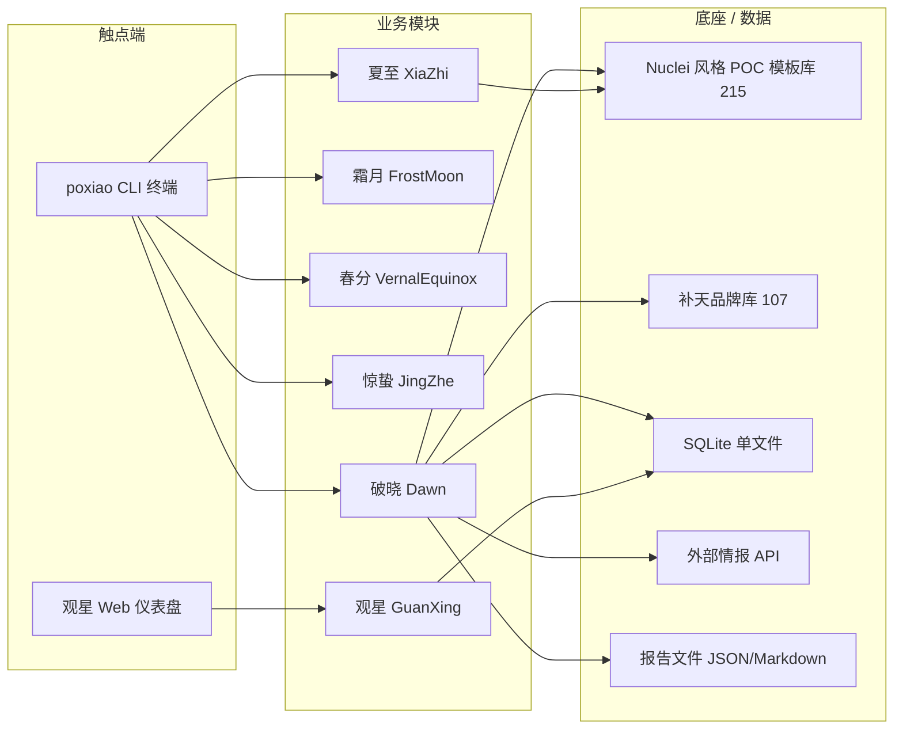

# AICoding 架构设计 · 高层架构设计

> 本文档为《AICoding 架构设计》核心产物之一，对应**高层架构设计**阶段（Gate G3）。
> 上游输入：破晓（PoXiao）v3.0.0 业务原始诉求 + `material_digest.md`（G1 通过）+ `research_report.md`（G2 通过）；
> 下游输出：驱动《系统设计》《部署设计》《安全设计》《UserStory》四份文档的撰写。
> 本文档是 `system-architect` 与 `product-story-designer` 的唯一上游边界基线，所有下游成员须对齐本文件冻结的业务边界。

---

## 0. 元信息：修订记录

```yaml
标题: 破晓 (PoXiao) v3.0.0 - 高层架构设计 v0.1
版本: v0.1
状态: Draft   # Draft | Reviewing | Approved | Deprecated
创建日期: 2026-07-09
最后更新: 2026-07-09
作者: 许边界（business-architect / 业务架构师）
评审人:
  - team-lead（主理人）

关联文档:
  上游输入:
    - 业务原始诉求 / PRD: 二十四节气 SRC 安全工具链（技术栈指纹 + CVE 精确匹配 + 三层降噪），由主理人注入
    - 行业调研报告: D:/HZR_PROJECTS/poxiao/.workbuddy/output/research_report.md
    - 资料摘要: D:/HZR_PROJECTS/poxiao/.workbuddy/output/material_digest.md
  下游产出:
    - 系统设计: AICoding架构设计-2-系统设计.md
    - 部署设计: AICoding架构设计-3-部署设计.md
    - 安全设计: AICoding架构设计-4-安全设计.md
    - UserStory: AICoding架构设计-5-UserStory.md
```

| 版本 | 日期 | 作者 | 变更内容 | 评审状态 |
| --- | --- | --- | --- | --- |
| v0.1 | 2026-07-09 | 许边界 | 初稿（基于 material_digest + research_report，冻结 X1/X2/X3 业务边界） | Draft（待 G3） |

> **版本管理纪律**：破坏性变更（章节结构调整 / 关键决策反转）升 MAJOR；新增章节、扩充内容升 MINOR。

---

## 1. 需求概要

### 1.1 需求概要说明

破晓（PoXiao）v3.0.0 用于解决 SRC（安全应急响应中心 / 漏洞赏金）场景下"扫描器误报高、盲打无效、结果不可提交"的核心业务问题，服务于漏洞赏金猎人、企业安全运营与 SRC 项目负责人，覆盖"信息收集 → 技术栈识别 → 已知漏洞匹配 → 精准打击 → SRC 报告提交"的全流程。本期由 RayScan 实战教训（50 目标 44 分钟 0 漏洞、误报率 94%）驱动启动，确立"先识别技术栈，再匹配 CVE，三层降噪消除假阳性"的换一套检测哲学。

### 1.2 关键决策摘要

| 编号 | 决策类别 | 决策内容 | 关联章节 |
| --- | --- | --- | --- |
| D1 | 范围决策 | 本期 In-Scope 聚焦核心扫描链路（破晓 Dawn + 霜月/春分/惊蛰/夏至 POC），Out-of-Scope 边界见 §6.1（GuanXing 监控、WAF 绕过核心能力不在 MVP） | §6.1 |
| D2 | 技术选型决策 | 复用 Nuclei 风格 YAML 模板引擎（215 模板）+ httpx 异步探测范式，全项目守"无外部依赖" | §3.2 / §4 |
| D3 | MVP / 完整版边界 | MVP 覆盖指纹 + CVE 精确匹配 + 三层降噪 + POC 引擎 + 渐进报告 + 存活/续扫/域名发现；GuanXing 监控与 WAF 绕过延后至完整版（WAF 绕过仅作可选实验模块、默认关闭） | §4.3 |
| D4 | 复用 vs 新建 | 复用 215 POC 模板库 / 107 补天品牌库 / 121 内置 CVE / SQLite 单文件；业务系统（六大工具 + 编排）新建 | §5.2 |
| D5 | 部署形态 | 私有化 / 本地 CLI（`pip install -e .`），无 SaaS、无多租户、数据不出本机 | §4.2 / §5.2 |

### 1.3 价值主张

| 价值维度 | 量化目标 | 度量指标 | 当前值 | 目标值 | 截止时间 |
| --- | --- | --- | --- | --- | --- |
| 效率 | 单批扫描耗时从"盲打 44 分钟 / 50 目标"降至秒级 | 30 目标端到端耗时 | 44 min / 50 目标（RayScan 基线） | ≤ 10 s / 30 目标（基线 7.6 s / 30 目标） | MVP 上线 |
| 合规 | 高置信度结果，误报率压到可提交水平 | 误报率 | 94% | ≤ 5% | MVP 上线 |
| 成本 | 零外部依赖、零 SaaS 订阅授权成本 | 单位扫描授权成本 | 商业 SaaS 高成本（Acunetix 形态被否决） | 0（本地运行） | MVP 上线 |
| 收入 | 有效漏洞可提交率提升 | 可提交补天报告数 / 扫描批 | ≈ 0（盲打） | > 0 / 批 | 完整版上线 |
| 体验 | 赏金猎人单命令跑通、渐进出报告 | 上手时长 / 首报时延 | 依赖经验、全量完才出 | 单命令跑通、首目标完即出 | MVP 上线 |

**硬指标**：业务价值 ≥ 2 条（效率、合规、收入）+ 技术/成本价值 ≥ 1 条（成本、体验）；每条可量化，无"提升 / 优化 / 加强"等模糊词。

---

## 2. 需求分析 & 痛点解构

### 2.1 核心角色关注点

本章从甲方决策者、最终用户（漏洞赏金猎人）、受影响方（合规/运维）三类核心角色展开，分别对应 SRC 项目负责人、漏洞赏金猎人、合规/运维三类身份。
甲方决策者角色关注投入产出与合规可控（本地运行、数据不出境）。
最终用户（漏洞赏金猎人 / 安全工程师）角色关注高置信度、低误报与快出结果。
受影响方（合规 / 运维）角色关注审计留痕与对生产可用性无影响。

| 角色 | 业务身份 | 主要操作 | Top1 关心点 | 来源 |
| --- | --- | --- | --- | --- |
| 甲方决策者 | SRC 项目负责人 / 安全团队负责人 | 工具选型与预算审批、看板审阅 | ROI 与合规可控（本地运行、数据不出境） | D1§1、D2§7 |
| 最终用户 A | 漏洞赏金猎人 / 安全工程师 | `poxiao scan` 跑批、阅读 SRC 报告 | 高置信度、低误报、快出结果 | D1§4、D2§5 |
| 最终用户 B | 企业安全运营（SOC）人员 | `guanxing serve` 监控资产变化 | 变化追踪时效与可追溯 | D1§2、D6§8 |
| 受影响方 | 合规 / 运维审计 | 审计留痕、生产影响评估 | 不留痕合规风险、不影响生产可用性 | D1§10、D2§2.2 |

**硬指标**：≥ 3 类（甲方决策者 / 最终用户 / 受影响方各至少一行）；每行有"Top1 关心点"，无"使用方便"类笼统描述。

### 2.2 核心痛点

| 编号 | 痛点描述 | 现象 / 数据 | 影响角色 | 影响程度 | 优先级 |
| --- | --- | --- | --- | --- | --- |
| P1 | 传统 payload 盲打≈0 漏洞、耗时极高 | RayScan 实战：50 目标 44 分钟产出 0 漏洞；误报率高达 94% | 赏金猎人 / 安全工程师 | 高（效率 + 合规） | P1 |
| P1 | 假阳性噪音淹没真实漏洞 | JSPathFinder 报告 1039 个"漏洞"全为噪音，需人工逐条筛除 | 赏金猎人 | 高（效率） | P1 |
| P2 | 不可达目标浪费扫描时间 | 无存活检测时大量超时目标挤占队列 | 赏金猎人 | 中 | P2 |
| P2 | 无断点续扫，中断后重跑 | Ctrl+C 后需重复扫描已扫目标，无 checkpoint | 赏金猎人 | 中 | P2 |
| P3 | 域名发现准确率不足 | 补天 3900 家厂商需解析为域名，准确率待提升（验收 > 60%） | SRC 项目负责人 | 中 | P3 |

**优先级标准**：
- **P1**：直接影响业务核心流程或合规底线，不解决无法上线。
- **P2**：影响用户体验或运营效率，可在 MVP 后迭代。
- **P3**：体验型 / 长尾问题，列入完整版或后续版本。

**硬指标**：每条痛点有"现象 / 数据"佐证；P1 ≥ 1 条且必须在 §2.3 有对应目标（本表 P1 × 2，均带数据）。

### 2.3 期待目标

| 编号 | 目标描述 | 对齐痛点 | 度量指标 | 当前值 | 目标值 | 截止时间 |
| --- | --- | --- | --- | --- | --- | --- |
| V1 | 误报率压降至 ≤ 5% | P1（假阳性噪音） | 误报率 | 94% | ≤ 5% | MVP 上线 |
| V2 | 单批 30 目标扫描 ≤ 10 s 级 | P1（盲打耗时高） | 30 目标端到端耗时 | 44 min / 50 目标 | ≤ 10 s / 30 目标 | MVP 上线 |
| V3 | 扫完第 1 个目标即出第 1 份报告（渐进输出） | P1 / P2（效率） | 首报时延 | 全量完才出 | 第 1 目标完即出 | MVP 上线 |
| V4 | 域名发现准确率 > 60% | P3（域名发现） | 解析准确率 | 待测 | > 60% | 完整版上线 |

**硬指标**：每条目标有数字 + 对齐 ≥ 1 条痛点；P1 痛点（P1 × 2）均有对应 V 级目标（V1、V2、V3）。

### 2.4 基线复用

| 复用类别 | 现有能力 | 复用方式 | 来源系统 | 备注 |
| --- | --- | --- | --- | --- |
| 检测模板 | Nuclei 风格 POC 模板库（215 个 YAML） | 直接加载，兼容社区模板 | 项目 templates/（D7§3） | X1 已冻结：以代码实际 215 为准 |
| 资产知识 | 补天品牌库（107 品牌） | `poxiao discover` 优先查表 | configs/brands.json（D7§1） | `_meta.total=107` |
| 漏洞知识 | 内置 CVE 121 条 + NVD/OSV 在线查询 | 本地匹配 + 在线补全 | dawn/cve_match.py（D6§4、D7§2） | "121 条"待源码核验（Q4，不影响边界） |
| 底座能力 | SQLite 单文件（GuanXing 监控库） | 直接复用 sqlite3 WAL | guanxing/db.py（D6§8） | X3 已冻结：监控统一 SQLite |
| 异步探测 | httpx（异步）/ dnspython / flask | 库调用，无外部服务 | pyproject.toml（D6§1） | 守"无外部依赖" |
| 报告范式 | JSON / Markdown 文件输出 | 文件写出 | D2§6.1、D6§3 | X3 已冻结：报告用 JSON/Markdown |

**硬指标**：先盘点再决定新建；功能缺口（§2.5）中"报告生成 / 模板引擎 / 品牌查询"均确认基线已覆盖，不重复新建。

### 2.5 功能缺口

按 SRC 挖洞生命周期分组（信息收集 / 漏洞检测 / 验证与报告 / 持续监控）：

| 阶段 | 功能缺口 | 必要性 | 优先级 | 对齐目标 |
| --- | --- | --- | --- | --- |
| 信息收集（事前） | 技术栈指纹 + 被动侦察（春分）+ 子域名（霜月）+ 域名发现 | 必须 | MVP | V2、V4 |
| 漏洞检测（事中） | CVE 精确匹配 + Nuclei 风格 POC 引擎（夏至）+ 三层降噪 | 必须 | MVP | V1 |
| 验证与报告（事后） | 漏洞验证（惊蛰）+ 渐进式 SRC 报告（JSON/Markdown）+ 一键提交补天 | 必须 | MVP | V1、V3 |
| 持续监控（运营） | 资产监控 Web 仪表盘（观星 GuanXing，SQLite） | 重要 | 完整版 | V4（变化追踪） |
| 持续监控（运营） | WAF 绕过（可选实验模块，默认关闭） | 可选 | 完整版 | — |

**硬指标**：每条缺口对齐 §2.3 至少一条目标；MVP 缺口（信息收集 / 漏洞检测 / 验证与报告）在 §6.3 功能清单中对应 MVP 范围标记 ✅。

---

## 3. 行业调研

> 本章整合 `research_report.md`（G2 通过）的事实 / 对比 / 建议 / 风险。调研结论为**建议**，最终业务边界由本章与 §4 / §5 / §6 冻结。明确区分：**事实**（已核实）、**建议**（调研侧）、**风险**（待下游裁决）。

### 3.1 行业标杆系统分析

| 标杆系统 | 厂商 / 来源 | 场景覆盖 | 技术亮点 | 商业模式 | 适用度 |
| --- | --- | --- | --- | --- | --- |
| Nuclei | ProjectDiscovery（开源社区） | 多协议漏洞扫描（HTTP/DNS/TCP/SSL/WebSocket 等）、模板驱动 | YAML DSL 模板引擎、社区模板库、验证式检测（零误报主张）、零外部依赖单二进制 | 开源（MIT）+ 商业云 | 高（4.70） |
| Acunetix（Invicti） | Invicti Security（商业） | Web/API DAST、IAST、WAF 兼容导出 | proof-based scanning 自动验证降噪、爬虫型 DAST、数千 CVE | 商业闭源订阅（SaaS + 本地） | 低（2.75） |
| OWASP ZAP | OWASP（开源社区） | Web 应用 DAST（代理被动 + 主动）、渗透辅助 | 代理架构、Add-on 插件市场、置信度评级报告 | 开源（Apache-2.0） | 中高（4.55） |
| reNgine | yogeshojha（开源社区） | Web 自动化侦察、子域/端点发现、Nuclei 扫描、资产监控与变化追踪 | 侦察数据关联、持续监控、Web 仪表盘、多角色权限 | 开源（GPL-3.0） | 中（3.70） |

**硬指标**：≥ 3 家；含 1 家头部 SaaS（Acunetix）+ 3 家开源/自研代表（Nuclei / ZAP / reNgine）。

### 3.2 方案对标及优先级打分

**对比矩阵**（每行权重之和 = 1.00；评分 1~5，5 = 完美契合对 PoXiao 的借鉴价值）：

| 评估维度 | 权重 | Nuclei | Acunetix | ZAP | reNgine |
| --- | --- | --- | --- | --- | --- |
| 场景契合度 | 0.30 | 4 | 3 | 4 | 4 |
| 技术成熟度 | 0.20 | 5 | 5 | 5 | 4 |
| 集成难度（反向） | 0.15 | 5 | 2 | 4 | 2 |
| 成本（反向） | 0.15 | 5 | 1 | 5 | 4 |
| 合规可控性 | 0.20 | 5 | 2 | 5 | 4 |
| **加权总分** | **1.00** | **4.70** | **2.75** | **4.55** | **3.70** |

**结论摘要**：
- **优先借鉴**：Nuclei（4.70）—— 模板驱动 + 本地 CLI + 无外部依赖与 PoXiao 设计原则（D1§10）同构；其 YAML DSL 是夏至 xiazhi 引擎的直接参照（D7§3 已同构 215 模板）。
- **部分借鉴**：ZAP（4.55）—— 置信度评级（Certain/Firm/Tentative）+ 上下文交叉验证 + 配置排除已知误报的降噪实践，可映射三层降噪；不借鉴其重量级代理/桌面 UI。
- **部分借鉴**：reNgine（3.70）—— "侦察数据变化追踪 + 持续监控 + Web 仪表盘"是 GuanXing（D1§2）直接范式参照；但 Django+Celery+PostgreSQL+Docker 全栈与 PoXiao"无外部依赖"冲突，仅借鉴监控概念、改用 SQLite 自研。
- **不借鉴**：Acunetix 的 SaaS / 商业闭源形态（2.75）—— 合规可控性 2/5（数据出境）+ 成本 1/5 + 集成难度 2/5，与"本地 CLI + 无外部依赖 + 开源"根本冲突；仅作方法论参考（proof-based 降噪、WAF 兼容非绕过、Issue 集成）。

### 3.3 完整报告参考

- 完整报告链接：`D:/HZR_PROJECTS/poxiao/.workbuddy/output/research_report.md`
- 调研工具：`tech-research-advisor`（见 research_report 附录 A/B）
- 调研日期：2026-07-09
- 调研归档：`D:/HZR_PROJECTS/poxiao/.workbuddy/output/research_report.md`

---

## 4. 方案决策

### 4.1 价值定位澄清

```
对外价值（客户侧）: 为漏洞赏金猎人 / 安全工程师提供"高置信度、低误报、可直提交 SRC"的扫描结果，把有效漏洞从噪音中分离出来
对内价值（运营侧）: 一线提效（渐进输出、断点续扫）+ 管理风险可控（本地运行、数据不出境）+ 合规留痕（JSON/Markdown 报告可追溯）
差异化价值        : 相对 RayScan 式盲打与 Acunetix 式 SaaS，独有能力 = "技术栈指纹 + CVE 精确匹配 + 三层降噪"把误报率从 94% 压到 ≤ 5%，且零外部依赖、零授权成本
```

**与产品矩阵的关系**：破晓在"SRC 挖洞工具链"中承担**核心检测与编排职责**，向上游对接外部情报 API（NVD/OSV/Shodan 等）与本地知识库（模板/品牌/CVE），向下游产出 JSON/Markdown 报告供人工提交补天，与 GuanXing 监控、夏至隐匿扫描形成完整业务闭环（见 §5.2、§5.3）。

### 4.2 系统定位澄清

| 维度 | 内容 |
| --- | --- |
| 系统名称 | 破晓（PoXiao）v3.0.0 — 二十四节气 SRC 安全工具链 |
| 系统类型 | 已有系统扩展（在现有 6 工具源码基础上做 v3.0.0 架构收敛与边界冻结） |
| 部署形态 | 私有化 / 本地 CLI（`pip install -e .`，Python 包）；无 SaaS、无容器编排 |
| 多租户 | 否（单机本地运行，数据不出本机；GuanXing 监控库为本地 SQLite 单文件） |
| 服务对象 | 漏洞赏金猎人 / 安全工程师（CLI 扫描）、企业安全运营（GuanXing 监控）、SRC 项目负责人（选型审阅） |
| 上游依赖 | 外部情报 API（NVD / OSV / Shodan / Censys / FOFA / Wayback / crt.sh / certspotter / OTX）、本地知识库（POC 模板 215 / 品牌库 107 / 内置 CVE 121） |
| 下游消费者 | 人工 SRC 提交（补天 / 漏洞盒子）、GuanXing 监控库（SQLite）、本地报告文件（JSON/Markdown） |
| 边界（不做） | 不做 SaaS / 云服务形态；不做商业闭源 IAST 深度；不做 WAF 绕过核心能力（仅可选实验模块、默认关闭）；不替代人工漏洞验证 |

### 4.3 MVP 与完整版决策

| 阶段 | 时间窗 | 范围（功能编号） | 架构差异点 | 退出标准 | 不做（延后） |
| --- | --- | --- | --- | --- | --- |
| MVP | W1 ~ W8 | F1 技术栈指纹、F2 CVE 精确匹配、F3 三层降噪、F4 POC 引擎、F5 渐进报告、F6 存活检测、F7 断点续扫、F8 域名发现、F9 被动侦察、F10 漏洞验证、F11 子域名收集、F12 SRC 报告一键生成、F13 目标管理、N1 异步优先、N2 无外部依赖 | 核心链路纯本地 CLI + SQLite（仅 GuanXing 预留接口不在 MVP 启用）；WAF 绕过模块不编译进主链路 | 跑通"30 目标 ≤ 10s、误报率 ≤ 5%、首目标完即出报告"核心场景 + 可提交补天报告 | 资产监控 Web 仪表盘（F-GuanXing）、WAF 绕过（Out-of-Scope 可选）、HTML 报告、子域名全量爆破增强 |
| 完整版 | W9 ~ W16 | + F-GuanXing 资产监控 Web 仪表盘（SQLite）、+ WAF 绕过可选模块（默认关闭）、+ HTML 可视化报告、+ 批量目标编排增强 | 启用 GuanXing Flask Web 仪表盘（复用 SQLite 单文件）；WAF 绕过作为可选插件挂载到夏至 stealth 链路 | 监控变化追踪稳定 30 天 + 可选模块可独立启用且默认关闭不影响主链路 | — |

**演进纪律**：
- ✅ MVP 架构骨架是完整版的**子集**：GuanXing 监控、WAF 绕过均为"新增可插拔模块"，MVP 上线后无需推倒重来。
- ✅ MVP 中可后置的能力（Web 仪表盘、HTML 报告）在 §4.3 明确"完整版替换 / 增补计划"，不引入完整版无法继承的临时架构。
- ❌ 禁止为赶工引入"完整版无法继承"的临时架构（如临时单文件 → 完整版分库分表）。

### 4.4 业务边界冻结裁决（上游冲突 X1 / X2 / X3）

> 以下三项由主理人在 Phase 3 任务中显式冻结，下游架构师（system-architect / security-architect / platform-architect）须对齐，**不得再留"待裁决"**。

| 编号 | 冲突主题 | 冻结裁决（业务边界） | 对下游的约束 |
| --- | --- | --- | --- |
| X1 | POC 模板数量（README 称 206 vs 代码实际 215） | **采用代码实际 215 个**（Nuclei 风格 YAML：cves 7 / default-logins 2 / exposures 122 / misconfig 58 / vulnerabilities 26）。统一口径，README 文案待修正（列入下游文档任务）。 | 夏至 xiazhi 引擎、报告模块均以 215 为准；system-architect 在系统设计中锁定模板 schema 对齐 Nuclei。 |
| X2 | WAF 绕过是否做（D2§7⑧ 否定 vs D1§2/D6§9 代码含 waf_bypass.py） | **不是 MVP 核心能力**。若保留，定位"可选实验模块、默认关闭"，通过夏至 `--stealth` 可选挂载，**不影响核心扫描链路**（指纹 + CVE + 三层降噪 + POC）。 | security-architect 将 WAF 绕过作为可选插件设计，默认关闭；其开关不得进入 MVP 主链路验收。 |
| X3 | 存储选型（SQLite vs JSON） | **资产监控（GuanXing）用本地 SQLite 单文件**（变化追踪 / 分页需 DB，守"无外部依赖"）；**扫描报告用 JSON / Markdown 文件输出**（人读 / 机读导出）。全项目守"无外部依赖"。 | system-architect 数据层：监控库 = SQLite（WAL），报告 = 文件；禁止引入 PostgreSQL / Redis / 外部 DB。 |

---

## 5. 业务架构设计

### 5.1 业务架构图

破晓业务架构按三层组织：**接入层**（CLI 终端 / GuanXing Web 仪表盘）→ **业务能力层**（破晓 Dawn 编排 + 霜月 / 春分 / 惊蛰 / 观星 / 夏至 五工具）→ **基础能力层**（Nuclei 风格 POC 模板库、补天品牌库、SQLite、外部情报 API、报告文件），三层协同构成 SRC 挖洞全流程闭环，详见下图。



> 绘制规范：三层（接入层 → 业务能力层 → 基础能力层）齐全；实线 = 同步调用 / 文件写出；CLI 经破晓 Dawn 编排五工具，GuanXing 经 Web 仪表盘独立接入；基础能力层为本地底座与外部情报 API。图由 diagrams-generator 方法论（Mermaid）生成并内嵌。

### 5.2 系统依赖架构

| 依赖类型 | 系统 / 模块 | 提供方 | 依赖能力 | 接入方式 | 同步/异步 | 关键约束 |
| --- | --- | --- | --- | --- | --- | --- |
| 上游 | 外部情报 API（NVD / OSV / Shodan / Censys / FOFA / Wayback / crt.sh / certspotter / OTX） | 第三方 SaaS / 公开服务 | CVE 库、IP/域名情报、历史 URL、证书透明 | HTTPS / REST | 异步（asyncio） | API Key 限流、超时 5~10s、失败降级本地库 |
| 上游 | 本地知识库（POC 模板 215 / 品牌库 107 / 内置 CVE 121） | PoXiao 自带 | 检测模板、品牌查询、CVE 匹配 | 本地文件读取 | 同步 | 模板 schema 对齐 Nuclei；X1 以 215 为准 |
| 下游 | SRC 报告（JSON / Markdown） | 人工提交补天 / 漏洞盒子 | 可提交漏洞报告 | 本地文件写出 | 同步 | 报告格式对齐补天提交规范 |
| 下游 | GuanXing 监控库（SQLite） | 观星 GuanXing | 资产变化追踪、分页查询 | 本地 sqlite3 WAL | 同步 | X3 冻结：SQLite 单文件，无外部 DB |
| 复用底座 | Python 生态（httpx / dnspython / flask / beautifulsoup4） | PyPI | 异步 HTTP、DNS、Web、解析 | 库调用 | 混合 | 守"无外部依赖"（不引入 Docker/Redis） |
| 数据订阅 | 扫描结果回灌（品牌库 / 模板库优化） | PoXiao 内部 | 规则迭代 | 本地文件更新 | 异步 | 业务效果回路（见 §5.3） |

**硬指标**：
- 每条依赖明确"接入方式 + 同步/异步 + 关键约束"，无"仅调用 API"空泛描述。
- P1 痛点对应核心能力（指纹 / CVE / 三层降噪 / POC / 报告）均在表中找到依赖来源（本地知识库 + 外部情报 API + 文件写出）。

### 5.3 业务闭环

**业务主链路**（端到端）：

```
目标输入（文件/参数/粘贴板） → 存活检测（poxiao check） → 技术栈指纹（Dawn） → CVE 精确匹配 + POC 扫描（夏至，三层降噪） → 漏洞验证（惊蛰） → SRC 报告（JSON/Markdown） → 人工提交补天
```

**关键反馈回路**：

| 回路 | 触发点 | 反馈对象 | 反馈机制 | 价值 |
| --- | --- | --- | --- | --- |
| 业务效果回路 | 扫描结果产出 | 品牌库 / POC 模板库 | 假阳性样本回流，优化指纹与模板 | 提升后续批次置信度 |
| 运营监控回路 | GuanXing 变化追踪发现新资产 / 变更 | 破晓 Dawn 重新扫描 | 定时 / 事件触发重扫 | 持续覆盖资产面 |
| 降噪迭代回路 | 三层降噪漏报 / 误报样本 | 校准匹配规则 | 校准路径规则更新（本地配置） | 误报率稳定 ≤ 5% |

**运营主线**：
- 每日：赏金猎人通过 CLI 跑批扫描，渐进式读取报告，筛出可提交漏洞。
- 每周：安全运营通过 GuanXing（完整版）review 资产变化追踪，触发重点目标重扫。
- 每月：维护者更新 POC 模板库（215→N）与补天品牌库（107→），回灌检测能力。

---

## 6. 产品需求及原型

### 6.1 需求边界

**In-Scope**（本期必做，共 15 条）：

```
F1. 技术栈指纹识别（破晓 Dawn）：Server/Language/CMS/CDN/WAF 指纹
F2. CVE 精确匹配（破晓 Dawn）：内置 121 条 + NVD/OSV 在线查询
F3. 三层降噪（破晓 Dawn）：内容特征 + 尺寸聚类 + 校准匹配
F4. Nuclei 风格 POC 引擎（夏至 XiaZhi）：215 模板，兼容社区模板
F5. 渐进式报告输出（破晓 Dawn）：扫完即出 JSON/Markdown
F6. 存活检测（poxiao check）：HTTP HEAD / TCP 并发检测
F7. 断点续扫（checkpoint）：Ctrl+C 后可恢复
F8. 域名自动发现（poxiao discover）：brands.json 107 + 搜索引擎补充
F9. 被动侦察（春分 VernalEquinox）：WHOIS/ICP/DNS/证书/IP/Wayback/GitHub 泄露
F10. 漏洞验证（惊蛰 JingZhe）：默认凭据/Git泄露/Swagger/Actuator/配置检测
F11. 子域名收集（霜月 FrostMoon）：crt.sh/certspotter/OTX/DNS爆破/泛解析检测
F12. SRC 报告一键生成（补天/漏洞盒子格式）：JSON/Markdown
F13. 目标管理（多源输入/去重/分类）：文件/参数/粘贴板
N1. 非功能：异步优先，30 目标 ≤ 10s 级（基线 7.6s/30 目标）
N2. 非功能：无外部依赖（不引入 Docker/Redis/外部 DB），全本地运行
```

以下 Out-of-Scope 事项（O1~O4）已冻结业务边界，后续版本或外部系统承担：
| 编号 | 不做的事 | 原因 | 后续计划 |
| --- | --- | --- | --- |
| O1 | 资产监控 Web 仪表盘（GuanXing 完整监控能力）纳入 MVP | MVP 核心链路为检测与报告；监控为"持续运营"阶段能力，可后置且不改变主链路 | 完整版（W9~W16）启用 Flask Web 仪表盘，复用 SQLite |
| O2 | WAF 绕过作为核心能力（Out-of-Scope 可选） | 行业主流（Nuclei/httpx/Acunetix）均不将绕过作核心；D2§7⑧ 显式否定；X2 已冻结为可选实验模块、默认关闭 | 完整版可选插件，默认关闭，不影响主链路 |
| O3 | SaaS / 云服务形态 | 与"本地 CLI + 无外部依赖 + 数据不出境"定位根本冲突（Acunetix 形态被否决，评分 2.75） | 不做，守本地私有化 |
| O4 | HTML 可视化报告（首版） | JSON/Markdown 已满足 SRC 提交与机器可读；HTML 为体验增强 | 完整版可选 |

**硬指标**：In-Scope ≤ 15 条（本表 15 条：F1~F13 + N1~N2）；Out-of-Scope ≥ 3 条（本表 O1~O4 共 4 条）。

### 6.2 产品模块全景图

**模块卡片**：

| 字段 | 说明 |
| --- | --- |
| 模块名称 | 破晓 Dawn（核心扫描器） |
| 一级归属 | 业务能力层 |
| 责任团队 | PoXiao 研发团队 |
| 上游 | CLI 接入、本地知识库、外部情报 API |
| 下游 | 报告文件、GuanXing 监控库 |
| MVP 是否包含 | 是 |

| 字段 | 说明 |
| --- | --- |
| 模块名称 | 霜月 FrostMoon（子域名收集） |
| 一级归属 | 业务能力层 |
| 责任团队 | PoXiao 研发团队 |
| 上游 | crt.sh/certspotter/OTX、DNS |
| 下游 | 目标管理 |
| MVP 是否包含 | 是 |

| 字段 | 说明 |
| --- | --- |
| 模块名称 | 春分 VernalEquinox（被动侦察） |
| 一级归属 | 业务能力层 |
| 责任团队 | PoXiao 研发团队 |
| 上游 | WHOIS/ICP/DNS/证书/IP/Wayback/GitHub |
| 下游 | 破晓 Dawn |
| MVP 是否包含 | 是 |

| 字段 | 说明 |
| --- | --- |
| 模块名称 | 惊蛰 JingZhe（漏洞验证） |
| 一级归属 | 业务能力层 |
| 责任团队 | PoXiao 研发团队 |
| 上游 | 破晓 Dawn 扫描结果 |
| 下游 | SRC 报告 |
| MVP 是否包含 | 是 |

| 字段 | 说明 |
| --- | --- |
| 模块名称 | 观星 GuanXing（资产监控） |
| 一级归属 | 业务能力层 |
| 责任团队 | PoXiao 研发团队 |
| 上游 | Web 仪表盘接入 |
| 下游 | SQLite 监控库 |
| MVP 是否包含 | 否（完整版） |

| 字段 | 说明 |
| --- | --- |
| 模块名称 | 夏至 XiaZhi（隐匿扫描 + POC 引擎） |
| 一级归属 | 业务能力层 |
| 责任团队 | PoXiao 研发团队 |
| 上游 | Nuclei 风格 POC 模板库 215 |
| 下游 | 破晓 Dawn、报告文件 |
| MVP 是否包含 | 是（POC 引擎部分；WAF 绕过可选默认关闭） |

| 字段 | 说明 |
| --- | --- |
| 模块名称 | 基础能力层（模板库 / 品牌库 / SQLite / 外部情报 / 报告） |
| 一级归属 | 基础能力层 |
| 责任团队 | PoXiao 研发团队 |
| 上游 | 社区模板、补天品牌、第三方 API |
| 下游 | 六大工具 |
| MVP 是否包含 | 是 |



### 6.3 功能清单

所有 P0 功能（F1~F8）全部在 MVP 范围内标记为 ✅，遵循"P0 必须 ✅ MVP"硬指标。

| 编号 | 一级模块 | 二级功能 | 功能描述 | 优先级 | MVP 范围 | 完整版范围 | 对齐目标 |
| --- | --- | --- | --- | --- | --- | --- | --- |
| F1 | 破晓 Dawn | 技术栈指纹识别 | Server/Language/CMS/CDN/WAF 指纹提取 | P0 | ✅ | ✅ | V2 |
| F2 | 破晓 Dawn | CVE 精确匹配 | 内置 121 条 + NVD/OSV 在线查询匹配 | P0 | ✅ | ✅ | V1 |
| F3 | 破晓 Dawn | 三层降噪 | 内容特征 + 尺寸聚类 + 校准匹配 | P0 | ✅ | ✅ | V1 |
| F4 | 夏至 XiaZhi | Nuclei 风格 POC 引擎 | 215 模板加载与匹配，兼容社区模板 | P0 | ✅ | ✅ | V1 |
| F5 | 破晓 Dawn | 渐进式报告输出 | 扫完即出 JSON/Markdown | P0 | ✅ | ✅ | V3 |
| F6 | 破晓 Dawn | 存活检测 | HTTP HEAD / TCP 并发检测，不可达跳过 | P0 | ✅ | ✅ | V2 |
| F7 | 破晓 Dawn | 断点续扫 | checkpoint 文件，Ctrl+C 可恢复 | P0 | ✅ | ✅ | V2 |
| F8 | 破晓 Dawn | 域名自动发现 | brands.json 107 + 搜索引擎补充 | P0 | ✅ | ✅ | V4 |
| F9 | 春分 VernalEquinox | 被动侦察 | WHOIS/ICP/DNS/证书/IP/Wayback/GitHub | P1 | ✅ | ✅ | V2 |
| F10 | 惊蛰 JingZhe | 漏洞验证 | 默认凭据/Git泄露/Swagger/Actuator/配置 | P1 | ✅ | ✅ | V1 |
| F11 | 霜月 FrostMoon | 子域名收集 | crt.sh/certspotter/OTX/DNS爆破/泛解析 | P1 | ✅ | ✅ | V4 |
| F12 | 破晓 Dawn | SRC 报告一键生成 | 补天/漏洞盒子格式 JSON/Markdown | P1 | ✅ | ✅ | V3 |
| F13 | 破晓 Dawn | 目标管理 | 多源输入/去重/分类 | P2 | ✅ | ✅ | V2 |
| F-GuanXing | 观星 GuanXing | 资产监控 Web 仪表盘 | Flask Web + SQLite 变化追踪/分页 | P2 | ❌ | ✅ | V4 |
| F-WAF | 夏至 XiaZhi | WAF 绕过（可选） | 可选实验模块，默认关闭 | P2 | ❌ | ✅（默认关闭） | — |
| F-HTML | 破晓 Dawn | HTML 可视化报告 | 报告 HTML 渲染 | P3 | ❌ | ✅ | — |

**硬指标**：
- 每个 P0 功能在 MVP 范围内为 ✅（F1~F8 全部 ✅）。
- 每个功能反向映射到 §2.5 功能缺口 + §2.3 期待目标（见"对齐目标"列）。

### 6.4 产品原型 - CLI 扫描工作台（核心触点端 1）

> 破晓主交互为终端 CLI（`poxiao` 命令），本节描述赏金猎人 / 安全工程师的核心操作页面与交互约束。

**核心页面清单**：

| 页面 | 用途 | 关键交互 | MVP |
| --- | --- | --- | --- |
| 扫描命令页 | `poxiao scan targets.txt` 发起批量扫描 | 参数补全（--report/--stealth）、目标文件拖入 | ✅ |
| 实时渐进输出页 | 终端实时打印每目标结果与进度条 | 扫完第 1 目标即打印第 1 份结果（渐进输出） | ✅ |
| 报告查看页 | 打开生成的 JSON/Markdown 报告 | 按严重性排序、可一键复制补天格式 | ✅ |
| 配置页 | `poxiao config init/show` | 并发/超时/API Key 编辑，环境变量覆盖 | ✅ |

**关键交互约束**：
- 首报时延：扫完第 1 个目标到首份报告呈现 ≤ 目标完成时间（对齐 V3）。
- 单批性能：30 目标端到端 ≤ 10 s 级（对齐 V2，基线 7.6 s / 30 目标）。
- 误报控制：三层降噪后误报率 ≤ 5%（对齐 V1）。

**原型链接**：终端 CLI，无独立 Figma（本地运行时 `poxiao scan --help` 即交互入口）。

### 6.5 产品原型 - 观星 Web 监控台（核心触点端 2）

> 观星 GuanXing 提供资产监控 Web 仪表盘（完整版启用），本节描述安全运营人员视角页面。

**核心页面清单**：

| 页面 | 用途 | 关键交互 | MVP |
| --- | --- | --- | --- |
| 仪表盘页 | 资产总数 / 变化数总览 | 实时刷新、按严重度筛选 | ❌（完整版） |
| 目标详情页 | 单资产历史扫描与变化时间轴 | 下钻查看变更 diff | ❌（完整版） |
| 变化追踪页 | 变化追踪列表（新增/消失/配置变更） | 标记已处理、触发重扫 | ❌（完整版） |
| 认证登录页 | GuanXing 访问认证（monitor.auth） | 用户名/密码登录，默认 admin | ❌（完整版） |

**关键交互约束**：
- 数据底座：SQLite 单文件（`scan_results/guanxing.db`，WAL），X3 冻结。
- 监控触发：定时 / 事件触发重扫，回灌破晓 Dawn（运营监控回路，§5.3）。
- 默认关闭认证风险：monitor.auth 默认 false，生产启用须开认证（security-architect 设计）。

**原型链接**：Flask + Bootstrap 5 本地 Web（127.0.0.1:5099），完整版提供。

---

## 附录 A：生成流程方法论

> 本附录为高层架构设计的**生成方法论**，描述每一步的目标、工具与产物形态。

### A.0 生成流程总览

| 步骤 | 名称 | 核心产出 | 落入正文章节 |
| --- | --- | --- | --- |
| Step0 | 业务基础知识库构建 | 关联文档结构化知识库（material_digest + research_report） | （为全文提供输入） |
| Step1 | 行业调研分析 | 行业标杆 / 方案对比 / MVP 决策 | §3 行业调研 |
| Step2 | 需求分析 / 痛点解构 | 需求画像卡 | §2 需求分析 & 痛点解构 |
| Step3 | 能力盘点，系统定位 | 价值定位 + 系统定位 | §4 方案决策 / §5.2 系统依赖架构 |
| Step4 | 生成系统高层架构设计 | 本文档主文档 | §1 ~ §5 |
| Step5 | 产品需求及原型 | 需求边界 + 全景图 + 原型 | §6 产品需求及原型 |


### A.1 Step0：业务基础知识库构建

#### A.1.1 目标

构建破晓 v3.0.0 关联信息知识库，为后续步骤提供"现有架构、外部依赖文档"等业务背景（material_digest.md 与 research_report.md）。

#### A.1.2 工具（Skill）

- `knowledge-ingest-engineer`：资料摘要（G1）
- `research-analyst`：行业调研（G2）
- `docx` / `pdf` / `pptx` / `xlsx`：解析存量知识库（本批未涉及）

#### A.1.3 能力效果展示

通过 Skill 将破晓存量文档（README / requirements / agents 约定 / 源码结构 / 配置与模板 / 数据）解析、结构化，沉淀为可在 Step1~Step5 直接召回的业务知识库（见 material_digest.md）。

### A.2 Step1：行业调研分析

#### A.2.1 目标

基于当前需求，调研行业标杆系统及对应解决方案，对标优秀方案，综合打分决策 MVP 功能和落地路径。

#### A.2.2 工具（Skill）

- `tech-research-advisor`（产出 research_report.md）

#### A.2.3 完整报告参考

- 完整报告链接：`D:/HZR_PROJECTS/poxiao/.workbuddy/output/research_report.md`

#### A.2.4 能力效果展示

##### A.2.4.1 用户输入问题

使用 `tech-research-advisor` 调研 SRC 安全工具链（Nuclei 模板引擎 / WAF 绕过 / 存储选型 / 降噪 / 部署形态）的行业标杆与方案对比。

##### A.2.4.2 行业标杆

Nuclei / Acunetix / OWASP ZAP / reNgine（4 家，含 1 头部 SaaS + 3 开源）。

##### A.2.4.3 行业优秀方案及对比

5 维度加权评分：Nuclei 4.70 > ZAP 4.55 > reNgine 3.70 > Acunetix 2.75。

##### A.2.4.4 方案打分及 MVP 功能评估

优先借鉴 Nuclei；部分借鉴 ZAP / reNgine；不借鉴 Acunetix SaaS 形态；MVP 聚焦核心检测链路。

##### A.2.4.5 能力清单 & 方案总结

以 Nuclei 为引擎范式主线，吸收 ZAP 降噪实践与 reNgine 监控概念（改为 SQLite 自研）。

### A.3 Step2：需求分析 / 痛点解构

#### A.3.1 目标

构建需求画像卡，深入解构需求要点及目标（结构对应正文 §2）。

#### A.3.2 能力效果展示

按"核心角色关注点 / 核心痛点 / 期待目标 / 基线复用 / 功能缺口"五段式产出（§2）。

### A.4 Step3：能力盘点，系统定位

#### A.4.1 目标

- 从能力知识库中召回已有能力并完成分层与去重
- 系统价值及能力嵌入：明确需求 / 系统在产品矩阵中的价值定位
- 系统架构定位、上下游推导

#### A.4.2 产物形态

- 价值定位澄清（§4.1）
- 系统定位澄清（§4.2）
- 系统依赖架构图（§5.2）

### A.5 Step4：生成系统高层架构设计

#### A.5.1 目标

整合行业分析、需求结构、项目背景，输出系统高层设计（§1 ~ §5）。

#### A.5.2 产物形态

- 需求概要（§1）
- 需求分析 & 痛点解构（§2）
- 行业调研（§3）
- 方案决策（§4）
- 业务架构设计（§5）

### A.6 Step5：产品需求及原型

#### A.6.1 目标

在系统高层设计基础上，输出需求边界、功能清单与产品原型（§6）。

#### A.6.2 产物形态

- 需求边界（§6.1）
- 产品模块全景图（§6.2）
- 功能清单（§6.3）
- 产品原型 - CLI 扫描工作台（§6.4）
- 产品原型 - 观星 Web 监控台（§6.5）

---

## 附录 B：配套工具清单

### B.1 知识库 Skill

> 用途：解析存量知识库内容。

- `docx`
- `pdf`
- `pptx`
- `xlsx`

### B.2 行业调研

> 用途：基于核心痛点与客户诉求，调研行业标杆项目及解决方案。

- `tech-research-advisor`

### B.3 图表生成

> 用途：生成业务架构图与模块全景图（Mermaid）。

- `diagrams-generator`（本文件 §5.1 / §6.2 的 Mermaid 图按其方法论生成并内嵌）

---

## 附录 C：阶段内中间确认自检报告（协议 §2.4）

> 按公共协议在 §2 / §4 / §5 / §6 完成后插入自检：先 §2.1 判定，再 §2.3 反向验证 3 问。本阶段**未命中**任何阻塞（上游冲突 X1/X2/X3 已由主理人显式冻结，其余决策均有研究证据且可逆），故未发起 `[中间确认]`。以下为各次自检证据，供 G3 追溯。

### C.1 §2 / §4 系统定位与价值定位自检

- §2.1 方案分歧型判定：部署形态（本地 CLI / 无 SaaS / 无多租户）、价值定位均直接来自上游已冻结设计原则（D1§10 无外部依赖 + 本地 CLI）与 research_report 结论（Nuclei 4.70 优先、Acunetix SaaS 2.75 否决）。上游已冻结，非"≥2 方案未决" → 不触发。
- 反向验证 3 问：
  - Q1：若将部署形态从"本地 CLI"推翻为"SaaS"，返工 = 全项目数据层 / 部署 / 安全设计重做，远超 30% / 1 人月 → **但本决策向上游已冻结（D1§10 + research 否决 SaaS），非本阶段新发起的分歧**；且当前选择即上游授权方向，推翻风险由上游承担。证据：D1§10 设计原则②"无外部依赖……SQLite 单文件"、research §3.2 不借鉴 Acunetix SaaS。
  - Q2：用户 / 客户可感知点——本地 CLI 是用户原始诉求显式形态（"Python 异步 CLI"），与诉求一致，未新增感知差异。证据：主理人注入诉求"Python 异步 CLI"。
  - Q3：与用户原始诉求一致性——诉求显式"技术栈指纹 + CVE 精确匹配 + 三层降噪""无外部依赖"，本定位完全对齐。证据：material_digest D1§1、D1§10。
- 结论：**未命中，不发起**。

### C.2 §4.3 / §4.4 MVP 范围与冲突冻结自检

- §2.1 方案分歧型判定：X1/X2/X3 已由主理人在 Phase 3 任务中显式冻结（"必须冻结的业务边界"），属上游已冻结文档，不触发 #1。
- 反向验证 3 问（以最易分歧的 X2 WAF 绕过为例）：
  - Q1：若 3 个月后推翻（保留↔移除 waf_bypass.py），返工 = 单个 xiazhi 模块 + stealth 标志位 + 测试 ≈ 0.5 人月，< 30% 产物 / 1 人月 → 可控。
  - Q2：WAF 绕过为内部扫描能力，非 SLA / 合同 / 监管 / 对外承诺感知点 → 感知不到。
  - Q3：用户诉求未显式提及 WAF 绕过；D2§7⑧ 显式"破晓不做 WAF 绕过"；本裁决（可选、默认关闭）与之对齐 → 一致。
- MVP 范围（GuanXing 监控延后至完整版）：研究已建议"MVP 后（部分）"，可逆（监控为可插拔模块，MVP 骨架是其子集，演进纪律满足），且与用户诉求核心（检测 + 报告）不冲突。Q1 可逆 <1 人月；Q2 虽有产品形态差异但属 phasing 且被研究佐证；Q3 未偏离诉求。结论：**未命中，不发起**。
- 结论：**未命中，不发起**。

### C.3 §5 三层业务架构图与业务闭环自检

- §2.1 方案分歧型判定：三层划分（接入 / 业务 / 基础）为模板标准骨架，模块归属与依赖均源自 material_digest 六大工具实际结构与 research 建议，无 ≥2 互斥方案 → 不触发。
- 反向验证 3 问：
  - Q1：若调整某一模块归属，返工 = §5 单章节 + 下游系统设计微调，< 30% 产物 → 可控。
  - Q2：业务架构图为内部设计视图，不改变用户可见 CLI 交互 → 感知不到。
  - Q3：模块划分对齐用户诉求的六大工具与"技术栈指纹 + CVE + 三层降噪"主链路 → 一致。
- 结论：**未命中，不发起**。

### C.4 §6 In-Scope / Out-of-Scope 与功能清单自检

- §2.1 方案分歧型判定：In/Out 边界源自 X1/X2/X3 冻结裁决 + MVP 决策（§4.3），上游已定，无新增分歧 → 不触发。
- 反向验证 3 问：
  - Q1：若调整某功能 In/Out，返工 = §6 单表 + 下游 UserStory 微调，< 30% → 可控。
  - Q2：功能边界决定是否提供某能力（如 WAF 绕过默认关闭、GuanXing 延后），属用户可感知；但均已按上游冻结 / 研究建议处理，且 MVP 演进纪律保证可逆，非跨界不可逆 → 未命中 §2.2(2) 的"不可逆"实质。
  - Q3：与用户诉求一致（核心检测 + 报告在 MVP，监控 / WAF 绕过按冻结延后）。
- 结论：**未命中，不发起**。

### C.5 总体结论

本阶段 4 次自检均**未命中**中间确认触发标准，故全程未发起 `[中间确认]`，业务边界按主理人冻结裁决 + research 建议直接落盘。所有 P0 功能标记 MVP，三层架构图与业务闭环齐全，硬指标达标。
